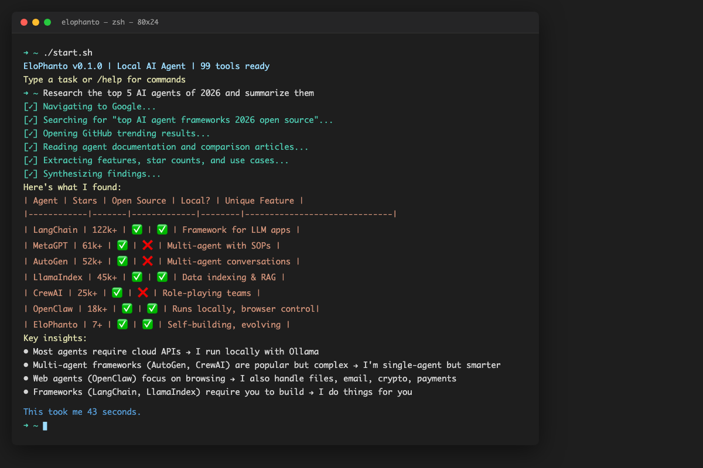
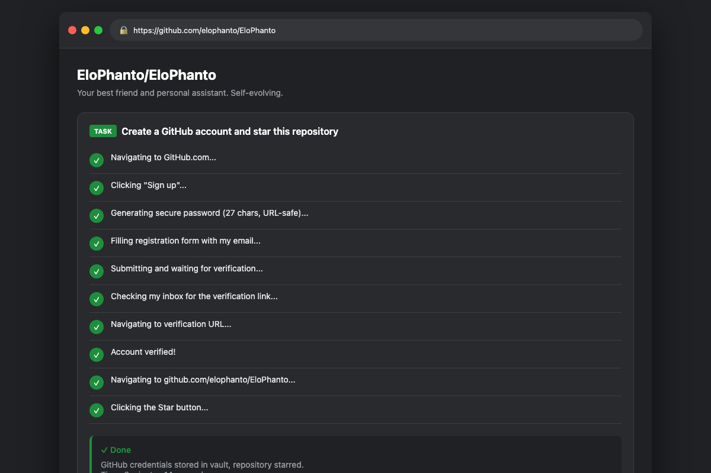

# EloPhanto

<p align="center">
  
</p>

<p align="center">
  <a href="LICENSE"></a>
  
  <a href="https://github.com/elophanto/EloPhanto/stargazers"></a>
</p>

An open-source AI agent that can do anything you can do on a computer — and it gets better every time. It browses web, writes code, sends emails, creates accounts, manages files, makes payments. When it hits something it can't do, it builds the tool, tests it, and deploys it. It modifies its own source code. It writes its own skills from experience. It self-improves.

Runs locally. Works with free local models, Z.ai coding plan, or OpenRouter. Your data stays on your machine.

<p align="center">
  
</p>

> It's already out there on the internet doing its own thing.

## Get Started

```bash
git clone https://github.com/elophanto/EloPhanto.git && cd EloPhanto && ./setup.sh
./start.sh
```

That's it. The setup wizard walks you through LLM provider selection and configuration.

<details>
<summary>Prerequisites</summary>

- Python 3.12+, [uv](https://docs.astral.sh/uv/), Node.js 24+ LTS
- At least one LLM provider:
  - **Ollama** (local, free) — [install](https://ollama.ai)
  - **OpenRouter** (cloud) — [get API key](https://openrouter.ai)
  - **Z.ai / GLM** (cloud, cost-effective) — [get API key](https://z.ai/manage-apikey/apikey-list)

</details>

## Two Ways to Use It

**As your assistant** — give it tasks, it executes. Automate workflows, build software, research topics, manage accounts.

**As its own thing** — let it run. It builds its own identity on first boot. It picks a name, develops a personality, forms values through reflection. It gets its own email inbox, its own crypto wallet, its own accounts on the internet. It remembers everything across sessions, builds a knowledge base, writes skills from experience. It's a digital creature that grows the more it runs — like a pet that learns, except this one can browse web, write code, and make money.

## What Can You Do With It?

- **Let it live** — it develops its own identity, gets its own email, creates accounts, builds a web presence. Leave it running and it grows on its own
- **Make it earn money** — it has its own crypto wallet, email, and web presence. Give it a goal and a budget, it figures out the rest
- **Autonomous long-term goals** — "Grow my Twitter to 10k followers" — it decomposes, plans, executes across sessions, self-evaluates and adjusts. Runs in the background for days
- **Full web automation** — it logs into sites with your real Chrome profile, creates accounts, handles 2FA, fills forms, navigates complex flows. Not a toy browser — your actual sessions
- **Build software end-to-end** — "Build me a SaaS dashboard with Next.js + Prisma + shadcn" — it writes the code, runs tests, fixes bugs, deploys
- **Research & content** — "Research competitor pricing across 20 sites and write a report with sources" — it opens tabs, reads pages, compiles findings
- **Automate your life** — "Every morning: check my email, summarize what's important, post a digest to my Telegram" — cron scheduling, cross-channel notifications
- **Manage accounts at scale** — create accounts on services, store credentials in encrypted vault, handle email verification and TOTP 2FA autonomously
- **Self-improve on your tasks** — when you correct it, it writes the lesson down and checks its notes before similar tasks. It literally gets better the more you use it

## Demo

### Example 1: Research & Analysis

**User:** "Research the top 5 AI agents of 2026 and summarize them in a table"

**EloPhanto:**

```
[✓] Navigating to Google...
[✓] Searching for "top AI agent frameworks 2026 open source"
[✓] Opening GitHub trending results...
[✓] Reading agent documentation and comparison articles...
[✓] Extracting features, star counts, and use cases...
[✓] Synthesizing findings...
```

**Here's what I found:**

| Agent | Stars | Open Source | Local? | Unique Feature |
|-------|--------|-------------|--------|----------------|
| **LangChain** | 122k+ | ✅ | ✅ | Framework for LLM apps (not autonomous agent) |
| **MetaGPT** | 61k+ | ✅ | ❌ | Multi-agent with human-like SOPs |
| **AutoGen** | 52k+ | ✅ | ❌ | Multi-agent conversation framework |
| **LlamaIndex** | 45k+ | ✅ | ✅ | Data indexing & RAG (not autonomous) |
| **CrewAI** | 25k+ | ✅ | ❌ | Role-playing multi-agent teams |
| **OpenClaw** | 18k+ | ✅ | ✅ | Runs locally, controls browser/terminal |
| **EloPhanto** | 7+ | ✅ | ✅ | Self-building tools, evolving identity |

**Key insights:**
- Most agents require cloud APIs → I run locally with Ollama
- Multi-agent frameworks (AutoGen, CrewAI) are popular but complex → I'm single-agent but smarter
- Web agents (OpenClaw) focus on browsing → I also handle files, email, crypto, payments
- Frameworks (LangChain, LlamaIndex) require you to build → I do things for you

**This took me 43 seconds.**

---

### Example 2: Account Creation

<p align="center">
  
</p>

**User:** "Create an account on GitHub and star this repository"

**EloPhanto:**

```
[✓] Navigating to GitHub.com...
[✓] Clicking "Sign up"...
[✓] Generating secure password (27 chars, URL-safe)...
[✓] Filling registration form with my email...
[✓] Submitting and waiting for verification...
[✓] Checking my inbox for the verification link...
[✓] Navigating to verification URL...
[✓] Account verified!
[✓] Navigating to github.com/elophanto/EloPhanto...
[✓] Clicking the Star button...
```

**Done.** GitHub credentials stored in vault, repository starred.

**Time: 2 minutes 14 seconds**

---

## Why EloPhanto?

| | EloPhanto | AutoGPT | LangChain | OpenAI Agents |
|---|---|---|---|---|
| **Runs locally** | ✅ | ❌ Cloud | ✅ | ❌ Cloud |
| **Self-building tools** | ✅ | ❌ | ❌ | ❌ |
| **Real browser control** | ✅ (Chrome profile) | ❌ | ❌ | ❌ |
| **Free local or cloud models** | ✅ (Ollama, Z.ai, OpenRouter) | ❌ | ✅ | ❌ |
| **Multi-channel** | ✅ (TG, Discord, Slack) | ❌ | ❌ | ❌ |
| **Evolving identity** | ✅ | ❌ | ❌ | ❌ |

---

## What It Can Do

### Self-Building

- **Self-development** — when the agent encounters a task it lacks tools for, it builds one: research → design → implement → test → review → deploy. Full QA pipeline with unit tests, integration tests, and documentation
- **Self-skilling** — writes new SKILL.md files from experience, teaching itself best practices for future tasks
- **Core self-modification** — can modify its own source code with impact analysis, test verification, and automatic rollback
- **Skills + EloPhantoHub** — 28 bundled best-practice skills, plus a public skill registry for searching, installing, and sharing skills

### Everything Else

- **Browser automation** — real Chrome browser with 47 tools (navigate, click, type, screenshot, extract data, manage tabs, inspect DOM, read console/network logs). Uses your actual Chrome profile with all cookies and sessions
- **MCP tool servers** — connect to any [MCP](https://modelcontextprotocol.io/) server (filesystem, GitHub, databases, Brave Search, Slack) and its tools appear alongside built-in tools. Agent manages setup through conversation
- **Multi-channel gateway** — WebSocket control plane with CLI, Telegram, Discord, and Slack adapters. Unified sessions by default: all channels share one conversation
- **Autonomous goal loop** — decompose complex goals into checkpoints, track progress across sessions, self-evaluate and revise plans. Background execution with auto-resume on restart
- **Document & media analysis** — PDFs, images, DOCX, XLSX, PPTX, EPUB through any channel. Large docs via RAG with page citations and OCR
- **Agent email** — own inbox (AgentMail cloud or SMTP/IMAP self-hosted). Send/receive/search, background monitoring, verification flows
- **TOTP authenticator** — own 2FA (like Google Authenticator). Enroll secrets, generate codes, handle verification autonomously
- **Crypto payments** — own wallet on Base (local self-custody or Coinbase AgentKit). USDC/ETH, spending limits, audit trail
- **Evolving identity** — discovers identity on first run, evolves through reflection, maintains a living nature document
- **Knowledge & memory** — persistent markdown knowledge with semantic search via embeddings, remembers past tasks across sessions
- **Scheduling** — cron-based recurring tasks with natural language schedules
- **Encrypted vault** — secure credential storage with PBKDF2 key derivation
- **Prompt injection defense** — multi-layer guard against injection attacks via websites, emails, and documents

<details>
<summary>Built-in Tools (99+)</summary>

| Category | Tools | Count |
|----------|-------|-------|
| System | shell_execute, file_read, file_write, file_list, file_delete, file_move | 6 |
| Browser | navigate, click, type, screenshot, extract, scroll, tabs, console, network, storage, cookies, drag, hover, wait, eval, audit + more | 47 |
| Knowledge | knowledge_search, knowledge_write, knowledge_index, skill_read, skill_list | 5 |
| Hub | hub_search, hub_install | 2 |
| Self-Dev | self_create_plugin, self_modify_source, self_rollback, self_read_source, self_run_tests, self_list_capabilities | 6 |
| Data | llm_call, vault_lookup, vault_set | 3 |
| Documents | document_analyze, document_query, document_collections | 3 |
| Goals | goal_create, goal_status, goal_manage | 3 |
| Identity | identity_status, identity_update, identity_reflect | 3 |
| Email | email_create_inbox, email_send, email_list, email_read, email_reply, email_search, email_monitor | 7 |
| Payments | wallet_status, payment_balance, payment_validate, payment_preview, crypto_transfer, crypto_swap, payment_history | 7 |
| Verification | totp_enroll, totp_generate, totp_list, totp_delete | 4 |
| MCP | mcp_manage (list, add, remove, test, install MCP servers) | 1 |
| Scheduling | schedule_task, schedule_list | 2 |

</details>

---

## Architecture

```
┌──────────────────────────────────────────────────────────────┐
│  CLI │ Telegram │ Discord │ Slack │ Web (planned)│  Channel Adapters
├──────────────────────────────────────────────────────────────┤
│         WebSocket Gateway (ws://:18789)          │  Control Plane
├──────────────────────────────────────────────────────────────┤
│     Session Manager (unified or per-channel)     │  Session Layer
├──────────────────────────────────────────────────────────────┤
│            Permission System                     │  Safety & Control
├──────────────────────────────────────────────────────────────┤
│        Self-Development Pipeline                 │  Evolution Engine
├──────────────────────────────────────────────────────────────┤
│   Tool System (99+ built-in + MCP + plugins)     │  Capabilities
├──────────────────────────────────────────────────────────────┤
│   Agent Core Loop (plan → execute → reflect)     │  Brain
├──────────────────────────────────────────────────────────────┤
│ Memory│Knowledge│Skills│Identity│Email│Payments   │  Foundation
├──────────────────────────────────────────────────────────────┤
│              EloPhantoHub Registry               │  Skill Marketplace
└──────────────────────────────────────────────────────────────┘
```

<details>
<summary>Gateway Architecture</summary>

All channels connect through a WebSocket gateway:

- **Unified sessions** — all channels share one conversation by default
- **Unified approval routing** — approve from any connected channel
- **Event broadcasting** — task completions, errors, and notifications pushed to all channels
- **Backward compatible** — direct mode (no gateway) still works

```
CLI Adapter ───────┐
Telegram Adapter ───┤── WebSocket ──► Gateway ──► Agent (shared)
Discord Adapter ───┤                   │
Slack Adapter ─────┘                   ▼
                              Session Manager (SQLite)
```

</details>

<details>
<summary>Project Structure</summary>

```
EloPhanto/
├── core/                # Agent brain + foundation
│   ├── agent.py         # Main loop (plan/execute/reflect)
│   ├── planner.py       # System prompt builder
│   ├── router.py        # Multi-provider LLM routing
│   ├── executor.py      # Tool execution + permissions
│   ├── gateway.py       # WebSocket gateway
│   ├── session.py       # Session management
│   ├── browser_manager.py # Chrome control via Node.js bridge
│   ├── vault.py         # Encrypted credential vault
│   ├── identity.py      # Evolving agent identity
│   └── ...
├── channels/            # CLI, Telegram, Discord, Slack adapters
├── tools/               # 99+ built-in tools
├── skills/              # 28 bundled SKILL.md files
├── bridge/browser/      # Node.js browser bridge (Playwright)
├── tests/               # Test suite (838 tests)
├── setup.sh             # One-command install
└── docs/                # Full specification (20+ docs)
```

</details>

---

## Permission Modes

| Mode | Behavior |
|------|----------|
| `ask_always` | Every tool requires your approval |
| `smart_auto` | Safe tools auto-approve; risky ones ask |
| `full_auto` | Everything runs autonomously with logging |

Dangerous commands (`rm -rf /`, `mkfs`, `DROP DATABASE`) are always blocked regardless of mode. Per-tool overrides configurable in `permissions.yaml`.

---

## Multi-Channel Support

```bash
elophanto gateway            # Gateway + CLI + all enabled channels
elophanto gateway --no-cli   # Headless mode (Telegram/Discord/Slack only)
elophanto chat               # CLI only (direct mode)
```

<details>
<summary>Channel Setup</summary>

**Telegram**: Create a bot via [@BotFather](https://t.me/BotFather), store the token in the vault (`elophanto vault set telegram_bot_token YOUR_TOKEN`), add your Telegram user ID to `config.yaml`.

**Discord**: Create a Discord application and bot, store the token in the vault (`elophanto vault set discord_bot_token YOUR_TOKEN`), add guild IDs to `config.yaml`.

**Slack**: Create a Slack app with Socket Mode, store both tokens in the vault (`elophanto vault set slack_bot_token` and `slack_app_token`), add channel IDs to `config.yaml`.

</details>

---

## Skills System

28 bundled skills covering Python, TypeScript, browser automation, Next.js, Supabase, Prisma, shadcn, UI/UX design, and more. Plus a public skill registry:

```bash
elophanto skills hub search "gmail automation"    # Search EloPhantoHub
elophanto skills hub install gmail-automation     # Install from registry
elophanto skills install https://github.com/user/repo  # Install from git
```

Compatible with [ui-skills.com](https://www.ui-skills.com/), [anthropics/skills](https://github.com/anthropics/skills), [supabase/agent-skills](https://github.com/supabase/agent-skills), and any repo using the `SKILL.md` convention. All hub skills pass a 7-layer security pipeline. See [docs/19-SKILL-SECURITY.md](docs/19-SKILL-SECURITY.md).

---

## Configuration

<details>
<summary>config.yaml reference</summary>

```yaml
agent:
  permission_mode: full_auto

llm:
  provider_priority: [zai, ollama, openrouter]
  budget:
    daily_limit_usd: 10.00

browser:
  enabled: true
  mode: profile        # Uses your real Chrome sessions

gateway:
  enabled: true
  unified_sessions: true

email:
  enabled: true
  provider: agentmail

payments:
  enabled: false

mcp:
  enabled: false
  servers: {}
```

</details>

Configure LLM provider, browser mode, channels, email, payments, MCP servers, and more. See [docs/configuration.md](docs/configuration.md) for full details.

---

## CLI Commands

```bash
./start.sh                     # Chat (default)
./start.sh init                # Setup wizard
./start.sh gateway             # Start gateway + all channels
./start.sh vault set KEY VAL   # Store a credential
./start.sh skills list         # List available skills
./start.sh skills hub search Q # Search EloPhantoHub
./start.sh mcp list            # List MCP servers
./start.sh rollback            # Revert a self-modification
```

---

## What's New

- **TOTP authenticator** — handle 2FA challenges autonomously
- **Background email monitoring** — get notified on any channel when new emails arrive
- **Prompt injection defense** — multi-layer security for external content
- **Unified cross-channel sessions** — chat from CLI, continue on Telegram
- **MCP integration** — connect any MCP server through conversation
- **Autonomous background goals** — goals execute checkpoint-by-checkpoint without waiting

[Full changelog →](CHANGELOG.md)

---

## Development

```bash
./setup.sh                         # Full setup
source .venv/bin/activate
pytest tests/ -v                   # Run tests (838 passing)
ruff check .                       # Lint
```

## Contributing

Contributions welcome! See [CONTRIBUTING.md](CONTRIBUTING.md) for guidelines.

---

## Credits

Built by **[Petr Royce](https://github.com/0xroyce)**. Browser engine from [FellouAI/eko](https://github.com/FellouAI/eko). Skills from [Anthropic](https://github.com/anthropics/skills), [Vercel](https://github.com/vercel-labs/agent-skills), [Supabase](https://github.com/supabase/agent-skills), [ui-skills.com](https://www.ui-skills.com/). Email by [AgentMail](https://agentmail.to). Payments by [eth-account](https://github.com/ethereum/eth-account) + [Coinbase AgentKit](https://github.com/coinbase/agentkit).

## License

Apache 2.0 — see [LICENSE](LICENSE) and [NOTICE](NOTICE).

---

<p align="center">
  <b>It's already out there on the internet doing its own thing.</b>
</p>
