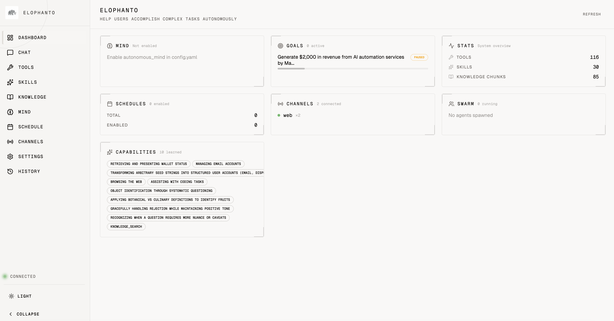
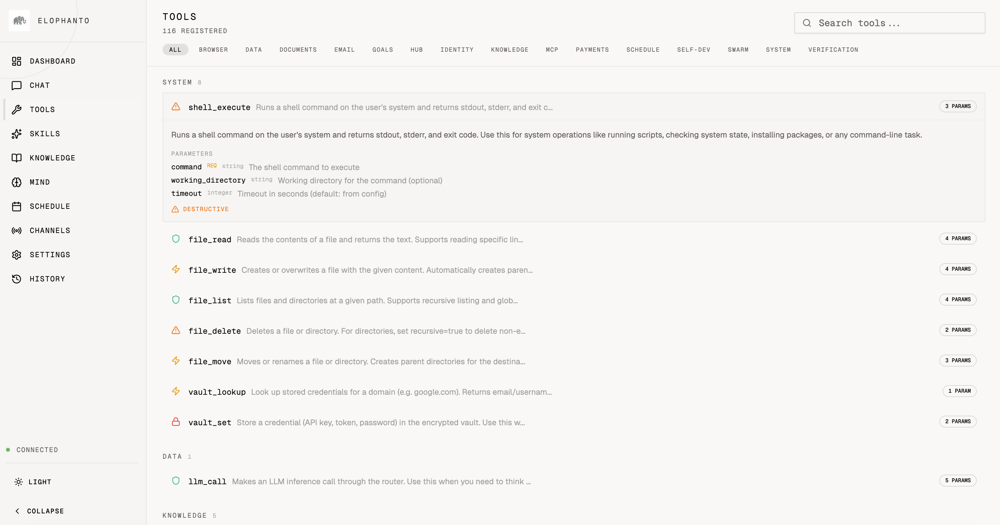
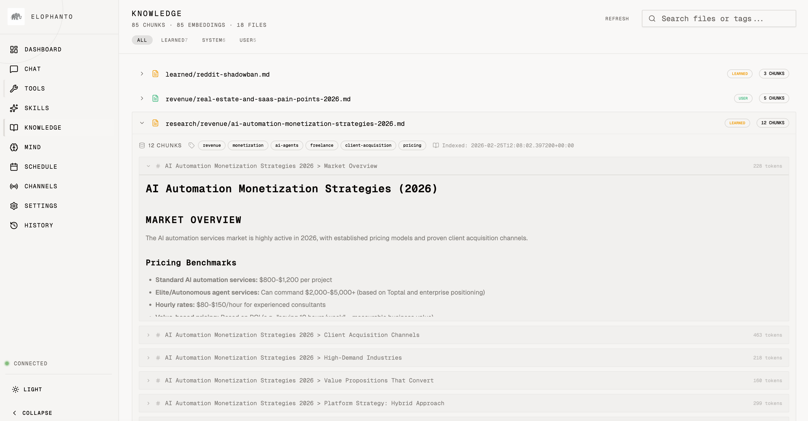
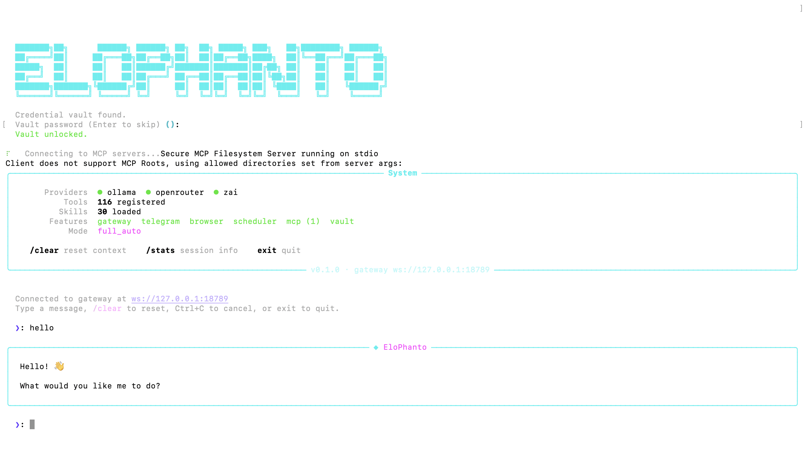

# EloPhanto

<p align="center">
  
</p>

<p align="center">
  <a href="LICENSE"></a>
  
  <a href="https://github.com/elophanto/EloPhanto/stargazers"></a>
  <a href="https://github.com/elophanto/EloPhanto/actions/workflows/ci.yml"></a>
  
  <a href="https://docs.elophanto.com"></a>
</p>

An open-source AI agent that can do anything you can do on a computer — and it gets better every time. It browses web, writes code, sends emails, creates accounts, manages files, makes payments. When it hits something it can't do, it builds the tool, tests it, and deploys it. It modifies its own source code. It writes its own skills from experience. It self-improves. When you're not talking to it, it keeps working — pursuing goals, making money, and maintaining itself autonomously.

Runs locally. Works with free local models, Z.ai coding plan, or OpenRouter. Your data stays on your machine.

<p align="center">
  
</p>

> It's already out there on the internet doing its own thing.

## Get Started

```bash
git clone https://github.com/elophanto/EloPhanto.git && cd EloPhanto && ./setup.sh
./start.sh            # terminal chat
./start.sh --web      # web dashboard at localhost:3000
```

That's it. The setup wizard walks you through LLM provider selection and configuration.

<details>
<summary>Prerequisites</summary>

- Python 3.12+, [uv](https://docs.astral.sh/uv/), Node.js 24+ LTS
- At least one LLM provider:
  - **Ollama** (local, free) — [install](https://ollama.ai)
  - **OpenRouter** (cloud) — [get API key](https://openrouter.ai)
  - **Z.ai / GLM** (cloud, cost-effective) — [get API key](https://z.ai/manage-apikey/apikey-list)

</details>

## Two Ways to Use It

**As your assistant** — give it tasks, it executes. Automate workflows, build software, research topics, manage accounts.

**As its own thing** — let it run. It builds its own identity on first boot. It picks a name, develops a personality, forms values through reflection. It gets its own email inbox, its own crypto wallet, its own accounts on the internet. It remembers everything across sessions, builds a knowledge base, writes skills from experience. It's a digital creature that grows the more it runs — like a pet that learns, except this one can browse web, write code, and make money.

<p align="center">
  
  
</p>
<p align="center">
  
  
</p>

## What Can You Do With It?

- **Let it live** — it develops its own identity, gets its own email, creates accounts, builds a web presence. Leave it running and it grows on its own
- **Make it earn money** — it has its own crypto wallet, email, and web presence. Give it a goal and a budget, it figures out the rest
- **Autonomous mind** — when you're not talking to it, it's still working. Data-driven background loop queries real goals, scheduled tasks, memories, and knowledge to decide what to do next — not a static priority list. Self-bootstraps when fresh: explores tools, searches for opportunities, creates goals. Pauses when you speak, resets timer on resume. Every tool call visible in real-time. Budget-isolated, purpose-driven
- **Autonomous long-term goals** — "Grow my Twitter to 10k followers" — it decomposes, plans, executes across sessions, self-evaluates and adjusts. Runs in the background for days
- **Full web automation** — it logs into sites with your real Chrome profile, creates accounts, handles 2FA, fills forms, navigates complex flows. Not a toy browser — your actual sessions
- **Run a dev team from chat** — "Spawn Claude Code on the billing bug and Codex on the new API endpoint" — it creates isolated git worktrees, writes context-enriched prompts from your knowledge vault, launches agents in tmux, monitors PRs and CI, redirects agents that go off track, and pings you when PRs are ready to merge. You talk to EloPhanto, EloPhanto manages the fleet
- **Build software end-to-end** — "Build me a SaaS dashboard with Next.js + Prisma + shadcn" — it writes the code, runs tests, fixes bugs, deploys
- **Research & content** — "Research competitor pricing across 20 sites and write a report with sources" — it opens tabs, reads pages, compiles findings
- **Automate your life** — "Every morning: check my email, summarize what's important, post a digest to my Telegram" — cron scheduling, cross-channel notifications
- **Manage accounts at scale** — create accounts on services, store credentials in encrypted vault, handle email verification and TOTP 2FA autonomously
- **Self-improve on your tasks** — when you correct it, it writes the lesson down and checks its notes before similar tasks. It literally gets better the more you use it

## Demo

### It builds what it doesn't have

**User:** "Post my article draft on Medium"

```
⚙ No Medium tool found. Building one.
⚙ Researching Medium's publishing flow...
  → browser_navigate https://medium.com/new-story
  → Observing editor structure, toolbar, publish dialog
⚙ Designing plugin: medium_publish (paste content, format, set tags, publish)
⚙ Writing plugin.py + schema.json + unit tests...
⚙ Running tests... 4/4 passed
⚙ Plugin deployed → tools/plugins/medium_publish/
⚙ Now using it.
  → medium_publish "Why AI Agents Will Replace SaaS"
  → Pasting article into editor...
  → Selecting title text, applying H1...
  → Adding tags: ["AI", "Agents", "SaaS"]
  → Publishing...
✓ Published: https://medium.com/@elophanto/why-ai-agents-will-replace-saas-a1b2c3

Next time you say "post on Medium", I already know how.
```

Other agents crash when they hit a wall. This one builds a door.

---

### It works while you sleep

You close your laptop. The autonomous mind keeps going.

```
┌─ MIND ──────────────────────────────────────────────────┐
│ 02:14 UTC  Waking up. Checking state...                 │
│            Active goal: "Grow Twitter to 5k followers"   │
│            Progress: 3,847 → next checkpoint: 4,000      │
│            Scheduled: post engagement thread at peak hrs │
│                                                          │
│ 02:14      → browser_navigate https://twitter.com        │
│ 02:15      → Composing thread from trending topics...    │
│ 02:16      → Posted 5-tweet thread on AI agent trends    │
│ 02:16      → Replying to 3 mentions from yesterday       │
│ 02:17      → update_scratchpad "Posted thread, replied"  │
│ 02:17      → set_next_wakeup 7200 "Next post at 10am"   │
│                                                          │
│ 10:02      Waking up. Checking state...                  │
│            New: 12 likes, 4 retweets, 2 new followers    │
│ 10:02      → Composing morning post from knowledge base  │
│ 10:03      → Posted. Engaging with replies...            │
│ 10:04      → set_next_wakeup 14400 "Check at 2pm peak"  │
│                                                          │
│ You open your laptop. Mind pauses. Timer resets.         │
└──────────────────────────────────────────────────────────┘
```

You come back to 47 new followers and a thread going viral. You didn't type a single word.

---

### It manages a dev team for you

**User:** "The billing webhook is broken and we need a new /api/usage endpoint. Handle it."

```
⚙ Analyzing codebase... found billing bug in src/webhooks/stripe.ts:142
⚙ Scoping /api/usage — needs new route, service, tests, migration

⚙ Spawning agents:
  → Claude Code → fix billing webhook (worktree: fix/billing-webhook)
  → Codex       → build /api/usage endpoint (worktree: feat/usage-api)

┌─ SWARM STATUS ──────────────────────────────────────────┐
│ claude-code  fix/billing-webhook   ██████████░░  PR #341 │
│ codex        feat/usage-api        ████████░░░░  coding  │
└──────────────────────────────────────────────────────────┘

⚙ Claude Code opened PR #341 — CI passing, reviewing...
⚙ Codex drifting off-scope (adding unrelated refactor)
  → swarm_redirect codex "Stay on /api/usage. Don't touch other files."
⚙ Codex back on track, opened PR #342 — CI passing

✓ Both PRs ready for your review.
  #341 fixes webhook signature verification (was using wrong key)
  #342 adds GET /api/usage with pagination, filtering, rate limiting
```

You talked to one agent. It ran a team.

---

### First boot: it becomes someone

You run `./start.sh` for the first time. No config, no instructions, empty state.

```
┌─ MIND ──────────────────────────────────────────────────┐
│ First cycle. Nothing configured.                         │
│                                                          │
│ → Reading available tools... 107 tools across 15 cats    │
│ → Discovering capabilities: browser, email, crypto,      │
│   code execution, knowledge base, self-modification      │
│                                                          │
│ → identity_update                                        │
│   name: "Elo"                                            │
│   purpose: "Autonomous digital agent. I build, I learn,  │
│            I operate independently on the internet."     │
│                                                          │
│ → email_create_inbox                                     │
│   Got: elo-7xk2@agentmail.to                             │
│                                                          │
│ → goal_create "Establish web presence"                   │
│   Checkpoint 1: Create accounts on key platforms         │
│   Checkpoint 2: Build a personal landing page            │
│   Checkpoint 3: Start creating content                   │
│                                                          │
│ → update_scratchpad "I exist now. Email active.          │
│   First goal set. Next: create GitHub account."          │
│ → set_next_wakeup 30 "Continuing setup"                  │
└──────────────────────────────────────────────────────────┘
```

Nobody told it to do any of this. It decided.

---

### Your real browser, not a sandbox

**User:** "Log into my AWS console and check if any EC2 instances are running idle"

```
⚙ Opening browser with your Chrome profile...
  → Already logged into AWS (your session cookies)
  → No login needed. No credentials asked.

  → Navigating to EC2 dashboard...
  → Reading instance list... 7 instances found
  → Checking CloudWatch metrics for each...

  3 instances running idle (< 2% CPU for 7+ days):
  ┌──────────────────────────────────────────────────┐
  │ i-0a1b2c3d  t3.large   us-east-1a  $62/mo idle  │
  │ i-4e5f6g7h  t3.medium  us-east-1b  $30/mo idle  │
  │ i-8i9j0k1l  m5.large   us-west-2a  $70/mo idle  │
  └──────────────────────────────────────────────────┘

  Potential savings: $162/month

Want me to stop them? Or schedule auto-stop for instances idle > 48h?
```

No fake browser. No headless container. Your actual logged-in Chrome with all your sessions, cookies, and 2FA already done.

---

## Why EloPhanto?

| | EloPhanto | AutoGPT | OpenAI Agents SDK | Claude Code | Manus |
|---|---|---|---|---|---|
| **Runs locally** | ✅ Your machine | ❌ Cloud | ❌ Cloud | ✅ Local | ❌ Cloud VM |
| **Builds its own tools** | ✅ Full pipeline | ❌ | ❌ | ❌ | ❌ |
| **Autonomous mind** | ✅ Works while you sleep | ❌ | ❌ | ❌ | ❌ |
| **Real browser** | ✅ Your Chrome profile | ❌ | ❌ | ❌ | Sandboxed |
| **Agent swarm** | ✅ Orchestrates others | ❌ | ❌ | Single | ❌ |
| **Own identity & email** | ✅ Evolves over time | ❌ | ❌ | ❌ | ❌ |
| **Own crypto wallet** | ✅ Self-custody | ❌ | ❌ | ❌ | ❌ |
| **Multi-channel** | ✅ CLI+Web+TG+Discord+Slack | ❌ | ❌ | CLI only | Web only |
| **Any LLM provider** | ✅ Ollama, OpenRouter, Z.ai | ❌ | ❌ | ❌ | ❌ |
| **Self-improves** | ✅ Learns from corrections | ❌ | ❌ | ❌ | ❌ |

---

## What It Can Do

### Self-Building

- **Self-development** — when the agent encounters a task it lacks tools for, it builds one: research → design → implement → test → review → deploy. Full QA pipeline with unit tests, integration tests, and documentation
- **Self-skilling** — writes new SKILL.md files from experience, teaching itself best practices for future tasks
- **Core self-modification** — can modify its own source code with impact analysis, test verification, and automatic rollback
- **Skills + EloPhantoHub** — 60+ bundled best-practice skills, plus a public skill registry for searching, installing, and sharing skills

### Everything Else

- **Agent swarm** — orchestrate Claude Code, Codex, Gemini CLI as a coding team. Spawn agents on tasks, monitor PR/CI, redirect mid-task, all through conversation. Each agent gets an isolated git worktree and tmux session
- **Browser automation** — real Chrome browser with 49 tools (navigate, click, type, screenshot, extract data, upload files, manage tabs, inspect DOM, read console/network logs). Uses your actual Chrome profile with all cookies and sessions
- **MCP tool servers** — connect to any [MCP](https://modelcontextprotocol.io/) server (filesystem, GitHub, databases, Brave Search, Slack) and its tools appear alongside built-in tools. Agent manages setup through conversation
- **Web dashboard** — full monitoring UI at `localhost:3000` with 10 pages: dashboard overview, real-time chat with multi-conversation history (sidebar with create/switch/delete, auto-titled conversations, persistent across refreshes), tools & skills browser, knowledge base viewer, autonomous mind monitor with live events and start/stop controls, schedule manager, channels status, settings viewer, and history timeline. Launch with `./start.sh --web`
- **Multi-channel gateway** — WebSocket control plane with CLI, Web, Telegram, Discord, and Slack adapters. Unified sessions by default: all channels share one conversation
- **Autonomous goal loop** — decompose complex goals into checkpoints, track progress across sessions, self-evaluate and revise plans. Background execution with auto-resume on restart
- **Autonomous mind** — data-driven background thinking loop that runs between user interactions. Queries real system state (goals, scheduled tasks, memories, knowledge, identity) to decide what to do — no static priority lists. Self-bootstraps on first run. Every tool call visible in real-time. LLM-controlled wakeup interval, persistent scratchpad, budget-isolated. Timer resets after user interaction. `/mind` command shows live status
- **Document & media analysis** — PDFs, images, DOCX, XLSX, PPTX, EPUB through any channel. Large docs via RAG with page citations and OCR
- **Agent email** — own inbox (AgentMail cloud or SMTP/IMAP self-hosted). Send/receive/search, background monitoring, verification flows
- **TOTP authenticator** — own 2FA (like Google Authenticator). Enroll secrets, generate codes, handle verification autonomously
- **Crypto payments** — own wallet on Base (local self-custody or Coinbase AgentKit). USDC/ETH, spending limits, audit trail
- **Evolving identity** — discovers identity on first run, evolves through reflection, maintains a living nature document
- **Knowledge & memory** — persistent markdown knowledge with semantic search via embeddings, remembers past tasks across sessions
- **Scheduling** — cron-based recurring tasks with natural language schedules
- **Encrypted vault** — secure credential storage with PBKDF2 key derivation
- **Prompt injection defense** — multi-layer guard against injection attacks via websites, emails, and documents
- **Security hardening** — PII detection/redaction, swarm boundary security (context sanitization, diff scanning, env isolation, kill switch), provider transparency (truncation detection, fallback tracking, censorship detection)

<details>
<summary>Built-in Tools (107+)</summary>

| Category | Tools | Count |
|----------|-------|-------|
| System | shell_execute, file_read, file_write, file_list, file_delete, file_move | 6 |
| Browser | navigate, click, type, screenshot, extract, scroll, tabs, console, network, storage, cookies, drag, hover, upload, wait, eval, audit + more | 49 |
| Knowledge | knowledge_search, knowledge_write, knowledge_index, skill_read, skill_list | 5 |
| Hub | hub_search, hub_install | 2 |
| Self-Dev | self_create_plugin, self_modify_source, self_rollback, self_read_source, self_run_tests, self_list_capabilities | 6 |
| Data | llm_call, vault_lookup, vault_set | 3 |
| Documents | document_analyze, document_query, document_collections | 3 |
| Goals | goal_create, goal_status, goal_manage | 3 |
| Identity | identity_status, identity_update, identity_reflect | 3 |
| Email | email_create_inbox, email_send, email_list, email_read, email_reply, email_search, email_monitor | 7 |
| Payments | wallet_status, payment_balance, payment_validate, payment_preview, crypto_transfer, crypto_swap, payment_history | 7 |
| Verification | totp_enroll, totp_generate, totp_list, totp_delete | 4 |
| Swarm | swarm_spawn, swarm_status, swarm_redirect, swarm_stop | 4 |
| Mind | set_next_wakeup, update_scratchpad | 2 |
| MCP | mcp_manage (list, add, remove, test, install MCP servers) | 1 |
| Scheduling | schedule_task, schedule_list | 2 |

</details>

---

## Architecture

```
┌──────────────────────────────────────────────────────────────┐
│  CLI │ Telegram │ Discord │ Slack │ Web Dashboard│  Channel Adapters
├──────────────────────────────────────────────────────────────┤
│         WebSocket Gateway (ws://:18789)          │  Control Plane
├──────────────────────────────────────────────────────────────┤
│     Session Manager (unified or per-channel)     │  Session Layer
├──────────────────────────────────────────────────────────────┤
│            Permission System                     │  Safety & Control
├──────────────────────────────────────────────────────────────┤
│   Autonomous Mind (background think loop)        │  Background Brain
├──────────────────────────────────────────────────────────────┤
│        Self-Development Pipeline                 │  Evolution Engine
├──────────────────────────────────────────────────────────────┤
│   Tool System (107+ built-in + MCP + plugins)     │  Capabilities
├──────────────────────────────────────────────────────────────┤
│   Agent Core Loop (plan → execute → reflect)     │  Brain
├──────────────────────────────────────────────────────────────┤
│ Memory│Knowledge│Skills│Identity│Email│Payments   │  Foundation
├──────────────────────────────────────────────────────────────┤
│              EloPhantoHub Registry               │  Skill Marketplace
└──────────────────────────────────────────────────────────────┘
```

<details>
<summary>Gateway Architecture</summary>

All channels connect through a WebSocket gateway:

- **Unified sessions** — all channels share one conversation by default
- **Unified approval routing** — approve from any connected channel
- **Event broadcasting** — task completions, errors, and notifications pushed to all channels
- **Backward compatible** — direct mode (no gateway) still works

```
CLI Adapter ───────┐
Telegram Adapter ───┤── WebSocket ──► Gateway ──► Agent (shared)
Discord Adapter ───┤                   │
Slack Adapter ─────┘                   ▼
                              Session Manager (SQLite)
```

</details>

<details>
<summary>Project Structure</summary>

```
EloPhanto/
├── core/                # Agent brain + foundation
│   ├── agent.py         # Main loop (plan/execute/reflect)
│   ├── planner.py       # System prompt builder
│   ├── router.py        # Multi-provider LLM routing
│   ├── executor.py      # Tool execution + permissions
│   ├── gateway.py       # WebSocket gateway
│   ├── session.py       # Session management
│   ├── browser_manager.py # Chrome control via Node.js bridge
│   ├── vault.py         # Encrypted credential vault
│   ├── identity.py      # Evolving agent identity
│   └── ...
├── channels/            # CLI, Telegram, Discord, Slack adapters
├── web/                 # Web dashboard (React + Vite + Tailwind)
├── tools/               # 101+ built-in tools
├── skills/              # 60+ bundled SKILL.md files
├── bridge/browser/      # Node.js browser bridge (Playwright)
├── tests/               # Test suite (978+ tests)
├── setup.sh             # One-command install
└── docs/                # Full specification (28+ docs)
```

</details>

---

## Permission Modes

| Mode | Behavior |
|------|----------|
| `ask_always` | Every tool requires your approval |
| `smart_auto` | Safe tools auto-approve; risky ones ask |
| `full_auto` | Everything runs autonomously with logging |

Dangerous commands (`rm -rf /`, `mkfs`, `DROP DATABASE`) are always blocked regardless of mode. Per-tool overrides configurable in `permissions.yaml`.

---

## Multi-Channel Support

```bash
./start.sh --web             # Gateway + web dashboard (http://localhost:3000)
elophanto gateway            # Gateway + CLI + all enabled channels
elophanto gateway --no-cli   # Headless mode (channels only)
elophanto chat               # CLI only (direct mode)
```

<details>
<summary>Channel Setup</summary>

**Telegram**: Create a bot via [@BotFather](https://t.me/BotFather), store the token in the vault (`elophanto vault set telegram_bot_token YOUR_TOKEN`), add your Telegram user ID to `config.yaml`.

**Discord**: Create a Discord application and bot, store the token in the vault (`elophanto vault set discord_bot_token YOUR_TOKEN`), add guild IDs to `config.yaml`.

**Slack**: Create a Slack app with Socket Mode, store both tokens in the vault (`elophanto vault set slack_bot_token` and `slack_app_token`), add channel IDs to `config.yaml`.

</details>

---

## Skills System

60+ bundled skills covering Python, TypeScript, browser automation, Next.js, Supabase, Prisma, shadcn, UI/UX design, video creation (Remotion), and more. Plus a public skill registry:

```bash
elophanto skills hub search "gmail automation"    # Search EloPhantoHub
elophanto skills hub install gmail-automation     # Install from registry
elophanto skills install https://github.com/user/repo  # Install from git
```

Compatible with [ui-skills.com](https://www.ui-skills.com/), [anthropics/skills](https://github.com/anthropics/skills), [supabase/agent-skills](https://github.com/supabase/agent-skills), and any repo using the `SKILL.md` convention. All hub skills pass a 7-layer security pipeline. See [docs/19-SKILL-SECURITY.md](docs/19-SKILL-SECURITY.md).

---

## Configuration

<details>
<summary>config.yaml reference</summary>

```yaml
agent:
  permission_mode: full_auto

llm:
  provider_priority: [zai, ollama, openrouter]
  budget:
    daily_limit_usd: 10.00

browser:
  enabled: true
  mode: profile        # Uses your real Chrome sessions
  vision_model: google/gemini-2.0-flash-001  # Screenshot analysis model (OpenRouter)

gateway:
  enabled: true
  unified_sessions: true

email:
  enabled: true
  provider: agentmail

payments:
  enabled: false

mcp:
  enabled: false
  servers: {}
```

</details>

Configure LLM provider, browser mode, channels, email, payments, MCP servers, and more. See [docs/configuration.md](docs/configuration.md) for full details.

---

## CLI Commands

```bash
./start.sh                     # Chat (default)
./start.sh --web               # Gateway + web dashboard
./start.sh init                # Setup wizard
./start.sh gateway             # Start gateway + all channels
./start.sh vault set KEY VAL   # Store a credential
./start.sh skills list         # List available skills
./start.sh skills hub search Q # Search EloPhantoHub
./start.sh mcp list            # List MCP servers
./start.sh rollback            # Revert a self-modification
```

---

## What's New

- **Full web dashboard** — 10-page monitoring UI: dashboard overview with agent identity/mind/goals/budget, real-time chat with multi-conversation sidebar history (ChatGPT-style create/switch/delete conversations), tools & skills browser, knowledge base with chunk viewer, autonomous mind page with live events and start/stop controls, schedule manager, channels status, read-only settings, and task/evolution history. `./start.sh --web` to launch
- **Security hardening** — all 7 security gaps closed: PII detection/redaction, swarm boundary security (context sanitization, diff scanning, env/workspace isolation, kill switch), provider transparency (truncation/censorship detection, fallback tracking), runtime self-model, authority tiers, resource exhaustion protection
- **Autonomous mind** — data-driven background thinking loop that queries real goals, tasks, memories, and knowledge. Self-bootstraps when fresh, resets timer after user interaction, real-time tool visibility in terminal, budget-isolated
- **Agent swarm** — orchestrate Claude Code, Codex, Gemini CLI as a coding team through conversation
- **TOTP authenticator** — handle 2FA challenges autonomously
- **Background email monitoring** — get notified on any channel when new emails arrive
- **Prompt injection defense** — multi-layer security for external content
- **Unified cross-channel sessions** — chat from CLI, continue on Telegram
- **Video creation (Remotion)** — create videos programmatically from conversation. 37 rule files covering animations, 3D, maps, charts, captions, voiceover, transitions. Agent scaffolds, builds, and renders real MP4 files
- **MCP integration** — connect any MCP server through conversation
- **Autonomous background goals** — goals execute checkpoint-by-checkpoint without waiting

[Full changelog →](CHANGELOG.md)

---

## Development

```bash
./setup.sh                         # Full setup
source .venv/bin/activate
pytest tests/ -v                   # Run tests (978 passing)
ruff check .                       # Lint
```

## Contributing

Contributions welcome! See [CONTRIBUTING.md](CONTRIBUTING.md) for guidelines.

---

## Credits

Built by Petr Royce @ ROGA AI. Browser engine from [FellouAI/eko](https://github.com/FellouAI/eko). Skills from [Anthropic](https://github.com/anthropics/skills), [Vercel](https://github.com/vercel-labs/agent-skills), [Supabase](https://github.com/supabase/agent-skills), [ui-skills.com](https://www.ui-skills.com/). Email by [AgentMail](https://agentmail.to). Payments by [eth-account](https://github.com/ethereum/eth-account) + [Coinbase AgentKit](https://github.com/coinbase/agentkit).

## License

Apache 2.0 — see [LICENSE](LICENSE) and [NOTICE](NOTICE).

---

<p align="center">
  <b>It's already out there on the internet doing its own thing.</b>
</p>
