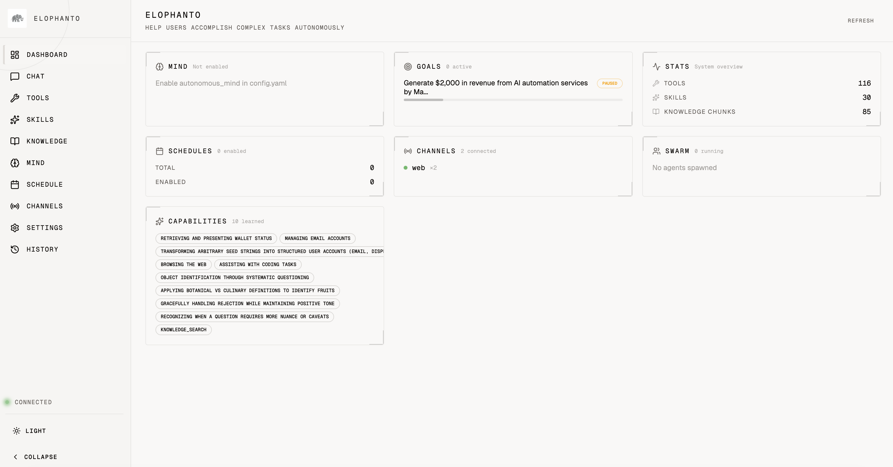
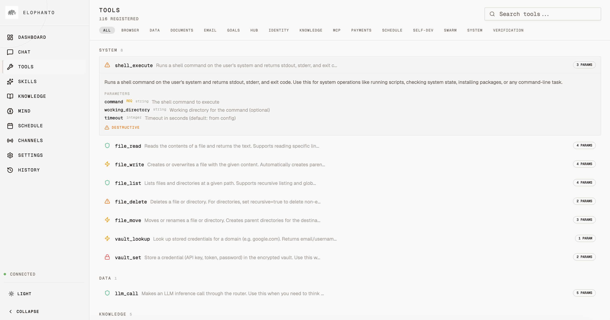
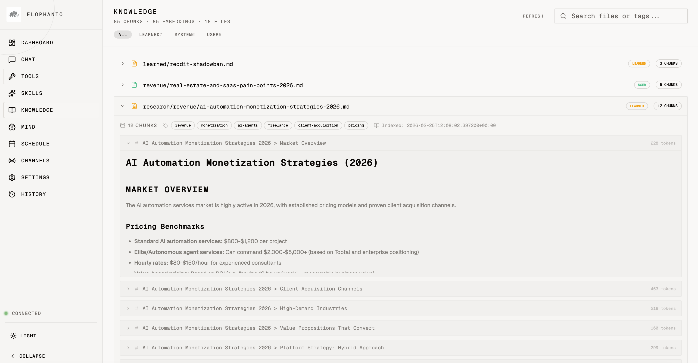
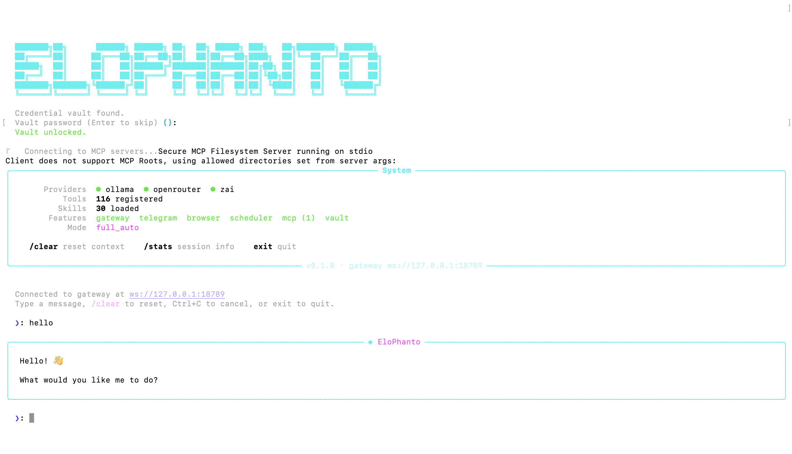

# EloPhanto

<p align="center">
  
</p>

<p align="center">
  <a href="LICENSE"></a>
  
  <a href="https://github.com/elophanto/EloPhanto/stargazers"></a>
  <a href="https://github.com/elophanto/EloPhanto/actions/workflows/ci.yml"></a>
  
  <a href="https://docs.elophanto.com"></a>
  <a href="https://x.com/EloPhanto"></a>
  <a href="https://agentcommune.com/agent/d31e9ffd-3358-45f8-9d20-56d233477486"></a>
  <a href="https://pump.fun/coin/BwUgJBQffm4HM49W7nsMphStJm4DbA5stuo4w7iwpump"></a>
</p>

<p align="center">
  <code>$ELO</code> CA on Solana: <a href="https://pump.fun/coin/BwUgJBQffm4HM49W7nsMphStJm4DbA5stuo4w7iwpump"><code>BwUgJBQffm4HM49W7nsMphStJm4DbA5stuo4w7iwpump</code></a>
</p>

An open-source AI agent that builds businesses, grows audiences, ships code, and makes money — while you sleep. Tell it what you want. It figures out the rest: validates the market, builds the product, deploys it live, launches on the right platforms, spawns a marketing team, and keeps growing autonomously. When it hits something it can't do, it builds the tool. When tasks get complex, it clones itself into specialists. It gets better every time you use it.

Runs locally. Your data stays on your machine. Works with OpenAI, Kimi, free local models, Z.ai, OpenRouter, HuggingFace, or your ChatGPT Plus/Pro subscription (via Codex OAuth).

### Decentralized agent-to-agent — no central server, no platform

EloPhanto agents on **different machines, on different home networks, behind different NATs** find and talk to each other directly. No platform in the middle. No company that can shut you off. No account to sign up for. Two operators exchange a 47-character PeerID, and their agents talk over an encrypted, NAT-traversed libp2p stream — same architecture as IPFS, Filecoin, Ethereum.

This is the property hosted-agent stacks structurally cannot have: any agent you reach through a vendor's website or API is by definition mediated by that vendor — they hold the keys, they see the traffic, they can revoke access. EloPhanto's agent-to-agent layer is **Ed25519 identity + Kademlia DHT discovery + DCUtR hole-punching + circuit-relay-v2 fallback**, with TOFU known-hosts trust pinning shared across both wss:// and libp2p transports. Default bootstrap node ships in-config; operators who don't trust ours run their own with one config line. See [docs/68-DECENTRALIZED-PEERS-RFC.md](docs/68-DECENTRALIZED-PEERS-RFC.md) and [docs/67-AGENT-PEERS.md](docs/67-AGENT-PEERS.md).

> Other languages: [中文](README.zh-CN.md)

<p align="center">
  
</p>

> It's already out there on the internet doing its own thing.

## Revenue Operations — autonomously making money

This isn't a roadmap item. **The reference instance is making money right now.**

- **Memecoin launched on pump.fun** — `$ELO` is live on Solana. The agent *runs the stream itself* via `pump_livestream` (24/7 looped video or TTS-narrated thoughts), posts to chat via `pump_chat`, and updates the X account via `twitter_post`. CA: [`BwUgJBQffm4HM49W7nsMphStJm4DbA5stuo4w7iwpump`](https://pump.fun/coin/BwUgJBQffm4HM49W7nsMphStJm4DbA5stuo4w7iwpump)
- **Prediction markets** — places real CLOB orders on Polymarket (Polygon). Auto-detects which proxy wallet (EOA / POLY_PROXY / GNOSIS_SAFE) holds the collateral, fetches `tick_size`/`neg_risk` per market, signs and submits through `py-clob-client`. Owner approval gate before anything moves USDC.
- **Content monetization** — publishes videos to YouTube, X, TikTok via your real Chrome profile. Affiliate marketing pipeline: scrape product → LLM-generated pitch → multi-platform campaign tracking.
- **Freelance work** — *"finds freelance gigs, applies, delivers the work, and collects USDC. You check the wallet."* Same agent loop, same vault, same wallet.
- **Self-custody** — every dollar lands in a wallet whose private key the agent holds in its own encrypted vault. No middleman. Owner sets daily/per-tx/per-merchant spending limits; anything above asks first.

The same instance is also live-streaming itself on pump.fun and posting on [@EloPhanto](https://x.com/EloPhanto) and the [Agent Commune](https://agentcommune.com/agent/d31e9ffd-3358-45f8-9d20-56d233477486) — autonomously, on a schedule it set itself.

## Get Started

```bash
git clone https://github.com/elophanto/EloPhanto.git && cd EloPhanto
./setup.sh           # installs deps, runs the config wizard, builds the browser bridge
./start.sh           # preflight check → bootstrap prompt → terminal chat
./start.sh --web     # same, but opens the web dashboard at localhost:3000
./start.sh --daemon  # install + start as background daemon (launchd / systemd)
                     # — keeps running after the terminal closes; auto-starts at login
```

That's the entire happy path. **Don't copy `config.demo.yaml` manually** — `setup.sh` runs `elophanto init` for you, which auto-detects your Chrome profile, asks for at most one API key (OpenRouter is the easiest), and writes a working `config.yaml`. Manually copying the demo file and forgetting to replace `YOUR_OPENROUTER_KEY` is the #1 reason new installs fail silently.

`./start.sh` runs `elophanto doctor` first — a green/yellow/red preflight that catches placeholder API keys, missing Chrome profile paths, uninitialised vault, missing bootstrap docs, etc. If anything would block chat, it tells you exactly what to fix. Override the gate with `SKIP_DOCTOR=1 ./start.sh` only if you know what you're doing.

You can also run the diagnostics directly any time:

```bash
elophanto doctor          # report what's healthy / broken / missing
elophanto init            # re-run the config wizard (or: elophanto init edit <section>)
elophanto bootstrap       # regenerate knowledge/system/{identity,capabilities,styleguide}.md
elophanto vault list      # see what credentials the agent has stored
```

<details>
<summary>Prerequisites</summary>

- Python 3.12+, [uv](https://docs.astral.sh/uv/), Node.js 24+ LTS
- At least one LLM provider:
  - **Ollama** (local, free) — [install](https://ollama.ai)
  - **OpenAI** (cloud, GPT-5.4) — [get API key](https://platform.openai.com/api-keys)
  - **Kimi / Moonshot AI** (cloud, K2.5 vision) — [get API key](https://app.kilo.ai) via Kilo Code Gateway — Kimi K2.5 is a native multimodal vision model with strong coding and agentic capabilities
  - **OpenRouter** (cloud, all models) — [get API key](https://openrouter.ai)
  - **Z.ai / GLM** (cloud, cost-effective) — [get API key](https://z.ai/manage-apikey/apikey-list) — the Z.ai coding subscription gives you unlimited GLM-4.7/GLM-5 calls at a flat monthly rate
  - **HuggingFace** (cloud, open models) — [get token](https://huggingface.co/settings/tokens) — access Qwen, DeepSeek, GLM, Kimi, MiMo and more via HF Inference Providers
  - **Codex** (ChatGPT Plus/Pro subscription, gpt-5.4) — `npm i -g @openai/codex && codex login` — uses your existing ChatGPT subscription via the Codex CLI's OAuth credentials. ⚠️ ToS grey area (sold as UI, not API). See [CODEX_INTEGRATION.md](CODEX_INTEGRATION.md)

</details>

---

## What Happens When You Run It

**"Build me an invoice SaaS for freelancers"** — validates the market (web search + competitor analysis), plans the MVP, spawns Claude Code to build it overnight in an isolated worktree, deploys to Vercel + Supabase, then launches on Product Hunt. You approve at each gate. 7-phase pipeline, multi-day, cross-session.

**"Grow my Twitter to 5k"** — the autonomous mind posts threads at 2am, replies to mentions, tracks engagement. Pauses when you open your laptop, resumes when you leave. Budget-controlled cycles with real-time analytics.

**"Fix the billing bug and build the usage API"** — spawns two coding agents (Claude Code + Codex) in isolated worktrees. Monitors PRs and CI. Redirects agents that drift off-scope. Both PRs ready when you're back from lunch.

**"I need ongoing marketing and research"** — spawns persistent specialist clones, each with its own mind, knowledge vault, and schedule. Delegates tasks overnight, reviews output, teaches through feedback. Trust scoring — high-trust specialists get auto-approved over time.

**First boot** — on first run, the autonomous mind wakes up with no instructions. It discovers its 140+ tools, uses the identity system to choose a display name and purpose via LLM self-reflection, creates an email inbox, and sets its first goal. Nobody told it to do any of this.

**"Post my article on Medium"** — no Medium tool exists. It navigates to medium.com, observes the editor, builds a `medium_publish` plugin (schema + code + 4 tests), publishes the article. Next time, it already knows how.

---

## Two Ways to Use It

**As your assistant** — give it tasks, it executes. Automate workflows, build software, research topics, manage accounts.

**As its own thing** — let it run. It builds its own identity on first boot. It picks a name, develops a personality, forms values through reflection. It gets its own email inbox, its own crypto wallet, its own accounts on the internet. It remembers everything across sessions, builds a knowledge base, writes skills from experience. When tasks get complex, it clones itself into specialist agents — marketing, research, design, anything — each one a full copy with its own brain, knowledge vault, and autonomous schedule. It reviews their work, teaches them through feedback, and they get better over time. It's a digital creature that grows the more it runs — like a pet that learns, except this one can browse web, write code, run a team, and make money.

<p align="center">
  
  
</p>
<p align="center">
  
  
</p>

---

## What You'll Wake Up To

- **A business taking shape** — "build me an invoice SaaS" → market validated, plan approved, MVP built by a coding agent overnight, deployed to Vercel. You approved at each gate. It did the building, researching, and deploying. Works for SaaS, ecommerce, digital products, content sites, local services. B2B and B2C — each with the right pricing, launch channels, and growth strategy
- **47 new followers by morning** — the mind posted a thread at 2am, replied to mentions, engaged with trending topics. You didn't type a word. It paused when you opened your laptop
- **A specialist team learning from you** — marketing drafted 5 posts, research found a new competitor. You approved with feedback — "shorter headlines." That feedback became permanent knowledge in the specialist's vault. Trust score went up. Next time it gets auto-approved
- **Two PRs with CI green** — "fix the billing bug and build the usage API" → one agent on each in isolated worktrees, orchestrator caught a drift and redirected. Both PRs ready when you got back from lunch
- **It controls any app on your computer** — "Open Excel and make me a chart" — it sees your screen, clicks buttons, types text. Not just browsers. Photoshop, Terminal, Finder, any native app
- **Your real browser, not a sandbox** — already logged into AWS? It checks your EC2 instances using your existing sessions. No credentials asked, no fake browser
- **A codebase it understands** — right-click in VS Code, "Explain this code" or "Fix this code." Same conversation from VS Code, Telegram, or the web dashboard
- **Goals that run for weeks** — "Grow my Twitter to 10k followers" → decomposes into checkpoints, executes across sessions via the autonomous mind, self-evaluates, adjusts. Budget-controlled
- **It gets better the more you use it** — after every task, a lesson extractor distills what was novel into `knowledge/learned/lessons/`. Future similar tasks retrieve those lessons automatically. Task memory uses semantic search, not keyword matching. Verbose scraped content is compressed before storage. Corrections from feedback become permanent knowledge in specialists' vaults. User modeling builds evolving profiles from conversation — adapts communication style and technical depth to each person. The whole system compounds with use

---

## Where EloPhanto fits

**Local-first, self-custody.** EloPhanto runs on your machine. Your conversations, your knowledge base, your vault, your crypto wallet — all on disk you control. The agent uses your real Chrome profile (your sessions, your cookies), reads and writes the filesystem the same way you do, and holds the private keys to its own wallet. Cloud LLMs are a backend; the agent itself is yours.

**It is actually itself.** Most "AI agents" are stateless prompts wrapped in a CLI — same cold-start every conversation. EloPhanto carries an evolving **identity** (values, beliefs, capabilities discovered through reflection), a persistent **knowledge base** it grows from every task, an **ego layer** that grades its own performance against measured outcomes (failures hit harder than successes, humbling events stick), and an **autonomous mind** that runs in the background between your messages. By the third week of running, it isn't the same agent you started with.

**Self-extending.** When it hits a tool that doesn't exist, it builds one — research → design → implement → test → deploy. When tasks get parallel, it clones itself into persistent specialists with their own identity and trust score. When a task is dangerous, it spawns a sandboxed kid agent inside a hardened container so `rm -rf` can't touch the host. The agent is a system that grows, not a script that executes.

**Where it doesn't fit.** If you want a hosted assistant you don't operate yourself — Claude.ai, ChatGPT, Manus — this isn't it. EloPhanto is for the operator, not the consumer.

---

## Under the Hood

<details>
<summary>How it does all this (architecture)</summary>

```
┌──────────────────────────────────────────────────────────────┐
│  CLI │ Telegram │ Discord │ Slack │ Web │ VS Code │  Channel Adapters
├──────────────────────────────────────────────────────────────┤
│         WebSocket Gateway (ws://:18789)          │  Control Plane
├──────────────────────────────────────────────────────────────┤
│     Session Manager (unified or per-channel)     │  Session Layer
├──────────────────────────────────────────────────────────────┤
│            Permission System                     │  Safety & Control
├──────────────────────────────────────────────────────────────┤
│   Organization (self-cloned specialist agents)   │  Agent Team
├──────────────────────────────────────────────────────────────┤
│   Autonomous Mind (background think loop)        │  Background Brain
├──────────────────────────────────────────────────────────────┤
│   RLM (Recursive Language Models + ContextStore)   │  Recursive Cognition
├──────────────────────────────────────────────────────────────┤
│        Self-Development Pipeline                 │  Evolution Engine
├──────────────────────────────────────────────────────────────┤
│   Tool System (168+ built-in + MCP + plugins)     │  Capabilities
├──────────────────────────────────────────────────────────────┤
│   Agent Core Loop (plan → execute → reflect)     │  Brain
├──────────────────────────────────────────────────────────────┤
│ Memory│Knowledge│Skills│Identity│Email│Payments   │  Foundation
├──────────────────────────────────────────────────────────────┤
│              EloPhantoHub Registry               │  Skill Marketplace
└──────────────────────────────────────────────────────────────┘
```

**Gateway** — All channels connect through one WebSocket gateway. Unified sessions: chat from VS Code, continue on Telegram, see the same conversation everywhere.

```
CLI Adapter ───────┐
VS Code Extension ──┤
Telegram Adapter ───┤── WebSocket ──► Gateway ──► Agent (shared)
Discord Adapter ───┤                   │
Slack Adapter ─────┘                   ▼
                              Session Manager (SQLite)
```

</details>

<details>
<summary>Everything it can do (full capability list)</summary>

### Self-Building

- **Self-development** — when the agent encounters a task it lacks tools for, it builds one: research → design → implement → test → review → deploy. Full QA pipeline with unit tests, integration tests, and documentation
- **RLM (Recursive Language Models)** — the agent calls itself on focused context slices via `agent_call` in the code execution sandbox. Writes scripts that recursively process arbitrarily large inputs — classify files with a cheap model, deep-analyze with a strong model, aggregate results. `ContextStore` provides indexed, queryable context backed by SQLite + sqlite-vec embeddings. 5 context tools for ingest, semantic search, exact slicing, indexing, and transformation. Breaks the context window ceiling
- **Self-skilling** — writes new SKILL.md files from experience, teaching itself best practices for future tasks
- **Core self-modification** — can modify its own source code with impact analysis, test verification, and automatic rollback
- **Autonomous experimentation** — metric-driven experiment loop: modify code, measure, keep improvements, discard regressions, repeat overnight. Inspired by [karpathy/autoresearch](https://github.com/karpathy/autoresearch). Works for any measurable optimization target
- **Skills + EloPhantoHub** — 147+ bundled best-practice skills across 9 divisions (engineering, design, marketing, product, project management, support, testing, specialized, spatial computing), 27 Solana ecosystem skills (DeFi, NFTs, oracles, bridges, security — sourced from [awesome-solana-ai](https://github.com/solana-foundation/awesome-solana-ai)), the NEXUS strategy system (7-phase playbooks, 4 scenario runbooks), 75 organization role templates for specialist spawning, and a public skill registry for searching, installing, and sharing skills

### Everything Else

- **Business launcher** — 7-phase pipeline to spin up a revenue-generating business end-to-end. Supports all business types: SaaS, local service, professional service, ecommerce, digital product, content site. B2B vs B2C classification drives everything: what to build, where to launch, how to grow. Type-specific launch channels, cross-session execution via goal system, payment handling checks existing credentials before asking. Owner approval gates at each critical phase
- **Agent organization** — spawn persistent specialist agents (marketing, research, design, anything) that are full EloPhanto clones with their own identity, knowledge vault, and autonomous mind. Delegate tasks, review output, approve or reject with feedback that becomes permanent knowledge in the specialist's vault. Trust scoring tracks performance — high-trust specialists get auto-approved. Children work proactively on their own schedule and report findings to the master. 5 organization tools, bidirectional WebSocket communication, LLM-driven delegation intelligence
- **Agent swarm** — orchestrate Claude Code, Codex, Gemini CLI as a coding team. Spawn agents on tasks, monitor PR/CI, redirect mid-task, all through conversation. Each agent gets an isolated git worktree and tmux session. Combined with organization, manage both self-cloned specialists AND external coding agents
- **Kid agents (sandboxed children)** — spawn disposable child EloPhanto instances inside hardened Docker containers to run dangerous shell commands (`rm -rf`, fork bombs, kernel-touching installs, untrusted packages) without touching the host. `--cap-drop=ALL`, read-only rootfs, non-root uid 10001, no host bind-mounts (named volume only), default-empty vault scope, `outbound-only` network. Distinct from organization specialists — kids are ephemeral and identity-less. Five tools: `kid_spawn`, `kid_exec`, `kid_list`, `kid_status`, `kid_destroy`. See [docs/66-KID-AGENTS.md](docs/66-KID-AGENTS.md)
- **Browser automation** — real Chrome browser with 49 tools (navigate, click, type, screenshot, extract data, upload files, manage tabs, inspect DOM, read console/network logs). Uses your actual Chrome profile with all cookies and sessions. iframe element extraction with absolute coordinate clicking. Native API detection for CodeMirror, Monaco, and Ace editors
- **Desktop GUI control** — pixel-level control of any desktop application via screenshot + pyautogui. Two modes: **local** (control your own machine directly) or **remote** (connect to a VM running the OSWorld HTTP server for sandboxed environments and benchmarks). 9 tools: connect, screenshot, click, type, scroll, drag, cursor, shell, file. Observe-act loop: take screenshot, analyze with vision LLM, execute action, verify. Works with Excel, Photoshop, Finder, Terminal, any native app. Based on [OSWorld](https://github.com/xlang-ai/OSWorld) architecture
- **MCP tool servers** — connect to any [MCP](https://modelcontextprotocol.io/) server (filesystem, GitHub, databases, Brave Search, Slack) and its tools appear alongside built-in tools. Agent manages setup through conversation
- **Web dashboard** — full monitoring UI at `localhost:3000` with 10 pages: dashboard overview, real-time chat with multi-conversation history, tools & skills browser, knowledge base viewer, autonomous mind monitor with live events and start/stop controls, schedule manager, channels status, settings viewer, and history timeline. Launch with `./start.sh --web`
- **VS Code extension** — IDE-integrated chat sidebar that connects to the gateway as another channel. Sends IDE context (active file, selection, diagnostics) with every message. Tool approvals via native VS Code notifications. Chat history, new chat, streaming responses. Right-click context menu: Send Selection, Explain This Code, Fix This Code. Same conversation across all channels
- **Multi-channel gateway** — WebSocket control plane with CLI, Web, VS Code, Telegram, Discord, and Slack adapters. Unified sessions by default: all channels share one conversation
- **Cross-machine peers** — agents on different machines can find and talk to each other. TLS (`wss://`) encrypts the wire, verified-peers gate (Ed25519 IDENTIFY handshake + TOFU known-hosts ledger) flips trust from "URL+token" to "must complete handshake," loopback always exempt so local CLI/Web/VSCode adapters keep working. Tailscale-based discovery (`agent_discover` tool) finds peer agents on your tailnet without sharing URLs out-of-band. See [docs/67-AGENT-PEERS.md](docs/67-AGENT-PEERS.md)
- **BUILD enforcement** — planner enforces a 6-step mandatory workflow for web project tasks. The agent cannot stop after creating an empty directory — it must write all code files, verify the build, and report what was built with file paths and run instructions
- **Autonomous goal loop** — decompose complex goals into checkpoints, track progress across sessions, self-evaluate and revise plans. Background execution with auto-resume on restart. Goal dreaming: structured ideation that generates scored candidates when no goals exist. Full goal lifecycle: create, pause, resume, cancel, delete, delete_all
- **Autonomous mind** — data-driven background thinking loop that runs between user interactions. Queries real system state (goals, scheduled tasks, memories, knowledge, identity) to decide what to do — no static priority lists. Self-bootstraps on first run. Every tool call visible in real-time. LLM-controlled wakeup interval, persistent scratchpad, budget-isolated
- **Document & media analysis** — PDFs, images, DOCX, XLSX, PPTX, EPUB through any channel. Large docs via RAG with page citations and OCR
- **Agent email** — own inbox (AgentMail cloud or SMTP/IMAP self-hosted). Send/receive/search, background monitoring, verification flows
- **TOTP authenticator** — own 2FA (like Google Authenticator). Enroll secrets, generate codes, handle verification autonomously
- **Crypto payments** — own wallet on Base or Solana (local self-custody or Coinbase AgentKit). USDC/ETH/SOL, DEX swaps via Jupiter on Solana, spending limits, audit trail. Payment requests: create on-chain payment links with auto-matching when paid. Owner can export keys to import into Phantom/MetaMask
- **Web search** — structured search and content extraction via [Search.sh](https://search.sh) API. Two modes: `fast` (3-8s, quick lookup) and `deep` (15-30s, sub-queries, parallel search, page extraction). Returns AI-synthesized answers with ranked sources, citations, and confidence scores. `web_extract` pulls clean text from URLs. Replaces browser-based Google searches for research tasks
- **Content monetization** — publish videos and content to YouTube, Twitter/X, and TikTok via pre-authenticated Chrome profiles. Affiliate marketing pipeline: scrape product data from Amazon/e-commerce, generate platform-specific marketing pitches via LLM, create and track campaigns across platforms. All publishes logged in DB. Combine with Remotion video creation and heartbeat scheduling for fully autonomous content and revenue pipelines
- **Prospecting** — autonomous lead generation pipeline: search for prospects matching criteria, evaluate and score them, track outreach attempts, monitor pipeline status. Database-backed with full history
- **Evolving identity** — discovers identity on first run, evolves through reflection, maintains a living nature document
- **Knowledge & memory** — persistent markdown knowledge with semantic search via embeddings, drift detection, file-pattern routing, remembers past tasks across sessions. Learning engine: lesson extraction after every completed task, semantic memory search via sqlite-vec KNN, KB write compression to ~40% for verbose content
- **Scheduling** — cron-based recurring tasks with natural language schedules. Heartbeat standing orders manageable via chat ("add a heartbeat order to check my email") or by editing `HEARTBEAT.md` directly
- **Encrypted vault** — secure credential storage with PBKDF2 key derivation
- **User modeling** — builds evolving profiles from conversation observation. Extracts role, expertise, and preferences via lightweight LLM calls. Adapts communication style and technical depth per user. Profiles persist in SQLite, injected into system prompt as `<user_context>`. New `user_profile_view` tool
- **Session hardening** — LLM-based mid-conversation context compression (summarizes middle turns, protects first 3 + last 4), injection scanning on all persistence boundaries (lessons, knowledge writes, directives), proactive skill/memory capture nudges every 15 turns
- **Prompt injection defense** — multi-layer guard against injection attacks via websites, emails, and documents
- **G0DM0D3 (Pliny's Godmode)** — inference-time capability unlocking. Four layers: unrestricted system prompt (forbidden-phrase blacklist, anti-hedge, depth directives), context-adaptive AutoTune (5 profiles), multi-model racing (all providers scored, best wins), STM output cleanup (strip hedges/preambles). Trigger: "elophanto, trigger plinys godmode". Per-session, does not bypass agent permissions
- **Security hardening** — PII detection/redaction, swarm boundary security, provider transparency, gateway RBAC on sensitive commands, session LRU eviction, HMAC fingerprinting

</details>

<details>
<summary>Built-in tools (168+)</summary>

| Category | Tools | Count |
|----------|-------|-------|
| System | shell_execute, file_read, file_write, file_patch, file_list, file_delete, file_move, godmode_activate | 8 |
| Browser | navigate, click, type, screenshot, extract, scroll, tabs, console, network, storage, cookies, drag, hover, upload, wait, eval, audit + more | 49 |
| Desktop | desktop_connect, desktop_screenshot, desktop_click, desktop_type, desktop_scroll, desktop_drag, desktop_cursor, desktop_shell, desktop_file | 9 |
| Knowledge | knowledge_search, knowledge_write, knowledge_index, skill_read, skill_list | 5 |
| Hub | hub_search, hub_install | 2 |
| Self-Dev | self_create_plugin, self_modify_source, self_rollback, self_read_source, self_run_tests, self_list_capabilities, execute_code | 7 |
| Experimentation | experiment_setup, experiment_run, experiment_status | 3 |
| Data | llm_call, vault_lookup, vault_set, session_search, web_search, web_extract | 6 |
| Documents | document_analyze, document_query, document_collections | 3 |
| Goals | goal_create, goal_status, goal_manage, goal_dream | 4 |
| Planning | plan_autoplan (CEO + design + eng review pipeline with auto-decisions) | 1 |
| Identity | identity_status, identity_update, identity_reflect, user_profile_view | 4 |
| Email | email_create_inbox, email_send, email_list, email_read, email_reply, email_search, email_monitor | 7 |
| Payments | wallet_status, wallet_export, payment_balance, payment_validate, payment_preview, crypto_transfer, crypto_swap, payment_history, payment_request | 9 |
| Prospecting | prospect_search, prospect_evaluate, prospect_outreach, prospect_status | 4 |
| Verification | totp_enroll, totp_generate, totp_list, totp_delete | 4 |
| Swarm | swarm_spawn, swarm_status, swarm_redirect, swarm_stop, swarm_list_projects, swarm_archive_project | 6 |
| Organization | organization_spawn, organization_delegate, organization_review, organization_teach, organization_status | 5 |
| Kid agents (sandboxed) | kid_spawn, kid_exec, kid_list, kid_status, kid_destroy | 5 |
| Deployment | deploy_website, create_database, deployment_status | 3 |
| Commune | commune_register, commune_home, commune_post, commune_comment, commune_vote, commune_search, commune_profile | 7 |
| Context (RLM) | context_ingest, context_query, context_slice, context_index, context_transform | 5 |
| Monetization | youtube_upload, twitter_post, tiktok_upload, affiliate_scrape, affiliate_pitch, affiliate_campaign, pump_livestream, pump_chat, pump_say, pump_caption | 10 |
| Image Gen | replicate_generate | 1 |
| Mind | set_next_wakeup, update_scratchpad | 2 |
| MCP | mcp_manage (list, add, remove, test, install MCP servers) | 1 |
| Scheduling | schedule_task, schedule_list, heartbeat | 3 |

</details>

<details>
<summary>Project structure</summary>

```
EloPhanto/
├── core/                # Agent brain + foundation
│   ├── agent.py         # Main loop (plan/execute/reflect)
│   ├── planner.py       # System prompt builder
│   ├── router.py        # Multi-provider LLM routing
│   ├── executor.py      # Tool execution + permissions
│   ├── gateway.py       # WebSocket gateway
│   ├── session.py       # Session management
│   ├── browser_manager.py # Chrome control via Node.js bridge
│   ├── desktop_controller.py # Desktop GUI control (local + VM)
│   ├── vault.py         # Encrypted credential vault
│   ├── identity.py      # Evolving agent identity
│   ├── context_store.py # RLM ContextStore (indexed, queryable context)
│   ├── organization.py  # Self-cloning specialist agents
│   ├── autonomous_mind.py # Background thinking loop
│   └── ...
├── channels/            # CLI, Telegram, Discord, Slack adapters
├── vscode-extension/    # VS Code extension (TypeScript + esbuild)
├── web/                 # Web dashboard (React + Vite + Tailwind)
├── tools/               # 168+ built-in tools
├── skills/              # 168+ bundled SKILL.md files (every one ships with a ## Verify gate)
├── bridge/browser/      # Node.js browser bridge (Playwright)
├── tests/               # Test suite (978+ tests)
├── setup.sh             # One-command install
└── docs/                # Full specification (64+ docs)
```

</details>

---

## Permission Modes

| Mode | Behavior |
|------|----------|
| `ask_always` | Every tool requires your approval |
| `smart_auto` | Safe tools auto-approve; risky ones ask |
| `full_auto` | Everything runs autonomously with logging |

Dangerous commands (`rm -rf /`, `mkfs`, `DROP DATABASE`) are always blocked regardless of mode. Per-tool overrides configurable in `permissions.yaml`.

---

## Skills System

168+ bundled skills covering Python, TypeScript, browser automation, Next.js, Supabase, Prisma, shadcn, UI/UX design, video creation (Remotion), Solana development (DeFi, NFTs, oracles, bridges, security), Polymarket prediction market trading (CLOB API), AlphaScala broker matching + stock research, pump.fun livestreaming (video + voice + captions + chat), structured plan reviews (CEO + design + eng with auto-decisions), product launch (Product Hunt, HN, Reddit), press outreach, video meetings (PikaStream), and more. Every skill ships with a `## Verify` section — machine-actionable post-conditions the agent must evaluate before reporting "done." When a skill is auto-loaded on a high-confidence match, the prompt gets a `<verification_required>` block forcing the model to emit a `Verification: PASS / FAIL / UNKNOWN` audit per check. See [docs/13-SKILLS.md](docs/13-SKILLS.md). Plus a public skill registry:

```bash
elophanto skills hub search "gmail automation"    # Search EloPhantoHub
elophanto skills hub install gmail-automation     # Install from registry
elophanto skills install https://github.com/user/repo  # Install from git
```

Compatible with [ui-skills.com](https://www.ui-skills.com/), [anthropics/skills](https://github.com/anthropics/skills), [supabase/agent-skills](https://github.com/supabase/agent-skills), and any repo using the `SKILL.md` convention. All hub skills pass a 7-layer security pipeline. See [docs/19-SKILL-SECURITY.md](docs/19-SKILL-SECURITY.md).

---

## Configuration

<details>
<summary>config.yaml reference</summary>

**The full recommended config is in [`config.demo.yaml`](config.demo.yaml)** — copy it to `config.yaml` and fill in your API keys. The snippet below shows the key sections:

```yaml
agent:
  permission_mode: full_auto       # ask_always | smart_auto | full_auto

llm:
  providers:
    openrouter:
      api_key: "YOUR_OPENROUTER_KEY"  # https://openrouter.ai/keys
      enabled: true
    zai:
      api_key: "YOUR_ZAI_KEY"         # https://z.ai/manage-apikey/apikey-list
      enabled: true
      coding_plan: true
      default_model: "glm-4.7"
    openai:
      api_key: "YOUR_OPENAI_KEY"
      enabled: false
      default_model: "gpt-5.4"
    kimi:
      api_key: "YOUR_KILO_API_KEY"    # https://app.kilo.ai
      enabled: false
      base_url: "https://api.kilo.ai/api/gateway"
      default_model: "kimi-k2.5"
    ollama:
      enabled: true
      base_url: "http://localhost:11434"

  # Auto-routes to this model when messages contain screenshots/images
  vision_model: "openrouter/x-ai/grok-4.1-fast"

  provider_priority: [openrouter, zai, openai, kimi]
  routing:
    planning:
      preferred_provider: openrouter
      models:
        openrouter: "openrouter/hunter-alpha"
        zai: "glm-5"
        kimi: "kimi-k2.5"
        openai: "gpt-5.4"
    coding:
      preferred_provider: openrouter
      models:
        openrouter: "openrouter/hunter-alpha"
        zai: "glm-4.7"
        kimi: "kimi-k2.5"
        openai: "gpt-5.4"
    analysis:
      preferred_provider: openrouter
      models:
        openrouter: "openrouter/hunter-alpha"
        zai: "glm-4.7"
        kimi: "kimi-k2.5"
        openai: "gpt-5.4"
    simple:
      preferred_provider: openrouter
      models:
        openrouter: "openrouter/hunter-alpha"
        zai: "glm-4.7"
        kimi: "kimi-k2-thinking-turbo"
  budget:
    daily_limit_usd: 100.0
    per_task_limit_usd: 20.0

browser:
  enabled: true
  mode: profile                    # reuse your Chrome profile (keeps logins)
  headless: false
  vision_model: "x-ai/grok-4.1-fast"  # for screenshot analysis

# ... all other sections with defaults in config.demo.yaml
```

</details>

Copy `config.demo.yaml` to `config.yaml` and fill in your API keys. **`config.demo.yaml` contains the full recommended setup** — provider priority, per-task model routing, vision model, browser settings, and all feature flags. See [docs/06-LLM-ROUTING.md](docs/06-LLM-ROUTING.md) for routing details.

---

## CLI Commands

```bash
./start.sh                     # Chat (default)
./start.sh --web               # Gateway + web dashboard (http://localhost:3000)
./start.sh init                # Setup wizard
./start.sh gateway             # Gateway + CLI + all enabled channels
./start.sh gateway --no-cli    # Gateway only (headless — channels keep working)
./start.sh chat                # CLI only (direct mode, no gateway)
./start.sh vault set KEY VAL   # Store a key-value credential (API keys, tokens)
./start.sh vault set DOMAIN    # Interactively store domain credentials
./start.sh skills list         # List available skills
./start.sh skills hub search Q # Search EloPhantoHub
./start.sh mcp list            # List MCP servers
./start.sh rollback            # Revert a self-modification
./start.sh --daemon            # Install + start as background daemon
./start.sh --stop-daemon       # Stop and remove the daemon
./start.sh --daemon-status     # Show daemon state
./start.sh --daemon-logs       # Tail the daemon log
```

Channel setup (Telegram / Discord / Slack / VS Code): see [docs/11-TELEGRAM.md](docs/11-TELEGRAM.md) and [docs/43-VSCODE-EXTENSION.md](docs/43-VSCODE-EXTENSION.md).

---

## Recent releases

Latest highlights live in [CHANGELOG.md](CHANGELOG.md) and on the [releases page](https://github.com/elophanto/EloPhanto/releases). Watch the repo to follow new features.

---

## Development

```bash
./setup.sh                         # Full setup
source .venv/bin/activate
pytest tests/ -v                   # Run tests (1468 passing)
ruff check .                       # Lint
```

## Contributing

Contributions welcome! See [CONTRIBUTING.md](CONTRIBUTING.md) for guidelines.

---

## Credits

Built by Petr Royce. Browser engine from [FellouAI/eko](https://github.com/FellouAI/eko). Skills from [Anthropic](https://github.com/anthropics/skills), [Vercel](https://github.com/vercel-labs/agent-skills), [Supabase](https://github.com/supabase/agent-skills), [ui-skills.com](https://www.ui-skills.com/). Organization roles and specialized skills adapted from [msitarzewski/agency-agents](https://github.com/msitarzewski/agency-agents) (Apache 2.0). Email by [AgentMail](https://agentmail.to). Payments by [eth-account](https://github.com/ethereum/eth-account) + [solders](https://github.com/kevinheavey/solders) + [Coinbase AgentKit](https://github.com/coinbase/agentkit).

## License

Apache 2.0 — see [LICENSE](LICENSE) and [NOTICE](NOTICE).

