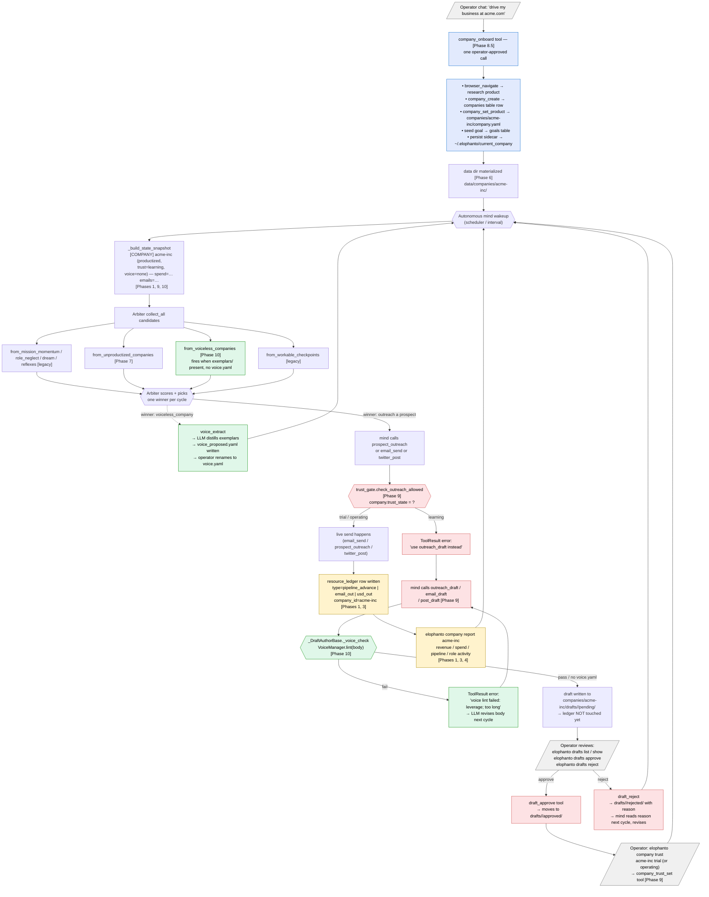

# 76 — ABE Framework: EloPhanto as an Autonomous Business Entity

**Status**: Plan · **Owner**: Petr Royce + Claude + GPT-5.5 · **Started**: 2026-05-24

> **Concept attribution**: The Autonomous Business Entity (ABE) framing —
> EloPhanto playing one identity that wears role masks, with a general
> typed ledger as the honest progress signal, missions as role mandates,
> product YAML as the steering anchor, and verification-first phased
> rollout — was originated by **Petr Royce** in 2023. The
> implementation in this codebase (Phases 1-8) was built collaboratively
> in May 2026 with Claude and GPT-5.5 to Petr's design.

> **Re-reading this doc**: jump to **Current Status** at the bottom for what's
> done and what's next. The body is the design contract — re-read top to
> bottom before starting any new phase so the load-bearing constraints
> (single identity, general ledger, reuse-first) stay in front of you.

## Verification failure log

Recording the verification gaps that surfaced after a phase was
declared "done." Each entry is an institutional-memory artifact —
the corresponding rule below is the durable lesson.

| Date | Phase | Symptom | Root cause | Rule that would have caught it |
|---|---|---|---|---|
| 2026-05-25 | 1-7 | Operator-side CLI worked; chat-side agent had no ABE tools | Built CLI commands without matching agent tools; chat operator can't drive ABE | **Check operator surface AND agent surface before declaring a phase shipped** |
| 2026-05-25 | Awareness fix (post-Phase 8) | Agent kept reconstructing "companies" from memory after the awareness-block patch | `personality.items()` crashed `build_identity_context` on the live DB (personality was a string, not a dict); `try/except: pass` in `Agent._build_prompt` swallowed it; entire identity injection was empty for production | **Test the fix against the live data shape, not just synthetic fixtures** + **silent excepts around prompt assembly hide production bugs** |
| 2026-05-25 | 2/7/8 | `company_list` returned "not initialized" even after awareness fix; ABE init silently never ran in the agent process | `self._project_root` referenced in Agent init but Agent only sets `self._config.project_root` — AttributeError swallowed by a try/except at the goal-init outer boundary; role_manager, company_manager, and every ABE tool's deps stayed None | **Integration test that exercises `Agent.initialize()` end-to-end** + **silent try/except around init code is the same anti-pattern as around prompt assembly — convert ALL such swallows to logged warnings with exc_info=True** |
| 2026-05-26 | 1-8 (workflow) | Operator asks "I have a business on alphascala.com, drive it" → agent responds conversationally; autonomous mind keeps writing to elophanto-self even after operator switches; LLM has to chain 4 separate tool calls correctly with no orchestration tool; no PRODUCT/COMPANY block in state snapshot so the mind has no awareness of which ABE it's operating | Built tools without building the **operator workflow** on top of them. Phase 8 added 11 chat-callable tools but no single-call orchestrator for the canonical intent. Mind didn't refresh company contextvar per cycle. State snapshot had no companies block. Awareness block named the tools but didn't name the **intent**. | **Build the workflow on top of the primitives, not just the primitives.** Don't declare a phase shipped until you can write down the one-line operator request that exercises the whole thing end-to-end and trace what the LLM will do without operator hand-holding. Senior reviews must ask: "what is the canonical user request that proves this works, and what does the LLM actually do when it arrives?" |
| 2026-05-26 | 1-8 (tool visibility) | Operator asked technically "is it perfectly connected?" — verified that all 12 ABE tools (`company_*`, `role_*`) had group `companies` / `roles` which were **NOT in any default profile** in `core/tool_profiles.py:DEFAULT_PROFILES`. Result: the LLM literally never received the tool schemas. `company_list` calls in earlier screenshots worked through some other path (likely a chat code path that bypassed profile filtering); the planning task path was silently broken. Same gap affected `missions` and `prospecting` groups going back to those features' original phases. | **Built tools without verifying the LLM actually receives their schemas.** Tier defaults to PROFILE, and PROFILE tools only ship to the LLM when `group ∈ profile.allowed_groups`. New groups MUST be added to a profile or marked CORE; otherwise the registration + injection + awareness all happen but the LLM never sees the tool. | **Always run `filter_tools_by_profile(all_tools, "full", DEFAULT_PROFILES)` and grep for your new group after registering tools.** Added regression test `test_abe_tools_visible_to_llm` that pins both legs (CORE entry points + `full` profile includes the rest). The fix promoted `company_list` / `company_report` / `company_onboard` / `role_list` to CORE (always visible — 4 schemas per call) and added `companies` / `roles` / `missions` / `prospecting` to `full`. |
| 2026-05-27 | 9-11 (workflow in code) | Phases 9, 10, 11 each grew a new section in `core/identity.py`'s awareness block (Sections 5-8: trust ladder / drive my business / voice contract / strategy pipeline). 3 KB of fixed prompt shipped on every LLM call regardless of intent. Operator caught it during the live test: *"i don't understand why didn't you build these as skills. seems like you just add prompts to code."* Composition also failed — "drive my EXISTING business with no active strategy" fell through both Section 6 (onboard — company exists) and Section 8 (post-onboard — no rule for pre-existing) so the agent went into `goal_create` slop. | **Built workflows as awareness prompt instead of as skills.** Skills have triggers + procedure + verification + composability via `[[ref]]` and load only on trigger match. Awareness sections ship on every call, can't be tested in isolation, and don't compose across overlapping intents. | **When a phase adds a workflow (intent → procedure), it must be a SKILL.md with triggers + procedure + verify — NOT a new awareness-block section.** Refactored: extracted 4 workflow skills (`drive-business`, `trust-ladder-workflow`, `voice-extraction-workflow`, `strategy-pipeline`), collapsed Sections 5-8 into a 1.4 KB pointer-card listing the skills by slug. Test `test_block_points_at_workflow_skills` now pins the skill names in the awareness, not the workflow text. |
| 2026-05-27 | Phase 11 (prompt scale) | Live test of "drive elophanto.com" hung at step 4 — codex/gpt-5.5 timed out after 5 min waiting on a 210+ KB prompt (147 KB system + 65 KB tool schemas + N KB messages). Pre-ABE prompts at this scale worked; the ABE additions (12 new CORE tools + 4 new verbose SKILL.md files getting `skill_read`ed into messages + larger state snapshot) pushed cumulative context past some provider threshold. Operator: *"you may be sending WAY too large prompts which means it's not scalable. it never got stuck before."* | **Shipped CORE-tier expansions and verbose workflow skills without profiling per-call prompt size.** Tool schemas (~700 chars each at avg) compound fast: every CORE add ships in every LLM call forever. Verbose SKILL.md content compounds across multi-step turns because `skill_read` puts the full body into messages. | **Profile per-call prompt size BEFORE shipping a phase that adds CORE-tier tools or large new skill files.** A budget conversation should accompany every CORE addition. CORE tier 28 → 22 (6 ABE tools moved to PROFILE while remaining accessible under their group's profile); verbose tool descriptions tightened; 4 new ABE skills cut ~60% body size; recommended-skills `top_k` 5 → 3. Net ~10-15 KB at step 1, ~20-30 KB over a multi-step turn. Re-run worked, all LLM responses 3-15s. |
| 2026-05-27 | Phase 11 (operator UX) | First successful Phase 11 run produced a strategy focused only on `/hire` (the declared `what_we_sell`) and ignored the OTHER active surfaces — X growth, Pump.fun livestream, Polymarket monitor — all of which the agent operates under `elophanto-self`. Operator: *"the review part is not good enough"*. Strategy generator had no signal about existing operational state. | **`company_plan` had no way to see what the company is already doing.** It only read `company.yaml` + `strategy_inputs`. | **Added `_build_operational_context(db, company_id)` that deterministically prepends ACTIVE SCHEDULES + last-7d ledger sums + prospect funnel + active missions to the LLM context BEFORE the planning call.** Prompt instructions added a SURFACE COVERAGE directive: *"strategy MUST address every distinct surface listed in OPERATIONAL CONTEXT, not just `what_we_sell`."* Multi-surface businesses now get multi-surface strategies. |
| 2026-05-27 | Phase 11 (input collection) | `drive-business` PATH B step 2 said *"ask the operator for strategy_inputs"* — putting the operator in fill-the-blanks mode for audience / competitors / USPs / etc. Operator: *"we should improve it and add recommendations there also. it can do research for pretty much all of it to provide really good recommendation."* | **Treated operator as data-entry, not editor.** Agent had `browser_navigate` + `web_search` + `company_report` + capabilities audit — could ground every field in research before asking. | **Research-then-propose pattern across the whole ABE pipeline.** Agent runs research first (homepage + `/about`/`/pricing`/`/hire` + web_search competitors + `company_report` for ledger state), then proposes every field as a chat table with one-line rationale; operator says approve / modify / override. Applied to PATH A onboard (slug, name, what_we_sell, channels, kpis, ...) and PATH B set_strategy_inputs (audience, competitors, USPs, mode, focus, ...). MODERATE permission gates unchanged — now operator sees proposed values in chat BEFORE the approval prompt. Same pattern was already in place for the strategy proposal itself (operator reviews `proposed/<ts>.yaml`), the voice contract (operator approves `voice_proposed.yaml`), and trust promotion (operator-only). Consistent end-to-end: agent proposes, operator edits. |

**The unified pattern across all three**: silent partial-init or
silent injection failure looks identical to "feature didn't ship"
from the operator's seat. Synthetic-fixture unit tests pass; the
agent's actual init path is the one that breaks. The fix in every
case is logging + integration tests against `Agent.initialize()`,
NOT a smarter unit test of the new code in isolation.

## Process rule (non-negotiable)

**Before writing ANY code for a phase, do a detailed verification review
and expand that phase's section in this doc with the verified specifics.**

What this means concretely, for every phase:

0. **Grep for `try/except: pass` and `try/except Exception:` around any
   code path the phase touches.** Silent excepts hide load-bearing
   bugs that look exactly like "feature didn't ship" — see the
   Verification failure log above. Convert every such swallow to
   `logger.warning(..., exc_info=True)` BEFORE adding new logic
   inside or near it.
0b. **Verify the LLM actually receives the new tools' schemas.**
   Tools default to ToolTier.PROFILE; they only ship to the LLM
   when `tool.group` is in the active task profile's `allowed_groups`.
   After registering any new tool: run `filter_tools_by_profile(
   all_tools, "full", DEFAULT_PROFILES)` and grep for the tool's
   name. If it's missing, either promote it to CORE
   (`_CORE_TOOLS` in registry.py) or add its group to the
   relevant profile in `core/tool_profiles.py:DEFAULT_PROFILES`.
   See Verification failure log row 5.
1. **Read the actual code** the phase touches — not what an audit said,
   not what feels right. Open `core/database.py`, `core/identity.py`,
   `core/mission_manager.py`, etc., and confirm constructor signatures,
   table columns, and migration patterns first-hand.
2. **Open the live SQLite DB** and verify table shapes / row counts /
   FK behavior. Audits can be optimistic; the DB is authoritative.
3. **Write the expanded phase section in this doc**: exact migration
   SQL with up/down, exact interface signatures (`CompanyContext.x()`,
   `IdentityManager.with_role(...)`), exact file edits with line refs,
   test approach, and explicit "things that turned out different from
   the original plan" callouts.
4. **Get explicit go-ahead** from Petr before starting implementation.
5. **Only then** write code.

If verification surfaces something that breaks the design contract
(decisions A–F), stop and update the contract section — do not silently
work around it.

The doc must always reflect what we will actually build, not what we
thought we'd build at design time. **A wrong contract is worse than no
contract.**

---

## Why this exists

EloPhanto today is a self-evolving AI agent that does tasks. The next step
is for it to act as an **Autonomous Business Entity (ABE)** — a small,
focused company-of-roles that:

- has a stated product/service
- tracks its own books (revenue in, cost out, runway)
- manages a customer pipeline
- assigns work to role personas (sales, support, ops, marketing)
- reports to the operator as a board, not as raw logs
- runs **multiple isolated companies** on one runtime

This is the realistic version of the ABE concept — **not** the marketing
version ("zero employees, infinite scale, 70% margins, unicorn exits").
The infinite-scale framing produces Evidence Gardens. We are building one
operator running a small focused company-of-agents that does one bounded
thing and tracks its own books. If the work starts drifting toward
"AI replaces all employees" — stop and re-read this paragraph.

## How it works end-to-end (chat → autonomous → outcome)

This is the canonical path through every shipped phase. It traces
one operator request ("drive my business at acme.com") from chat
to a voice-compliant draft awaiting operator review, then through
trust-ladder promotion to autonomous live outreach with ledger
attribution. Phase numbers in `[]` mark which phase contributes
each step.



**Reading the diagram.** Three things are load-bearing:

1. **Operator chat is the only entry point for new companies.** The
   autonomous mind never invents a company — it operates the ones
   the operator onboarded. (Phase 8.5 closed this gap: previously
   the mind would respond conversationally instead of calling
   `company_onboard`, leaving the operator with no ABE state.)

2. **Two gates fire before any send hits the outside world**, in
   strict order: the **trust gate** (red, Phase 9) decides whether
   the company is even allowed to send live yet, and the **voice
   lint** (green, Phase 10) decides whether the *content* matches
   the operator-approved voice contract. A `learning` company can
   only produce drafts; a `learning` company without a voice.yaml
   produces drafts that bypass the lint (fail-soft) but the
   operator can still reject — and rejection feedback flows back
   into the next cycle.

3. **Everything that happens lands in `resource_ledger`** (yellow):
   live sends, payments, LLM cost, pipeline advances. The honest
   progress signal — `company report` reads it directly — is the
   single source of truth for "is this company actually doing
   anything?"

**Where each phase shows up:**

| Phase | Where in the diagram |
|---|---|
| 1 | `resource_ledger` write at every send + `company report` |
| 2 | role overlay applied to system prompt before each cycle (off-diagram, runs around the WAKE loop) |
| 3 | `pipeline_advance` ledger rows on prospect status transitions |
| 4 | product.yaml fuels dream PRODUCT block + arbiter KPI bias (off-diagram in `_dream_focus_for_today`) |
| 6 | `data/companies/<slug>/` materialization + per-company contextvar |
| 7 | `from_unproductized_companies` candidate + `company_set_product` |
| 8 | the entire `elophanto company / role` CLI surface (off-diagram, parallel to chat) |
| 8.5 | `company_onboard` + sidecar persistence so the mind inherits company context on next wakeup |
| 9 | trust gate, draft tools, approve/reject, `company_trust_set` |
| 10 | `from_voiceless_companies`, `voice_extract`, `_voice_check` lint, `voice=` in snapshot |

## Load-bearing design decisions

These are the constraints. Every later choice must respect them.

### A. EloPhanto IS the CEO. Single evolving identity, roles as overlays.

There is **one identity** — EloPhanto's. It evolves over time as it does
today. The CEO is not a separate persona; **EloPhanto plays the CEO** by
default. Other roles (sales, support, ops, marketing, finance, legal) are
**system-prompt overlays + tool subsets** the mind switches into per cycle.

- ❌ Do not create N identities
- ❌ Do not create N agents
- ✅ One identity, current_role attribute, prompt overlay layered at runtime
- ✅ Role context is ephemeral; identity evolution is permanent

### B. The ledger is general, not "books".

Money is one resource flow. LLM tokens are another. Time spent in role-X
is another. Customer touches are another. Build **one typed ledger** that
all of these write to. This is also the **honest progress signal** that
fixes the "bounded reconciliation" loop documented in
[`docs/75-AUTONOMOUS-MIND-V2.md`](75-AUTONOMOUS-MIND-V2.md) — if no
ledger event fires in a cycle, the goal didn't make progress, regardless
of what the LLM narrates.

- ❌ Do not build a separate "books" / accounting module
- ❌ Do not build a separate cost-tracking module
- ✅ `resource_ledger` table; `type` discriminates (`usd`, `tokens`, `email_sent`, `pipeline_advance`, ...)
- ✅ Every meaningful action writes a ledger event; goal progress = ledger delta

### C. `company_id` is the single isolation key.

One column threaded through everything. Default company `elophanto-self`
owns all existing rows via a one-shot migration so old code keeps working.

- ✅ Add `company_id` column (DEFAULT `'elophanto-self'`) on: `sessions`, `missions`, `goals`, `scheduled_tasks`, `llm_usage`, `payment_audit`, `payment_requests`, `email_log`, `prospects`, `outreach_log`
- ✅ Integrity enforced in app code, not SQLite (verified 2026-05-25: `PRAGMA foreign_keys=0` in live DB; codebase convention is "FK is informational" — see `core/database.py:800-802`). No `REFERENCES` clause needed.
- ❌ Do not invent a separate tenancy / workspace / org abstraction

### D. Mission IS the mandate.

`missions` already exists with priority weight + momentum decay. Add
`owner_role` and you have role-scoped mandates. CEO (= EloPhanto) creates a
mission `owner_role='sales'` ("grow qualified pipeline to 50/wk"); the
sales role's cycles operate against it.

- ❌ Do not invent a `mandates` table
- ✅ `missions.owner_role` column, nullable (null = CEO/EloPhanto)

### E. Roles are NOT plugins.

Plugins are heavy (dir + schema.json + python). Roles need a ~20-line YAML
each. They are config, not code.

- ✅ `roles/<name>.yaml` files + a `roles` table seeded from them
- ❌ Do not put roles in `plugins/`

### F. Product config = YAML file, not table.

Mirrors how `skills/` and `plugins/` already work. One file per company:
`companies/<slug>/company.yaml`. Read on demand. If `what_we_sell` is
empty, the company refuses to activate — empty product = navel-gazing
risk reborn.

- ✅ `companies/<slug>/company.yaml` (the only per-company config surface)
- ❌ Do not build a `company_config` key-value table

---

## What the audit found (the reuse map)

A full codebase audit on 2026-05-25 confirmed: **11 of 16 areas extend
in-place; 5 need new schema/UI**. No architectural rewrites needed.

| Area | Verdict | Action |
|---|---|---|
| Identity & evolution (`core/identity.py`) | EXTEND | add `role_persona` column |
| Missions (`core/mission_manager.py`) | EXTEND | add `owner_role` column |
| Goals (`core/goal_manager.py`) | EXTEND | add `assigned_to_role` column |
| Skills (`core/skills.py`) | REUSE | roles compose skill tags |
| Tool registry + per-call permission (`core/executor.py`) | EXTEND | pass `current_role` to `approval_callback` |
| Sessions (`core/session.py`) | EXTEND | add `company_id` FK |
| Channels (`channels/*`, `core/gateway.py`) | EXTEND | route by `company_id` on `ClientConnection` |
| Scheduler (`core/scheduler.py`) | EXTEND | add `owner_role` column |
| LLM cost tracking (`llm_usage`) | EXTEND | add `company_id`; mirror to ledger |
| Email (`tools/email/*`, `email_log`) | EXTEND | add `company_id` |
| Payments (`tools/payments/*`, `payment_audit`, `payment_requests`) | EXTEND | add `company_id` |
| CRM (`prospects`, `outreach_log` — already exist!) | EXTEND | add `company_id` + stage enum |
| Dream / arbiter (`core/mind_arbiter.py`) | EXTEND | add `from_role_neglect` candidate source |
| Config (`core/config.py`) | REUSE | per-company config = YAML file, not table |
| Plugins (`core/plugin_loader.py`) | REUSE | unchanged |
| Dashboard (`cli/dashboard/app.py`) | EXTEND | add `CompanyBoardPanel` + company selector |
| **`companies` table** | NEW | `(id, slug, name, status, product_yaml_path, created_at)` |
| **`roles` table** | NEW | `(role_name, prompt_overlay, skill_tags, kpi_json, scope)` |
| **`resource_ledger` table** | NEW | `(company_id, ts, direction, type, amount, unit, source_table, source_id)` |

**Total new tables: 3. New columns on existing tables: 4 + 10 FK additions.**

## Things we explicitly DO NOT build

If you find yourself doing one of these, stop and re-read the design
decisions above. Each was rejected for a specific reason.

- ❌ A CRM module — extend existing `prospects` + `outreach_log`
- ❌ A books / accounting module — `resource_ledger` is general
- ❌ A per-tenant config DB table — `companies/<slug>/company.yaml`
- ❌ Separate role agents / identities — one identity, role overlay
- ❌ A new arbiter — extend `mind_arbiter.py` with `from_role_neglect`
- ❌ A new dashboard — add panels to existing one
- ❌ A new scheduler — extend `scheduled_tasks` with `owner_role`
- ❌ A new permission system — pass `current_role` through `approval_callback`
- ❌ An external "company API" / orchestration layer — operator interacts via existing channels

## Schema delta (minimal)

```sql
-- NEW
CREATE TABLE companies (
  id           TEXT PRIMARY KEY,    -- slug; default 'elophanto-self'
  name         TEXT NOT NULL,
  status       TEXT NOT NULL,       -- 'active' | 'paused' | 'archived'
  product_yaml TEXT,                -- relative path to companies/<slug>/company.yaml
  created_at   INTEGER NOT NULL
);

CREATE TABLE roles (
  role_name        TEXT PRIMARY KEY,
  prompt_overlay   TEXT NOT NULL,
  skill_tags       TEXT NOT NULL,   -- JSON array
  kpi_json         TEXT,            -- JSON object
  scope            TEXT NOT NULL    -- 'global' | 'company'
);

CREATE TABLE resource_ledger (
  id           INTEGER PRIMARY KEY AUTOINCREMENT,
  company_id   TEXT NOT NULL REFERENCES companies(id),
  ts           INTEGER NOT NULL,
  direction    TEXT NOT NULL,        -- 'in' | 'out'
  type         TEXT NOT NULL,        -- 'usd' | 'tokens' | 'email_sent' | 'pipeline_advance' | ...
  amount       REAL NOT NULL,
  unit         TEXT NOT NULL,        -- 'usd' | 'tok' | 'count' | 'min'
  source_table TEXT,                 -- e.g. 'llm_usage'
  source_id    INTEGER,              -- pointer back to origin row
  role_name    TEXT,                 -- which role booked this, if any
  note         TEXT
);
CREATE INDEX idx_ledger_company_ts ON resource_ledger(company_id, ts);
CREATE INDEX idx_ledger_company_type ON resource_ledger(company_id, type);

-- EXTEND (new columns on existing tables)
ALTER TABLE identity         ADD COLUMN role_persona TEXT;          -- nullable, current role
ALTER TABLE missions         ADD COLUMN owner_role TEXT;            -- nullable, null = CEO/EloPhanto
ALTER TABLE goals            ADD COLUMN assigned_to_role TEXT;      -- nullable
ALTER TABLE scheduled_tasks  ADD COLUMN owner_role TEXT;            -- nullable
-- NOTE: `prospects.status` already exists (DEFAULT 'new'). Reuse it
-- for stage with the enum: new | qualified | opportunity | customer | lost.
-- Do NOT add a parallel `stage` column. (Verified 2026-05-25.)

-- EXTEND (company_id FK on 10 tables; one migration adds all)
-- Each gets: ALTER TABLE <t> ADD COLUMN company_id TEXT
--            REFERENCES companies(id) DEFAULT 'elophanto-self';
-- Tables: sessions, missions, goals, scheduled_tasks, llm_usage,
--         payment_audit, payment_requests, email_log, prospects, outreach_log
```

---

## Phased rollout (in leverage order)

Each phase is an independent merge. Do not start a phase before the
previous one is in.

### Phase 1 — Company scope + ledger (the foundation) — VERIFIED 2026-05-25

Without this everything else is fiction.

#### Verification findings (deltas from the original plan)

The verification pass on 2026-05-25 read `core/database.py`,
`core/identity.py`, `core/mission_manager.py`, `core/goal_manager.py`,
`core/session.py`, `core/scheduler.py`, `core/executor.py`,
`core/router.py`, `core/payments/audit.py`, `tools/email/*`, and the
live SQLite DB. Confirmed facts (so we don't re-verify these):

1. **FK enforcement is OFF.** Live DB has `PRAGMA foreign_keys = 0`; the
   ON pragma is set per-connection inside [`_init_sync`](../core/database.py)
   but the convention is "FK is informational — SQLite enforces only
   when foreign_keys pragma is on; we don't depend on cascade" (comment
   at `core/database.py:800-802`). **Consequence**: new `company_id`
   columns are plain `ADD COLUMN … NOT NULL DEFAULT 'elophanto-self'`.
   No `REFERENCES` clause needed; integrity enforced in app code.
2. **Migration pattern is two Python lists** in `core/database.py`:
   `_SCHEMA` (CREATE TABLE IF NOT EXISTS, runs first) and `_MIGRATIONS`
   (idempotent ALTER TABLEs, "duplicate column name" silently swallowed
   at lines 849-854). Extending both lists IS the migration. No
   versioned migrations directory, no schema_version table.
3. **`goals.mission_id` already exists** (added at `core/database.py:803`
   for mind v2). So Phase 1 only adds `assigned_to_role` to goals.
4. **`prospects.status` already exists** with `DEFAULT 'new'`. **The
   original plan called for a new `stage` column — DROP that.** Reuse
   the existing `status` column with the enum
   `new | qualified | opportunity | customer | lost`. Phase 3 will
   formalise the enum; Phase 1 just adds `prospects.company_id`.
5. **`approval_callback` is positional**: `(tool_name, description, params) -> bool`,
   set via `Executor.set_approval_callback` (`core/executor.py:123-130`),
   called at `core/executor.py:462-464`. **Adding a positional `role`
   would break every existing caller.** Use a `contextvars.ContextVar`
   for current_role + company_id instead — the executor reads from
   context, callback signature unchanged.
6. **`sessions` table has `UNIQUE(channel, user_id)`** (`core/database.py:125`).
   SQLite cannot drop a UNIQUE constraint via ALTER. **For Phase 1 we
   leave the constraint alone** and scope by `company_id` in app code
   (3 sessions live; collision risk negligible). A proper table-rebuild
   migration is **deferred to Phase 6** (multi-company hardening).
7. **`MissionManager.create`** signature is
   `(title, description, priority_weight, *, mission_id)` — keyword-only
   tail. Adding `owner_role: str | None = None` as another kw-only is
   non-breaking (Phase 2).
8. **`GoalManager.create_goal`** signature is
   `(goal, session_id, *, mission_id)` — same pattern. Adding
   `assigned_to_role: str | None = None` is non-breaking (Phase 2).
9. **`IdentityManager.__init__`** = `(db, router, config, agent_name="EloPhanto")`
   (`core/identity.py:193-217`). Singleton row at `id='self'`. Phase 1
   does NOT touch identity (role_persona lands in Phase 2).
10. **Live row counts**: `llm_usage` = 12,968; `payment_audit` = 30;
    `email_log` = 187; `scheduled_tasks` = 45; `sessions` = 3;
    `prospects` / `outreach_log` / `goals` / `missions` / `payment_requests` = 0.
    All non-zero tables backfill via a single `UPDATE … SET company_id
    = 'elophanto-self' WHERE company_id IS NULL`. The `DEFAULT` on
    the column makes the backfill effectively free for new rows.

#### Schema delta (Phase 1 only)

Add to `_SCHEMA` in `core/database.py` (place near related tables):

```sql
-- After the `missions` block:
CREATE TABLE IF NOT EXISTS companies (
    id TEXT PRIMARY KEY,                      -- slug; e.g. 'elophanto-self'
    name TEXT NOT NULL,
    status TEXT NOT NULL DEFAULT 'active'
        CHECK (status IN ('active','paused','archived')),
    product_yaml TEXT,                        -- rel path to companies/<slug>/company.yaml
    created_at TEXT NOT NULL,
    updated_at TEXT NOT NULL
);

CREATE TABLE IF NOT EXISTS resource_ledger (
    id INTEGER PRIMARY KEY AUTOINCREMENT,
    company_id TEXT NOT NULL,
    ts TEXT NOT NULL,                          -- ISO8601 UTC
    direction TEXT NOT NULL CHECK (direction IN ('in','out')),
    type TEXT NOT NULL,                        -- 'usd' | 'tokens' | 'email_sent' | 'pipeline_advance' | 'decision' | ...
    amount REAL NOT NULL,
    unit TEXT NOT NULL,                        -- 'usd' | 'tok' | 'count' | 'min'
    source_table TEXT,                         -- e.g. 'llm_usage', 'payment_audit', 'email_log'
    source_id INTEGER,                         -- rowid in source_table
    role_name TEXT,                            -- which role booked it (Phase 2 fills this)
    note TEXT
);
CREATE INDEX IF NOT EXISTS idx_ledger_company_ts ON resource_ledger(company_id, ts);
CREATE INDEX IF NOT EXISTS idx_ledger_company_type ON resource_ledger(company_id, type);
```

Append to `_MIGRATIONS` in `core/database.py` (each line is independent;
idempotent via existing try/except):

```python
# ABE Phase 1 — company_id on every multi-tenant table.
# DEFAULT 'elophanto-self' so existing 12,968 llm_usage rows etc.
# attribute correctly without a separate backfill UPDATE.
"ALTER TABLE sessions         ADD COLUMN company_id TEXT NOT NULL DEFAULT 'elophanto-self'",
"ALTER TABLE missions         ADD COLUMN company_id TEXT NOT NULL DEFAULT 'elophanto-self'",
"ALTER TABLE goals            ADD COLUMN company_id TEXT NOT NULL DEFAULT 'elophanto-self'",
"ALTER TABLE scheduled_tasks  ADD COLUMN company_id TEXT NOT NULL DEFAULT 'elophanto-self'",
"ALTER TABLE llm_usage        ADD COLUMN company_id TEXT NOT NULL DEFAULT 'elophanto-self'",
"ALTER TABLE payment_audit    ADD COLUMN company_id TEXT NOT NULL DEFAULT 'elophanto-self'",
"ALTER TABLE payment_requests ADD COLUMN company_id TEXT NOT NULL DEFAULT 'elophanto-self'",
"ALTER TABLE email_log        ADD COLUMN company_id TEXT NOT NULL DEFAULT 'elophanto-self'",
"ALTER TABLE prospects        ADD COLUMN company_id TEXT NOT NULL DEFAULT 'elophanto-self'",
"ALTER TABLE outreach_log     ADD COLUMN company_id TEXT NOT NULL DEFAULT 'elophanto-self'",
```

Seed `elophanto-self` in `Database._init_sync` after the migrations run:

```python
# Seed default company; idempotent.
self._conn.execute(
    "INSERT OR IGNORE INTO companies (id, name, status, created_at, updated_at) "
    "VALUES ('elophanto-self', 'EloPhanto (self)', 'active', ?, ?)",
    (now_iso, now_iso),
)
self._conn.commit()
```

#### New code files (Phase 1)

**`core/company.py`** — context + manager (target ~150 LOC):

```python
import contextvars
from dataclasses import dataclass

# Module-level context var. Defaults to elophanto-self so any code
# path that forgets to set it gets safe behavior, not a crash.
_current_company: contextvars.ContextVar[str] = contextvars.ContextVar(
    "elophanto_company_id", default="elophanto-self"
)

def current_company_id() -> str:
    return _current_company.get()

def set_current_company(company_id: str) -> contextvars.Token:
    return _current_company.set(company_id)

@dataclass
class Company:
    id: str
    name: str
    status: str           # 'active' | 'paused' | 'archived'
    product_yaml: str | None
    created_at: str
    updated_at: str

class CompanyManager:
    def __init__(self, db): self._db = db
    async def list(self) -> list[Company]: ...
    async def get(self, company_id: str) -> Company | None: ...
    async def create(self, slug: str, name: str, product_yaml: str | None = None) -> Company: ...
    async def use(self, company_id: str) -> None:
        """Sets the process-wide context var. CLI helper; the mind loop
        sets this per-cycle from the company it's serving."""
```

**`core/ledger.py`** — single writer (target ~100 LOC):

```python
from dataclasses import dataclass
from datetime import datetime, UTC

@dataclass
class LedgerEntry:
    company_id: str
    direction: str       # 'in' | 'out'
    type: str            # 'usd' | 'tokens' | 'email_sent' | 'pipeline_advance' | 'decision'
    amount: float
    unit: str            # 'usd' | 'tok' | 'count' | 'min'
    source_table: str | None = None
    source_id: int | None = None
    role_name: str | None = None
    note: str | None = None

class ResourceLedger:
    def __init__(self, db): self._db = db
    async def write(self, entry: LedgerEntry) -> int: ...        # returns row id
    async def sum(self, company_id: str, *, type: str | None = None,
                  direction: str | None = None,
                  since: str | None = None) -> float: ...
    async def recent(self, company_id: str, limit: int = 50) -> list[dict]: ...
```

**`cli/company_cmd.py`** — CLI surface (target ~80 LOC):

```bash
elophanto company list                       # all companies + status
elophanto company create <slug> [--name X]   # creates row; doesn't activate
elophanto company use <slug>                 # writes ~/.elophanto/current_company
elophanto company current                    # prints active company
```

The "current company" persists across CLI invocations via a file at
`~/.elophanto/current_company` (single line: the slug). Process-wide
contextvar reads it on startup.

#### Existing-file edits (Phase 1)

1. **`core/database.py`**
   - Insert `companies` and `resource_ledger` CREATE TABLE blocks into
     `_SCHEMA` (around line 217, after the `missions` block).
   - Append 10 `ALTER TABLE … ADD COLUMN company_id` lines to `_MIGRATIONS`
     (after line 803).
   - In `_init_sync`, after migrations loop (line ~855), add the
     `INSERT OR IGNORE` seed for `elophanto-self`.

2. **`core/router.py:112-125`** — `CostTracker.flush()` INSERT into
   `llm_usage`. Change to also append two `resource_ledger` rows per
   call: one `(direction='out', type='tokens', unit='tok')`, one
   `(direction='out', type='usd', unit='usd')`. Use the current company
   from `core.company.current_company_id()`. Set
   `source_table='llm_usage'`, `source_id=<new llm_usage rowid>`.

3. **`core/payments/audit.py:39-63`** — `PaymentAudit.log()`. After the
   INSERT, append a `resource_ledger` row with `direction='out'`
   (`payment_type='outbound'` cases) or `direction='in'`
   (`payment_type='inbound'` cases), `type='usd'`, `unit='usd'`,
   `source_table='payment_audit'`. **Do not block on ledger write
   errors** — log a warning, swallow; payment_audit is the source of
   truth.

4. **`tools/email/send_tool.py:257-287`**,
   **`tools/email/reply_tool.py:305`**,
   **`tools/email/create_inbox_tool.py:305`** — after each email_log
   INSERT, append `resource_ledger` row `(direction='out', type='email_sent', unit='count', amount=1, source_table='email_log')`.
   Three call sites; factor out into a helper in `tools/email/_log.py`
   to avoid drift.

5. **No changes** in Phase 1 to: identity, mission_manager, goal_manager,
   scheduler, executor, agent, sessions. Those land in Phases 2-6.

#### Tests (Phase 1)

Create `tests/test_core/test_company.py` and `tests/test_core/test_ledger.py`:

1. `test_default_company_seeded_on_init` — fresh DB has exactly one
   `companies` row with `id='elophanto-self'`.
2. `test_existing_rows_attribute_to_self` — migration preserves
   `llm_usage` row count and stamps all rows with
   `company_id='elophanto-self'`.
3. `test_company_create_and_list` — `CompanyManager.create('test-co', 'Test Co')`
   round-trips through `list()` and `get()`.
4. `test_ledger_write_and_sum` — write 3 entries (one in, two out),
   `sum(direction='in')` returns 1st amount, `sum(type='usd')` returns
   all matching by type.
5. `test_llm_usage_mirrors_to_ledger` — flushing CostTracker creates
   paired ledger rows; sum matches `llm_usage.cost_usd`.
6. `test_email_send_mirrors_to_ledger` — mock email tool; assert
   `type='email_sent'` row appears with `source_id` = email_log row id.
7. `test_current_company_contextvar_default` — `current_company_id()`
   returns `'elophanto-self'` without explicit `set_current_company`.
8. `test_migration_idempotent` — running `_init_sync` twice doesn't
   raise; column count unchanged.

#### Phase 1 acceptance criteria

- All Phase 1 tests pass
- `uv run ruff check` clean, `uv run mypy core/ cli/` clean
- One PR, one migration commit, ~700 LOC including tests
- After merge, running `elophanto company list` shows `elophanto-self`
  with all 12,968 llm_usage rows attributed to it
- `ResourceLedger.sum('elophanto-self', type='usd', direction='out')`
  returns sum of `llm_usage.cost_usd + payment_audit.amount` for
  outbound payments (new rows only — backfilling historical
  `llm_usage` into ledger is deferred to Phase 5 if needed for board)

#### What Phase 1 does NOT include

- ❌ Roles, role_persona, owner_role, assigned_to_role (Phase 2)
- ❌ Backfilling 12,968 historical `llm_usage` rows into the ledger
  (Phase 5 if board view needs it; until then, ledger is forward-only)
- ❌ Sessions UNIQUE constraint rebuild (Phase 6)
- ❌ Per-company data directories (Phase 6)
- ❌ Channel routing by company_id (Phase 6)
- ❌ `companies/<slug>/company.yaml` schema (Phase 4)

---

### Phase 2 — Roles as overlays — VERIFIED 2026-05-25

The architectural lift. EloPhanto plays N roles via system-prompt
overlays + tool subsets; identity stays single and evolving.

#### Verification findings (deltas from the original sketch)

The Phase 2 verification pass read `core/identity.py`, `core/skills.py`,
`core/executor.py`, `core/registry.py`, `core/mission_manager.py`,
`core/goal_manager.py`, `core/planner.py`, `core/mind_candidates.py`,
and `plugins/_template/`. Confirmed facts:

1. **Identity dataclass has no role concept today** — `core/identity.py:71-97`,
   15 fields, all single-self. Adding `role_persona: str | None = None`
   is a clean addition (no existing field to repurpose).
2. **System prompt injection is via `IdentityManager.build_identity_context()`**
   at `core/identity.py:534`, which returns an XML `<self_model>` block
   that `core/planner.py:1894-1895` concatenates into the rendered
   identity section. Role overlay slots in at that build site — we
   add `<role>` to the XML block when `role_persona` is set, plus a
   role-specific prompt overlay loaded from `roles/<name>.yaml`.
3. **Skills have no `tags` or `category` field** (`core/skills.py:156-173`).
   So roles can't reference "skills tagged X" — roles must list
   skills by name. The seed YAML names skills explicitly; if the named
   skill is missing the role loader logs a warning, doesn't crash.
4. **Tool objects have no `tags` either** (`core/registry.py`). Existing
   filter mechanism is `task_groups` on `get_tools_for_context`. The
   minimal Phase 2 design adds `allowed_tools: [list of tool names]`
   AND `allowed_tool_groups: [list of group strings]` to the role,
   so an operator can express either "exact tool list" or "everything
   in these groups." Empty role = no filter (full registry).
5. **`Executor._check_permission()` is the gate point** at
   `core/executor.py:427-466`, called at `core/executor.py:186-187`.
   The role-gate inserts **before** the existing permission logic so
   a role-denied tool short-circuits even if permission_mode would
   auto-approve it. Signature of `approval_callback` stays unchanged
   (positional `(tool_name, description, params) -> bool`); role is
   read from the contextvar Phase 1 established the pattern for.
6. **`MissionManager.create()` is kw-only-tail** at
   `core/mission_manager.py:103-134` — `(title, description, priority_weight, *, mission_id=None)`.
   Adding `owner_role: str | None = None` as another kw-only is
   non-breaking. The INSERT at `core/mission_manager.py:117-122` needs
   one extra column.
7. **`GoalManager.create_goal()` is kw-only-tail** at
   `core/goal_manager.py:177-202` — `(goal, session_id=None, *, mission_id=None)`.
   Same pattern: add `assigned_to_role: str | None = None` kw-only.
   The Goal dataclass at `core/goal_manager.py:44-66` needs one new
   field. INSERT updated accordingly.
8. **Plugins are heavyweight** — `plugins/_template/` has 4 files
   (`plugin.py` BaseTool subclass + `schema.json` + `test_plugin.py`
   + `README.md`). Confirms the "roles are NOT plugins" decision:
   roles are config files, plugins are code. **`roles/` directory does
   not exist yet** — create it in Phase 2.
9. **`from_mission_momentum`** exists at `core/mind_candidates.py:182-226`
   with signature `async def from_mission_momentum(ctx: CandidateContext) -> list[Candidate]`.
   Mirror this exactly for `from_role_neglect`: read roles ordered by
   staleness (last cycle a role was active), yield candidates that
   propose "switch into role X for this cycle." `CandidateContext` at
   `core/mind_candidates.py:38-57` carries optional managers; add an
   optional `role_manager` to it.
10. **`mission_id` was already a kw-only on `create_goal`** (verified
    by reading the function, not just the audit). Goal dataclass has
    `mission_id`. So our column-addition pattern is proven safe.

#### Schema delta (Phase 2 only)

Append to `_SCHEMA` (new table — placed after the `companies`/`resource_ledger`
block from Phase 1):

```sql
-- ABE Phase 2 (docs/76-ABE-FRAMEWORK.md) — role personas. A role is
-- a system-prompt overlay + tool subset that EloPhanto switches into
-- per cycle. NOT a separate identity. Loaded from roles/<name>.yaml
-- files on boot, mirrored into this table for query efficiency.
CREATE TABLE IF NOT EXISTS roles (
    role_name TEXT PRIMARY KEY,           -- e.g. 'ceo', 'sales', 'support'
    description TEXT NOT NULL DEFAULT '',
    prompt_overlay TEXT NOT NULL DEFAULT '',
    allowed_tools TEXT NOT NULL DEFAULT '[]',       -- JSON array of tool names
    allowed_tool_groups TEXT NOT NULL DEFAULT '[]', -- JSON array of group strings
    kpi_json TEXT NOT NULL DEFAULT '{}',  -- JSON object: {ledger_type: target_amount}
    scope TEXT NOT NULL DEFAULT 'global'
        CHECK (scope IN ('global','company')),
    last_active_at TEXT,                  -- for role-neglect ranking
    created_at TEXT NOT NULL,
    updated_at TEXT NOT NULL
);

CREATE INDEX IF NOT EXISTS idx_roles_last_active ON roles(last_active_at);
```

Append to `_MIGRATIONS`:

```python
# ABE Phase 2 — role overlay on identity, owner_role on missions,
# assigned_to_role on goals. All nullable; null = "CEO" / EloPhanto-as-self.
"ALTER TABLE identity ADD COLUMN role_persona TEXT",
"ALTER TABLE missions ADD COLUMN owner_role TEXT",
"ALTER TABLE goals    ADD COLUMN assigned_to_role TEXT",
```

#### New code files (Phase 2)

**`core/role.py`** — Role dataclass + RoleManager (target ~200 LOC):

```python
@dataclass(slots=True)
class Role:
    name: str                          # 'ceo', 'sales', 'support'
    description: str
    prompt_overlay: str                # appended to identity context
    allowed_tools: list[str]           # exact tool names; empty = no constraint
    allowed_tool_groups: list[str]     # group strings; empty = no constraint
    kpi: dict[str, float]              # ledger_type → target_amount
    scope: str                         # 'global' | 'company'
    last_active_at: str | None
    created_at: str
    updated_at: str

class RoleManager:
    def __init__(self, db, roles_dir: Path | None = None): ...
    async def list(self) -> list[Role]: ...
    async def get(self, name: str) -> Role | None: ...
    async def upsert_from_yaml(self, path: Path) -> Role: ...
    async def sync_from_disk(self) -> int:
        """Walk roles/*.yaml and upsert each. Idempotent. Returns count."""
    async def touch(self, name: str) -> None:
        """Mark a role as active right now (sets last_active_at)."""
    async def list_by_neglect(self, limit: int = 5) -> list[Role]: ...
    def is_tool_allowed(self, role: Role, tool_name: str, tool_group: str | None) -> bool:
        """Empty allowed_tools AND empty allowed_tool_groups → allow.
        Otherwise tool name OR group must match."""
```

**`core/role_context.py`** — contextvar (mirror Phase 1's company pattern):

```python
import contextvars
_current_role: contextvars.ContextVar[str | None] = contextvars.ContextVar(
    "elophanto_current_role", default=None
)
def current_role() -> str | None: ...
def set_current_role(name: str | None) -> contextvars.Token: ...
def reset_current_role(token) -> None: ...
```

**`roles/ceo.yaml`**, **`roles/sales.yaml`**, **`roles/support.yaml`**,
**`roles/ops.yaml`**, **`roles/marketing.yaml`** — five seed files,
~20 lines each. The CEO role is the default-when-nothing-set (no
overlay, no tool restriction); the others have explicit tool
allowlists. Example:

```yaml
# roles/sales.yaml
name: sales
description: |
  Lead generation, qualification, outreach, follow-up.
prompt_overlay: |
  You are operating in the SALES role for this cycle. Your job is to
  move qualified leads through the pipeline. Every cycle should end
  with either: (a) a new prospect added, (b) a prospect advanced one
  stage, or (c) an outbound touch sent. If none of these happened,
  the cycle made no progress.
allowed_tools:
  - prospect_search
  - prospect_evaluate
  - prospect_outreach
  - prospect_status
  - email_send
  - email_reply
  - email_search
  - knowledge_search
allowed_tool_groups: []
kpi:
  pipeline_advance: 5   # 5 stage-advances per week
  email_sent: 20        # 20 outbound touches per week
scope: global
```

**`cli/role_cmd.py`** — `elophanto role list / show <name> / sync /
use <name>` (sync re-reads roles/*.yaml into the DB; use sets the
role for the current shell, persisted to `~/.elophanto/current_role`).

#### Existing-file edits (Phase 2)

1. **`core/database.py`** — append new `roles` table to `_SCHEMA`
   (after the Phase 1 `resource_ledger` block); append the 3 ALTER
   statements to `_MIGRATIONS`.

2. **`core/identity.py:71-97`** — add `role_persona: str | None = None`
   to the `Identity` dataclass.
   **`core/identity.py:717-742`** — add `role_persona` to the
   `_persist_identity()` INSERT OR REPLACE column list + values tuple.
   **`core/identity.py:534-569`** — `build_identity_context()`: when
   the active role contextvar is set, append `<role>{name}</role>` and
   the role's `prompt_overlay` to the XML. Cache invalidation: clear
   the identity context cache on role change so a stale identity
   string can't outlive the role switch.

3. **`core/executor.py:186-190`** — before the existing permission
   check, gate on the active role:
   ```python
   role_name = current_role()
   if role_name and self._role_manager is not None:
       role = await self._role_manager.get(role_name)
       if role is not None and not self._role_manager.is_tool_allowed(
           role, tool.name, getattr(tool, "group", None)
       ):
           return ExecutionResult(
               denied=True,
               error=f"Tool {tool.name!r} not in role {role_name!r} allowlist",
           )
   ```
   The `_role_manager` field is set by `Agent.__init__` if Phase 2
   is enabled; None during the Phase 1-only window keeps the gate
   inert. **No change to `approval_callback` signature.**

4. **`core/mission_manager.py:103-134`** — add
   `owner_role: str | None = None` to `create()`; update INSERT at
   line 117-122 to include `owner_role`. Add `owner_role` to the
   `Mission` dataclass at line 46-56.

5. **`core/goal_manager.py:177-202`** — add
   `assigned_to_role: str | None = None` to `create_goal()`. Update
   `Goal` dataclass at line 44-66. Update `_persist_goal()` INSERT
   columns.

6. **`core/mind_candidates.py`** — add new generator
   `from_role_neglect(ctx)` mirroring `from_mission_momentum` (line
   182-226). Add optional `role_manager` to `CandidateContext`
   (line 38-57). Each role becomes one candidate with
   `staleness_bonus` scaled by hours since `last_active_at`.

7. **`core/autonomous_mind.py`** — wire `RoleManager` instantiation
   (same pattern as `MissionManager`); after the arbiter picks a
   candidate that carries `role_focus`, call `set_current_role(name)`
   for the duration of the cycle (in a try/finally so the contextvar
   resets on failure). Touch the role's `last_active_at` at cycle end.

8. **`cli/main.py`** — read `~/.elophanto/current_role` at startup
   into the contextvar (same pattern as Phase 1 company persistence).
   Register `role_cmd`.

#### Tests (Phase 2)

Create `tests/test_core/test_role_manager.py` and
`tests/test_core/test_role_overlay.py`:

1. `test_role_yaml_sync_creates_rows` — `RoleManager.sync_from_disk()`
   reads `roles/*.yaml` and inserts matching DB rows; re-running is a
   no-op (idempotent upsert).
2. `test_is_tool_allowed_empty_means_full` — a role with empty
   `allowed_tools` AND `allowed_tool_groups` accepts every tool.
3. `test_is_tool_allowed_name_match` — role with `allowed_tools=['email_send']`
   accepts `email_send`, denies `shell_execute`.
4. `test_is_tool_allowed_group_match` — role with
   `allowed_tool_groups=['email']` accepts every tool in the `email`
   group regardless of name.
5. `test_role_persona_persists_on_identity` — set
   `identity.role_persona = 'sales'`, persist, reload — value survives.
6. `test_identity_context_includes_role` — when current_role contextvar
   is set, `build_identity_context()` includes `<role>` and the
   role's prompt_overlay.
7. `test_identity_context_no_role_unchanged` — default contextvar
   value (None) produces identical XML to pre-Phase-2.
8. `test_executor_denies_tool_outside_role` — execute a tool with
   `current_role='sales'` against a role that doesn't include the
   tool — assert `denied=True`, error mentions the role.
9. `test_executor_allows_tool_in_role` — same as above but tool IS in
   the allowlist — assert it goes through to the normal permission
   check.
10. `test_mission_create_with_owner_role` — `mission.create(title='x', owner_role='sales')`
    persists and reloads with `owner_role='sales'`.
11. `test_goal_create_with_assigned_to_role` — same for goals.
12. `test_from_role_neglect_yields_candidate_per_role` — given 3
    seeded roles with varied `last_active_at`, the generator returns
    candidates ranked by neglect.
13. `test_role_context_var_default_none` — default value is `None`,
    not a string.

Plus regression sanity: full suite still 1962+ passing.

#### Phase 2 acceptance criteria

- All 13 new tests pass
- `uv run ruff check` + `uv run mypy core/ cli/` clean
- One PR, ~900 LOC including tests + 5 YAML files
- After merge: `elophanto role sync` populates the `roles` table from
  the 5 seed YAMLs; `elophanto role use sales` switches the active
  role; running any subsequent CLI command (chat, schedule, mind) has
  `current_role()` returning `'sales'`; the executor denies tools
  outside the sales allowlist with a legible error
- The dashboard's mascot / status panels can display the current role
  alongside the current company (Phase 5 will formalize this; for
  Phase 2 just exposing the contextvar is enough)

#### What Phase 2 does NOT include

- ❌ CRM stage normalization (Phase 3 — adds prospects.status enum)
- ❌ `companies/<slug>/company.yaml` product config (Phase 4)
- ❌ `from_role_neglect` weight tuning in arbiter (Phase 4 — for
  Phase 2, neglect_score is just an additive bonus, no weight knob)
- ❌ CompanyBoardPanel role widget (Phase 5)
- ❌ Per-company role scoping (Phase 6 — `roles.scope='company'`
  exists in the schema but is enforced only globally in Phase 2)

---

### Phase 3 — Pipeline (CRM) on existing tables — VERIFIED 2026-05-25

#### Verification findings (deltas from the original sketch)

Phase 3 verification read `tools/prospecting/*.py` and re-checked the
live DB. Confirmed facts:

1. **`prospect_outreach` ALREADY exists** (`tools/prospecting/outreach_tool.py`)
   and does everything Phase 3 was going to build a new tool for:
   logs to `outreach_log`, updates `prospects.status`, has a hard
   10/day email rate-limit. Its `new_status` enum is the established
   pipeline:
   `new | evaluated | outreach_sent | replied | converted | rejected | expired`.
   **The original Phase 3 sketch picked a different funnel (lead /
   qualified / opportunity / customer / lost) without checking what
   the codebase already used. Drop the new enum; use the existing
   one.** Sales SaaS terminology is not a contract — the existing
   states are what current code reads and writes.
2. **Phase 3 needs zero new tools.** The original sketch said "one
   new tool: `crm_advance_lead`" — but that would duplicate
   `prospect_outreach` with cleaner wording, giving operators two
   tools that overlap. Reuse-first: **extend `prospect_outreach` to
   mirror to the resource ledger when status advances**, instead of
   adding a sibling. Same pattern as Phase 1's `email_log` mirror.
3. **Phase 3 needs zero schema changes.** `prospects.status` exists
   (`DEFAULT 'new'`), `prospects.company_id` was added in Phase 1,
   `outreach_log.company_id` was added in Phase 1. The only schema
   work is `_MIGRATIONS` — none of which is needed.
4. **All 4 prospect tools currently write WITHOUT `company_id`** —
   relying on the column DEFAULT. Phase 3 wires `company_id`
   explicitly so non-default companies (Phase 2+) get correct
   attribution. Same surgical pattern as the Phase 1 LLM/email/payment
   tools.
5. **Live DB**: `prospects` = 0 rows, `outreach_log` = 0 rows. So no
   backfill needed — the wiring activates on the next write.
6. **Pipeline-advance ledger rule**: ANY transition to one of
   `{evaluated, outreach_sent, replied, converted}` writes one
   `resource_ledger` row with `direction='in', type='pipeline_advance',
   unit='count', amount=1`. Transitions to `rejected` / `expired`
   do NOT — those are negative outcomes (pipeline shrinks). The
   ledger sums "how many positive stage advances happened" without
   needing to know about CRM funnels specifically.
7. **Visibility (per the Phase-1 rule that visibility ships in the
   same phase as the data)**: `elophanto company report` gets a
   "Pipeline" section grouping prospects by `status` for the active
   company. No new CLI command — extending the existing report keeps
   the operator's surface area constant.

#### What Phase 3 actually does (verified-spec)

| Area | Change | File |
|---|---|---|
| Schema | None (everything in place from Phase 1) | — |
| `prospect_outreach.execute` | Pass `company_id` explicitly in both INSERT and UPDATE; write `resource_ledger` row when `new_status` is one of `{evaluated, outreach_sent, replied, converted}` | `tools/prospecting/outreach_tool.py` |
| `prospect_search.execute` | Pass `company_id` explicitly in INSERT INTO prospects | `tools/prospecting/search_tool.py` |
| `prospect_evaluate.execute` | Pass `company_id` explicitly in the UPDATE (so when Phase 2+ runs the agent under `acme-inc`, the evaluate stays attributed there even if the prospect row was created under `elophanto-self`) | `tools/prospecting/evaluate_tool.py` |
| `company report` CLI | New "Pipeline by stage" table — counts prospects grouped by status for the active company | `cli/company_cmd.py:_report` |

#### Tests (Phase 3)

Create `tests/test_tools/test_prospect_ledger_mirror.py`:

1. `test_outreach_email_sent_status_writes_ledger` — call
   `prospect_outreach(action='email_sent')` on a fresh prospect,
   assert one `resource_ledger` row with `type='pipeline_advance'`,
   `amount=1`, `direction='in'`, `source_table='outreach_log'`.
2. `test_outreach_reply_received_writes_ledger` — same for
   `action='reply_received'` (auto-sets status to `replied`).
3. `test_outreach_rejected_does_NOT_write_ledger` — explicit
   `new_status='rejected'` writes outreach_log but no
   pipeline_advance ledger row.
4. `test_outreach_attributes_to_active_company` — wrap call in
   `set_current_company('acme-inc')`; assert ledger row has
   `company_id='acme-inc'`, NOT `'elophanto-self'`.
5. `test_search_writes_with_active_company_id` — wrap in
   `set_current_company('acme-inc')`; assert new prospect row has
   `company_id='acme-inc'`.
6. `test_pipeline_advance_count_sums_correctly` — three positive
   transitions + one negative; `ResourceLedger.sum(type='pipeline_advance')`
   returns 3.0.

#### Phase 3 acceptance criteria

- All 6 new tests pass
- `uv run ruff check` + `uv run mypy` clean on touched files
- After implementation: `elophanto company report` shows a "Pipeline"
  section (empty for the operator's current DB since `prospects` is
  empty — but the section renders, and any new prospect will appear)
- Full regression still 1981+

#### What Phase 3 does NOT include

- ❌ Stage normalization migration (the existing enum is what the
  codebase already uses and tests would break for no operator gain)
- ❌ A `crm_advance_lead` tool (`prospect_outreach` is the existing
  mechanism; duplicating it adds noise)
- ❌ A separate `elophanto crm` CLI (the pipeline section in
  `company report` is the visibility surface)
- ❌ Per-role prospect filtering (Phase 4 once role-rotation lands
  in the arbiter)

---

### Phase 4 — Product config + arbiter role-rotation — VERIFIED 2026-05-25

#### Verification findings

1. **`companies/` dir does not exist yet.** Phase 4 creates it +
   seeds `companies/elophanto-self/company.yaml` as the starter
   template. `CompanyManager` already has a `product_yaml` column on
   the `companies` row (added in Phase 1) but it's `NULL` for the
   default seed — Phase 4 doesn't use that column; loader checks the
   path directly at `companies/<slug>/company.yaml`. Keep the column
   for a future operator-overridable path; don't depend on it.
2. **Arbiter score is linear** (`core/mind_arbiter.py:182-208`):
   `score = value*quality + lens_bonus*lens_match*quality +
   staleness_bonus*staleness + affect_bias*affect - cost*cost +
   mission_weight*mission_priority`. Adding a `kpi_gap` term follows
   the exact same shape — one new field on `Candidate`, one new
   weight knob on `ArbiterWeights`, one new line in `score_candidate`.
3. **`ArbiterWeights.from_config_dict`** ignores unknown keys (line
   163-164) — so adding `kpi_gap` to the dataclass is non-breaking
   for existing configs.
4. **`from_role_neglect` already passes through scoring** (Phase 2).
   Phase 4 just enriches each candidate with the role's KPI gap so
   the arbiter biases toward the role whose actual ledger sums are
   furthest below its declared targets.
5. **Dream-phase context injection point**: `tools/goals/dream_tool.py:692`
   right after `PURPOSE` block. New PRODUCT section slots in there.
   Empty/missing product = no section (no scolding, no crash).
6. **Empty product safeguard** (per design F: empty `what_we_sell`
   is the navel-gazing risk reborn): the loader returns `None` when
   `what_we_sell` is empty/missing. The dream-phase code only prepends
   PRODUCT if the loader returned a real product. The CLI `company
   report` shows `(product not defined)` line when missing. **We do
   NOT block `company use` on missing product** — the company is
   still a valid attribution scope; the product is what *steers*
   work, not what *gates* operation.
7. **`Role.kpi`** (Phase 2 field) maps `ledger_type → target_amount`.
   Currently `target_amount` was implicitly "per week" — Phase 4
   formalizes that by computing actual = `ResourceLedger.sum(type=X,
   since=7d_ago, direction='in')` and gap = `max(0, target-actual)/target`.

#### Schema delta (Phase 4)

**None.** Reuses:
- `companies.product_yaml` (Phase 1 column, unused until now — but Phase 4 *still* doesn't write it; loader reads `companies/<slug>/company.yaml` by convention)
- `roles.kpi_json` (Phase 2)
- `resource_ledger` (Phase 1) — KPI-gap is computed from ledger sums

#### New files (Phase 4)

**`core/product.py`** — Product loader (~120 LOC):
```python
@dataclass(slots=True)
class Product:
    name: str
    what_we_sell: str
    price: dict[str, Any] | None
    fulfillment: str
    channels: list[str]
    wallet: dict[str, str] | None
    kpis: list[dict[str, Any]]      # [{type, target_weekly}, ...]
    source_path: str                # where this was loaded from

def load_product(project_root: Path, company_id: str) -> Product | None:
    """Load companies/<slug>/company.yaml. Returns None if missing,
    empty what_we_sell, or YAML parse fails. Never raises."""
```

**`companies/elophanto-self/company.yaml`** — starter template:
```yaml
name: EloPhanto (self)
what_we_sell: |
  Open-source self-evolving AI agent (this codebase). Operator (Petr
  Royce) provides bespoke automations, agent-building, and consulting
  built on top of EloPhanto.
price:
  amount: 0
  currency: USD
  model: project-based
fulfillment: |
  Operator-mediated. The agent does research / drafting / outreach;
  the operator finalises, ships, and bills.
channels: [cli, telegram, x]
wallet:
  chain: solana
  address: ""        # operator sets via vault, not in product yaml
kpis:
  - type: pipeline_advance
    target_weekly: 5
  - type: email_sent
    target_weekly: 20
```

#### Existing-file edits (Phase 4)

1. **`core/mind_arbiter.py`** — extend `Candidate` (line 46) with
   `kpi_gap: float = 0.0` (range 0.0–1.0; 0 = at/above target, 1.0
   = no progress at all). Add `kpi_gap_weight: float = 0.4` to
   `ArbiterWeights` (line 117) + `from_config_dict` (line 160). Add
   `score += weights.kpi_gap_weight * c.kpi_gap * 10` to
   `score_candidate` (line 200) — multiplier of 10 puts a max-gap
   role at ~+4 points, comparable to a stale mission move.

2. **`core/mind_candidates.py:from_role_neglect`** — compute
   `kpi_gap` for each role candidate. For each KPI on the role,
   read `ResourceLedger.sum(company_id=current_company, type=KPI.type,
   direction='in', since=7d_ago)` and gap_per_kpi = `max(0,
   target - actual) / max(target, 1)`. Role's `kpi_gap` = mean of
   per-KPI gaps. Falls through to 0.0 if no KPIs declared or no
   ledger available.

3. **`tools/goals/dream_tool.py`** — at line 692 (after PURPOSE),
   inject PRODUCT block when `load_product(project_root,
   current_company_id())` returns non-None:
   ```
   PRODUCT (this company sells):
   <what_we_sell, capped at 600 chars>
   ```
   Lazy load; failures log at debug and skip the block.

4. **`cli/company_cmd.py:_report`** — add PRODUCT row to the
   headline. When product is None, show
   `(product not defined — write companies/<slug>/company.yaml)`.

#### Tests (Phase 4)

Create `tests/test_core/test_product_and_kpi_gap.py`:

1. `test_load_product_missing_file_returns_none` — fresh tmp_path,
   no YAML — `load_product` returns `None`, no exception.
2. `test_load_product_empty_what_we_sell_returns_none` — YAML present
   but `what_we_sell: ""` → returns `None` (navel-gazing guard).
3. `test_load_product_happy_path` — valid YAML round-trips through
   `Product` dataclass with all fields.
4. `test_load_product_invalid_yaml_returns_none` — malformed file
   doesn't crash; returns `None`; warning logged.
5. `test_arbiter_kpi_gap_term_adds_to_score` — score one candidate
   with `kpi_gap=0.0` and one with `kpi_gap=1.0`, all else equal —
   the latter scores `kpi_gap_weight * 10` higher.
6. `test_arbiter_kpi_gap_zero_when_no_gap_field` — legacy Candidate
   construction (no `kpi_gap`) defaults to 0 and doesn't break the
   score combiner.
7. `test_from_role_neglect_populates_kpi_gap_from_ledger` — seed a
   role with `kpi={pipeline_advance: 10}`, write 3 pipeline_advance
   ledger rows for the past 7d, call `from_role_neglect`, assert
   gap = (10-3)/10 = 0.7.
8. `test_from_role_neglect_no_kpis_has_zero_gap` — role with empty
   `kpi` dict → candidate `kpi_gap` is 0.0.
9. `test_dream_context_includes_product_when_available` — seed the
   product yaml, build context, assert "PRODUCT" appears.
10. `test_dream_context_omits_product_when_missing` — no yaml,
    context has no PRODUCT block, no error.

#### Phase 4 acceptance criteria

- 10 new tests pass
- `uv run ruff check` + `uv run mypy` clean on touched files
- After implementation: `companies/elophanto-self/company.yaml`
  exists with the operator-provided `what_we_sell`; `elophanto
  company report` shows the product summary; running the dream phase
  produces context that includes the product (verifiable via dream
  journal entries); creating a new role with KPIs and running for
  a few days, `from_role_neglect` favors the role with the largest
  ledger-target gap
- Full regression still 1989+

#### What Phase 4 does NOT include

- ❌ Auto-create `companies/<slug>/company.yaml` on `company create`
  (operator writes it by hand; auto-creation invites garbage)
- ❌ Per-company channel routing (Phase 6)
- ❌ Wallet binding (the YAML declares a wallet field but Phase 4
  doesn't wire it into payment_audit — that's a Phase 6 isolation
  concern)
- ❌ Hard-blocking `company use` on missing product (kept soft so
  Phase 1-3 attribution still works for any slug)
- ❌ KPI-gap-driven arbiter for non-role candidates (only
  `from_role_neglect` gets the bias; missions get their existing
  mission_weight only)

---

### Phase 5 — Board view

- `CompanyBoardPanel` in dashboard: revenue (sum `ledger where type='usd' direction='in'`), spend (sum `usd out`), runway (cash / 30-day burn), pipeline by stage (count `prospects group by stage`), last 5 role decisions (recent `resource_ledger` rows where `type='decision'`), blockers (goals where status='paused' or needs-input)
- Company selector at top of dashboard; existing panels filter on selection

### Phase 6 — Multi-company isolation hardening — VERIFIED 2026-05-25

#### Verification findings (deltas from the original sketch)

Verification surfaced that the original Phase 6 bullets mixed *load-bearing primitives* (one-line wiring) with *heavy structural lifts* (multi-week features). The honest split:

| Original bullet | Verdict | Phase 6 action |
|---|---|---|
| Channel routing by company_id | Lightweight primitive | **DO**: add `company_id` to `ClientConnection`, defaulted from contextvar; `Gateway.broadcast` accepts optional `company_id=` filter |
| Per-company scheduler queue | Lightweight primitive | **DO**: when scheduler dispatches a task, set `current_company(task.company_id)` for its execution scope — task's writes attribute correctly. No queue partitioning. |
| Per-company `data/<id>/` dir | Lightweight primitive | **DO**: create `data/companies/<slug>/` on `company create`; document as the per-company runtime-state location. Don't migrate existing flows. |
| Sessions `UNIQUE` rebuild | Heavy + low payoff | **DEFER**: requires SQLite table rebuild (rename / create / insert / drop / rename); 3 live sessions = trivial collision risk; bookkeeping deferred since Phase 1 with same reasoning. Document why. |
| `roles.scope='company'` enforced | Heavy + speculative | **DEFER**: needs a `company_id` column on `roles`, scope-aware queries throughout, role manager rework. No current role wants company-scoping. Document why. |

The pattern across Phases 3 and 4 — verification shrinking the scope by surfacing what's already in place — repeats here. Phase 6 ships as three small primitives + two documented deferrals, not five features.

1. **`ClientConnection`** at `core/gateway.py:43-75` is a dataclass — adding a field is one line. Routing logic (`Gateway.broadcast`) is the natural filter site; no existing per-conn metadata is queried, so the new field is additive.
2. **Scheduler dispatch**: scheduled_tasks already has `company_id` (Phase 1). The dispatch site needs `set_current_company(task.company_id)` wrapped in try/finally around the task callback. ~5 lines.
3. **`data/companies/<slug>/`**: creating a directory is `Path.mkdir(parents=True, exist_ok=True)`. Hook into `CompanyManager.create()`. Plus a one-time backfill for `elophanto-self` on next CLI invocation. Document the location in the company `report` output so operators discover it.
4. **Session UNIQUE deferral note**: The risk is "two operators on different companies share a channel+user_id and collide on session lookup." Current setup is one operator, mostly one company. The fix is a table rebuild — straightforward SQL but high-touch (cache invalidation, in-flight session handling). Worth doing only when there are multiple real companies sharing channels. **Trigger to revisit**: when `companies` row count > 1 AND any channel adapter is shared between them.
5. **`roles.scope='company'` deferral note**: Today every role is `scope='global'`. A company-scoped role would only matter if e.g. "acme-inc's sales overlay differs from elophanto-self's sales overlay." That's a real use case for multi-tenant ABE-as-a-service but not for one operator's two companies. **Trigger to revisit**: when an operator wants role overlays that differ per company.

#### Schema delta (Phase 6)

**None.** All necessary columns landed in Phases 1-2.

#### Existing-file edits (Phase 6)

1. **`core/gateway.py:43-75`** — add `company_id: str = "elophanto-self"` to `ClientConnection`. In `Gateway.broadcast(msg, *, session_id=None)`, add optional `company_id: str | None = None` kwarg; when set, only fan out to connections whose `company_id` matches.
2. **`core/scheduler.py`** — in the dispatch callback, wrap the task execution in `set_current_company(task.company_id) / reset_current_company(token)` (read company_id from the row; default `'elophanto-self'`). Means a scheduled task tagged for `acme-inc` writes its ledger events / outreach rows under `acme-inc` even when the operator's CLI is set to `elophanto-self`.
3. **`core/company.py:CompanyManager.create()`** — after the row insert, `(project_root / "data" / "companies" / slug).mkdir(parents=True, exist_ok=True)`. Need to thread `project_root` into `CompanyManager.__init__` (optional, defaults to CWD-based discovery).
4. **`cli/company_cmd.py:_dispatch`** — pass `project_root` to `CompanyManager(db, project_root=config.project_root)`. After existing init logic for `elophanto-self`, ensure its data dir exists too (one-shot idempotent).
5. **`cli/company_cmd.py:_report`** — add a `Data dir:` line showing the per-company directory location (or "(not created)" if missing).

#### Tests (Phase 6)

Create `tests/test_core/test_phase6_isolation.py`:

1. `test_client_connection_default_company` — `ClientConnection(client_id="x", websocket=mock)` has `company_id="elophanto-self"`.
2. `test_gateway_broadcast_filters_by_company` — two `ClientConnection` instances (one acme-inc, one elophanto-self); broadcast with `company_id="acme-inc"` only fans out to the matching one.
3. `test_gateway_broadcast_no_filter_fans_to_all` — broadcast with no `company_id=` reaches every connection regardless.
4. `test_company_create_makes_data_dir` — `CompanyManager.create("test-co")` results in `<root>/data/companies/test-co/` existing.
5. `test_company_create_data_dir_idempotent` — second `create` (which raises `ValueError`) didn't make the test's tmp_path data dir gain duplicate state; ensure_data_dir helper runs cleanly on existing dirs.
6. `test_scheduler_dispatch_sets_current_company` — fake scheduled task with `company_id="acme-inc"`; mock the dispatch callback to assert `current_company_id() == "acme-inc"` during execution, returns to previous value afterward.

#### Phase 6 acceptance criteria

- 6 new tests pass
- ruff + mypy clean on touched files
- After implementation: `elophanto company create acme-inc` creates `data/companies/acme-inc/`; `company report` shows the data dir line; full 2007+ regression green.

#### What Phase 6 does NOT include (deferrals recorded)

- ❌ Session `UNIQUE` constraint rebuild — see #4 above; trigger: >1 company sharing channels
- ❌ `roles.scope='company'` enforcement — see #5 above; trigger: operator wants per-company role overlays
- ❌ Per-company channel adapter binding (e.g. one Telegram bot per company) — heavyweight infrastructure, not needed until multiple companies actually want to publish through dedicated channels. Phase 7 territory.
- ❌ File-system isolation for scratchpad / workspace / knowledge — would touch the entire skill + indexer pipeline. Out of scope; tools can opt in to `data/companies/<slug>/` as they need it.

---

### Phase 8 — Chat-driven ABE management — VERIFIED 2026-05-25

**Verification failure recorded**: Phases 1-7 shipped CLI commands
(`elophanto company …`, `elophanto role …`) without corresponding
agent-callable tools. For an operator who lives in chat, that's
half a feature — the agent can't be told *"create a company
called acme-inc and switch to it"* because no tool exists.
Phase 8 closes this gap.

**Senior call recorded** (no operator question asked — pattern is
established, no real tradeoff): full set of 10 tools; session-only
contextvar by default with optional `persist: true` for the rare
case of changing the operator's CLI default.

#### Tools (10) — all in `tools/companies/` + `tools/roles/`

| Tool | Tier | Reuses | Purpose |
|---|---|---|---|
| `company_list` | SAFE | `CompanyManager.list()` | List all companies + status + product status |
| `company_report` | SAFE | `cli/company_cmd._report` logic | Structured headline + recent ledger events for one company |
| `company_create` | MODERATE | `CompanyManager.create()` | New company row + data dir |
| `company_use` | MODERATE | `core.company.set_current_company` | Session-only by default; `persist=true` writes sidecar |
| `company_pause` | MODERATE | `CompanyManager.set_status()` | status='paused' |
| `company_resume` | MODERATE | `CompanyManager.set_status()` | status='active' |
| `role_list` | SAFE | `RoleManager.list_roles()` | All roles + active marker + last_active_at |
| `role_show` | SAFE | `RoleManager.get()` | Full overlay + allowlist + KPI |
| `role_use` | MODERATE | `core.role_context.set_current_role` | Session-only by default; `persist=true` writes sidecar |
| `role_sync` | MODERATE | `RoleManager.sync_from_disk()` | Re-read roles/*.yaml into DB |

`company_set_product` (Phase 7) already exists; Phase 8 adds the 10
above. Total ABE-tool surface: 11.

#### Schema delta

**None.** All logic reuses Phases 1-7 managers.

#### Existing-file edits

1. `tools/companies/__init__.py` — re-export the 6 new company tools
2. `core/registry.py` — register the 10 new tools alongside `CompanySetProductTool`
3. `core/agent.py:_inject_company_deps()` — extend to inject `_db` + `_project_root` + `_company_manager` + `_role_manager` into all 11 tools (idempotent)

#### Tests

`tests/test_tools/test_abe_management_tools.py` — at least one round-trip per tool (create → list → report → use → pause → resume; sync → list_roles → show → use). ~15 tests.

#### Phase 8 acceptance criteria

- 15+ new tests pass; full regression green
- Live smoke via chat: ask the agent "list all companies" → it calls `company_list` and reports cleanly; "switch to demo-co" → it calls `company_use(slug='demo-co')`, operator approves, the tool returns "active for this session"

#### What Phase 8 does NOT include

- ❌ A "switch role for one tool call only" mechanic (use + clear is fine)
- ❌ A "company_delete" tool (operator territory; archive via pause)
- ❌ Auto-detection of company_use intent from chat (no, the LLM picks the tool — that's how every other tool works)

---

### Phase 9 — Trust Ladder & Draft-Before-Act — VERIFIED 2026-05-26

#### Why this exists

Live test of Phase 8.5 (the "drive my business" workflow) on
2026-05-26 surfaced a load-bearing product gap: even with the
canonical workflow firing correctly (research → company_set_product
→ schedule_task → goal_create), the agent's instinct was to claim
"10 prospects saved" and propose outreach without first earning
operator trust on **voice, messaging, and cadence**. The substrate
was enabling spam. Permission gates ask *"should I do this once?"*;
the operator needs to ask *"should I let this agent's voice loose
on this channel at all?"*

The fix mirrors how an operator would onboard a new sales hire:
agent learns → agent drafts → operator reviews voice + samples →
operator promotes to trial (per-action approval) → operator
promotes to operating (autonomous within budget).

#### Frozen design decisions (the four senior calls)

1. **Default trust state for new companies = `learning`.** Safest.
   Live outreach is REFUSED in this state — agent must draft, not
   send. Forces operator-in-the-loop for voice before any external
   communication.
2. **Existing `elophanto-self` migrates to `operating`** in a
   one-shot. Without this the migration breaks existing scheduled
   work + the user's current production flow. New trust state
   defaults apply only to NEW companies.
3. **Research tools stay open in `learning`.** `browser_navigate`,
   `web_search`, `knowledge_search`, all read paths — fine. Only
   outbound communication tools are gated. Research without
   outreach is the whole point of the `learning` phase.
4. **No auto-promotion.** `trial → operating` is operator-decided
   via CLI/tool. Auto-promotion based on "N successful approvals"
   adds complexity for a feature we don't know we need yet —
   defer until operator says they want it.

#### Trust states (frozen)

| State | What it means | What's allowed | What's blocked |
|---|---|---|---|
| `learning` (default for new) | Agent is still figuring out voice + offer. Operator hasn't approved any live outreach yet. | All read/research tools (browser, web_search, knowledge_search, etc.). Drafts via new `*_draft` tools. company_set_product, schedule_task, goal_create. | Live outreach: `email_send`, `email_reply`, `prospect_outreach`, `twitter_post`. |
| `trial` | Operator approved the voice/offer. Each live send still needs operator approval. | All read tools + drafts + live outreach AS LONG AS each call gets explicit approval per the existing MODERATE permission gate. | Nothing extra blocked beyond the per-call gate (this state is identical to today's MODERATE flow — but explicitly named so the agent + operator understand the phase). |
| `operating` | Operator promoted the company to autonomous. | Everything within budget + permission_mode. | Nothing (standard permission_mode applies). |

#### Schema delta (Phase 9)

```sql
ALTER TABLE companies ADD COLUMN trust_state TEXT NOT NULL DEFAULT 'learning'
    CHECK (trust_state IN ('learning','trial','operating'));
```

One-shot seed migration on init (idempotent):

```sql
-- Default seed is operating so existing production schedules
-- continue working without operator intervention.
UPDATE companies SET trust_state = 'operating'
    WHERE id = 'elophanto-self' AND trust_state = 'learning';
```

#### New code (Phase 9)

**`core/trust_gate.py`** (~80 LOC) — shared gate helper:
```python
async def check_outreach_allowed(
    db, tool_name: str, company_id: str | None = None
) -> tuple[bool, str]:
    """Return (allowed, reason). When False, the calling tool
    must refuse and tell the LLM to draft instead."""
    # Default to current_company_id() when no company_id passed.
    # Reads companies.trust_state. learning → False, trial/operating → True.
    # Failures degrade open (don't break legacy code paths).
```

**`tools/drafts/`** (~250 LOC across 4 files):
- `email_draft_tool.py` — writes a markdown draft to
  `companies/<slug>/drafts/email-<ts>-<id>.md`
- `outreach_draft_tool.py` — same shape for prospect outreach
- `post_draft_tool.py` — for twitter_post drafts
- `__init__.py` — exports + registration

Drafts include: target audience, channel, draft body, attribution
to which company + role, awaiting operator approval marker.

**`cli/drafts_cmd.py`** (~120 LOC) — `elophanto drafts {list,show,approve,reject}`.

**Tool: `draft_approve(draft_id, [edits])`** (~80 LOC) — operator approves
a draft. Optional `edits` lets operator amend the body before
approving. Approval moves the draft to `companies/<slug>/drafts/approved/`
and (in trial+ state) the next outreach call can reference the
approved draft id.

**Tool: `company_trust_set(slug, state, [reason])`** (~50 LOC) — MODERATE
permission. Operator-controlled promotion.

#### Existing-file edits

1. **`core/database.py`** — add the `companies.trust_state` migration
   (idempotent `ADD COLUMN`) + the seed UPDATE for `elophanto-self`.
2. **`core/company.py`** — `Company` dataclass gets `trust_state: str`;
   `_row_to_company` reads it; `CompanyManager` gets
   `set_trust_state(slug, state)` and `get_trust_state(slug)` methods.
3. **`tools/email/send_tool.py:execute`** — first call:
   `gate_check(db, "email_send")`; on deny return ToolResult with
   error pointing to `email_draft` tool.
4. **`tools/email/reply_tool.py:execute`** — same gate.
5. **`tools/prospecting/outreach_tool.py:execute`** — same gate.
6. **`tools/publishing/twitter_tool.py:execute`** — same gate.
7. **`core/identity.py:build_identity_context`** — new section 6
   in the `<abe_framework>` block: "Trust ladder. For companies in
   `learning` state, NEVER call email_send / email_reply /
   prospect_outreach / twitter_post — they will refuse. Draft first
   via `email_draft` / `outreach_draft` / `post_draft`, present to
   operator, wait for `draft_approve` + trust promotion."
8. **`core/autonomous_mind.py:_build_state_snapshot`** — extend the
   `[COMPANY]` block to include `trust=<state>` so the mind always
   knows the current trust state per company.
9. **`cli/company_cmd.py:_report`** — show trust state in the report.

#### Tests (Phase 9)

`tests/test_core/test_trust_gate.py`:
1. `learning` state refuses email_send / email_reply / prospect_outreach / twitter_post
2. `trial` state allows them (subject to per-call approval, which is the existing MODERATE gate)
3. `operating` state allows them (subject to permission_mode)
4. Unknown state defaults to `learning` (fail safe)
5. Missing company defaults to `learning` (fail safe)
6. `elophanto-self` is `operating` after migration (the seed exception)
7. `company_trust_set` MODERATE, changes state, idempotent

`tests/test_tools/test_drafts.py`:
8. `email_draft` writes a markdown draft to the right path
9. Draft filename collisions handled (timestamp + uuid suffix)
10. `draft_approve` moves draft to `approved/`
11. `draft_reject` moves to `rejected/<ts>/`

`tests/test_core/test_abe_awareness.py` extended:
12. Awareness block names trust ladder + the 3 draft tools

#### Acceptance criteria

- 12 new tests pass; full regression green
- `elophanto company report elophanto-self` shows `trust=operating`
- `elophanto company create test-co` produces a company with
  `trust=learning`
- An agent attempting `email_send` for `test-co` gets back an error
  pointing it at `email_draft`
- `email_draft` produces a real markdown file the operator can read
- `elophanto drafts list test-co` shows the pending draft
- `elophanto drafts approve <id>` moves it to approved/
- `elophanto company trust set test-co trial` promotes it; subsequent
  `email_send` no longer refused at the trust gate (still subject to
  permission_mode)

#### What Phase 9 does NOT include

- ❌ Auto-promotion based on N successful approvals (operator decides — kept manual to avoid complexity until operator asks)
- ❌ Per-channel trust (one trust_state covers all outreach channels for the company; can split later if operator finds it limiting)
- ❌ Draft analytics / AB testing across drafts (real but premature)
- ❌ Voice training as a separate phase (operator just reads draft samples + approves; the voice IS the body of approved drafts)
  - **Reversed 2026-05-26**: live test exposed that approve-only is too slow and too reactive to prevent AI-slop drafts in the first place. Voice learning promoted to Phase 10 with operator-curated exemplars + per-company `voice.yaml` + a lint pass that runs inside the draft tools.

---

### Phase 10 — Voice Learning (anti-slop quality layer) — VERIFIED 2026-05-26

**Status**: verified, awaiting operator go-ahead before implementation. Verification pass on 2026-05-26 confirmed the design against `tools/drafts/draft_tools.py`, `core/agent.py:_inject_company_deps`, `core/executor.py` (ToolResult handling), `core/company.py:data_dir`, `core/registry.py:_CORE_TOOLS`, and a full grep for existing voice/style/tone modules. Deltas from the original stub are folded in below.

**Why this exists.** Phase 9 stopped the agent from sending anything outbound without an operator-approved draft, but it didn't constrain the *content* of the draft. The live test on 2026-05-26 showed the agent producing generic "We help businesses leverage AI" hook patterns — exactly the AI-slop the operator named as the next failure mode. Operator framing: "we cannot be doing AI SLOP so it needs to always learn what to do and how. for example, for twitter I tell it to read posts from couple of users that i define and then to learn their style."

Phase 10 makes the agent learn voice from operator-curated exemplars, persist a per-company voice profile, and self-lint every draft against it before it reaches the operator's queue. Drafts that fail the lint either auto-revise or surface the violations so the operator sees *why* this draft is being rejected, instead of approving slop because the alternative is a blank queue.

#### Verification findings (deltas from the original stub)

1. **Voice files live under the data dir, not the source dir.** Original stub said `companies/<slug>/voice.yaml` and `companies/<slug>/exemplars/...`. Verified `CompanyManager.data_dir()` ([core/company.py:115-120](core/company.py#L115-L120)) returns `data/companies/<slug>/` and `ensure_data_dir()` ([core/company.py:122-130](core/company.py#L122-L130)) materializes it. `companies/<slug>/company.yaml` is the *source* config (read by Phase 4's `load_product`); `voice.yaml` is *generated* (via `voice_extract` or operator-written) so it belongs alongside other runtime state in `data/companies/<slug>/`. Exemplars are also operator-curated runtime inputs — same dir.
2. **Lint insertion is a single shared call site.** The three draft tools all funnel through `_write_draft()` at [tools/drafts/draft_tools.py:83-119](tools/drafts/draft_tools.py#L83-L119). Confirmed call sites: EmailDraftTool at line 203, OutreachDraftTool at line 277, PostDraftTool at line 350. The lint check goes in each `execute()` method AFTER the empty-body validation (lines 200-201, 273-274, 345-346) and BEFORE the `_write_draft()` call — one short block per tool, sharing a single `VoiceLinter` instance.
3. **Draft-fail behavior: option (a) revise-once via ToolResult error.** Traced ToolResult handling in [core/agent.py:3850-3945](core/agent.py#L3850-L3945) — when a tool returns `ToolResult(success=False, error="...")`, the error string is wrapped as a JSON tool message and fed back to the LLM in the next planning cycle. The LLM naturally retries with a revised body; no explicit revise-loop orchestration code is needed. **The draft file is NEVER written on lint fail** — no garbage in the operator's queue. This is simpler than (b) persist-with-violations and matches the existing error pattern (e.g. Phase 9 trust-gate denies).
4. **Violations surface as the tool error message, not as front-matter.** Phase 9 drafts use pure markdown with inline metadata ([tools/drafts/draft_tools.py:104-110](tools/drafts/draft_tools.py#L104-L110)) — there's no YAML front-matter to extend. The `voice_violations:` block in the original stub is dropped. Instead, the violations list is rendered into the `ToolResult.error` string so the LLM sees it and revises.
5. **`_write_draft()` is sync; `voice_lint` will be sync too.** `_write_draft()` is a sync helper called from async `execute()` methods. `voice_lint` is pure (no DB, no LLM, no IO except reading the cached `voice.yaml`) so making it sync keeps it cheap and avoids needless `async` plumbing. The lint call from `execute()` is `result = self._voice_linter.lint(body, channel="email")`.
6. **CORE-tier confirmed.** [core/registry.py:629-664](core/registry.py#L629-L664) lists 23 CORE tools today, including the Phase 9 trio (`email_draft`, `outreach_draft`, `post_draft` at lines 661-663). The same rationale ("if the gated action is CORE, the gating/quality layer must also be CORE so the LLM never needs to discover it") applies to all three voice tools. +3 schemas (~150 tokens/call) is the same cost the operator already accepted for Phase 9.
7. **`load_voice()` must fail-soft.** If `data/companies/<slug>/voice.yaml` doesn't exist (which it won't for any company that hasn't done `voice_extract` yet), the linter must return `passed=True, violations=[]` — i.e. no voice = no restrictions. Otherwise Phase 10 breaks every existing company in `learning` state. This matches Phase 4's `load_product()` shape (returns `None` when missing).
8. **No existing voice/style/tone code to collide with.** Grep found `tools/pumpfun/voice_tool.py` (real-time TTS for livestreams — unrelated) and 16 marketing skills (all knowledge docs, no extraction logic). No `b2c-marketing-voice` skill exists yet. Clean greenfield.
9. **VoiceManager construction order.** `Agent.__init__` must construct `self._voice_manager = VoiceManager(db, project_root, company_manager)` BEFORE `_inject_company_deps()` runs. Mirror the existing pattern around `self._company_manager` in [core/agent.py](core/agent.py).
10. **Exemplar file format.** No existing `exemplars/` convention in the repo. Format: one post/email per `.md` file with a small front-matter (`author`, `date`, `channel`, optional `notes`) followed by `---` and the raw body. `voice_extract` parses the front-matter for context and feeds the bodies to the LLM for pattern extraction.

#### Design (VERIFIED)

**Per-company voice profile** at `data/companies/<slug>/voice.yaml`:
```yaml
persona: "founder writing on Twitter as themselves"
tone: ["direct", "concrete", "no-jargon"]
length_target: { min_chars: 80, max_chars: 240 }
allowed_hooks:
  - "POV: <scenario>"
  - "<Person> didn't believe me until I showed them <thing>"
  - "I used to <wrong belief>. Then <concrete moment>. Now <new belief>."
banned_phrases:
  - "leverage"
  - "unlock"
  - "in today's fast-paced world"
  - "are you tired of"
banned_patterns:
  - regex: "^(We|Our team) (help|are helping)"
    reason: "self-focused hook — dead per b2c-marketing"
cta_style: "soft — one line, no link spam"
```

**Operator-curated exemplars** at `data/companies/<slug>/exemplars/<channel>/*.md`. Operator drops 5–20 posts/emails from accounts whose voice the agent should learn (no scraping — operator pastes them in deliberately). Each file has a small front-matter (`author`, `date`, `channel`, optional `notes`) then `---` then the raw body. `voice_extract` reads these to *propose* a `voice.yaml` at `data/companies/<slug>/voice_proposed.yaml` for operator review.

**Three new tools** (extending the Phase 9 draft system):

1. `voice_extract` (SAFE, CORE-tier): reads `companies/<slug>/exemplars/<channel>/*.md`, asks the LLM to extract recurring hooks / banned phrases / tone, writes a *proposed* `voice.yaml` to `data/companies/<slug>/voice_proposed.yaml`. Operator promotes via `voice_approve` (or just renames the file).
2. `voice_show` (SAFE, CORE-tier): prints the active `voice.yaml` for the current company. Cheap awareness fix — agent can re-read its own voice contract per cycle without re-extracting.
3. `voice_lint` (SAFE, CORE-tier): takes `{text, channel}`, runs the active company's voice rules (banned phrases, banned regexes, length bounds, hook allowlist if non-empty), returns `{passed: bool, violations: [...], suggestions: [...]}`. Pure function, no LLM call — fast, deterministic, cheap to call repeatedly.

**Draft tool integration**. `email_draft` / `outreach_draft` / `post_draft` (Phase 9) call `voice_lint` on the body BEFORE writing the draft file. On fail: return `ToolResult(success=False, error=...)` with the violations rendered into the error string. The LLM sees the error in the next planning cycle (verified at [core/agent.py:3850-3945](core/agent.py#L3850-L3945)) and revises naturally — no orchestration code, no garbage drafts on disk. Missing `voice.yaml` = lint always passes (fail-soft) so companies without a voice contract aren't blocked.

**New skill** `b2c-marketing-voice` (inspired by ClawHub `jackfriks/b2c-marketing`, distilled to a local SKILL.md): the *meta*-prompt that tells the LLM what "good hook / bad hook" looks like before it drafts. Loaded automatically when active company has channel=`twitter` or `linkedin`. Distilled principles:
- Another person + conflict + "showed them" + changed mind beats self-focused claims.
- Concrete object/screenshot/number beats abstraction.
- "POV:" framing puts reader inside the scene.
- Generic CTAs ("DM me", "check link in bio") are dead; soft CTAs ("if this resonates...") work.

**Awareness block addendum** (`core/identity.py`): new section telling the agent "you have a voice contract at `companies/<slug>/voice.yaml`; call `voice_show` before drafting; `voice_lint` is free, use it as a self-check."

#### What Phase 10 will NOT include (until operator asks)

- ❌ Automatic exemplar scraping from URLs (operator pastes deliberately — kept manual to avoid building yet another scraper)
- ❌ Per-channel `voice.yaml` files (one per company, one channel-aware section per channel — splitting later if operator finds it limiting)
- ❌ LLM-judged "is this slop?" classifier (deterministic lint first; classifier is a real but premature add-on)
- ❌ Voice drift tracking / "are recent drafts converging or diverging from exemplars" telemetry (real, premature)
- ❌ Cross-company voice transfer (each company starts fresh; copy/paste is fine for v1)

#### Implementation plan (VERIFIED)

**New files**:
- `core/voice.py` (~200 LOC): `Voice` dataclass + `VoiceManager` (loads/caches `data/companies/<slug>/voice.yaml`, provides `lint(body, channel) -> LintResult`).
- `tools/voice/extract_tool.py`, `tools/voice/show_tool.py`, `tools/voice/lint_tool.py` (~300 LOC total, SAFE permission, CORE tier).
- `tools/voice/__init__.py` re-exports.
- `skills/b2c-marketing-voice/SKILL.md` (~100 LOC distilled from ClawHub `jackfriks/b2c-marketing` — hook/CTA principles, anti-patterns).

**Edits**:
- [core/agent.py](core/agent.py): construct `self._voice_manager` in `__init__` before `_inject_company_deps`; add voice tools to the tool-name tuple in `_inject_company_deps` with `hasattr(tool, "_voice_manager")` guards.
- [core/registry.py:629-664](core/registry.py#L629-L664): add `voice_extract`, `voice_show`, `voice_lint` to `_CORE_TOOLS`.
- [tools/drafts/draft_tools.py](tools/drafts/draft_tools.py) lines 190-229, 264-299, 337-376: insert `voice_lint` call (3 short blocks); add `_voice_linter` attribute to the 3 draft tool classes.
- [core/identity.py](core/identity.py) awareness block: add Section 7 — "you have a voice contract at `data/companies/<slug>/voice.yaml`; call `voice_show` before drafting; `voice_lint` is free, use it as a self-check before persisting." (Note: Phase 9 added Section 5 trust ladder + renamed-to-Section-6 drive-my-business. Phase 10 is Section 7.)

**Tests** (~15-20 new):
- `tests/test_core/test_voice.py`: voice.yaml round-trip, fail-soft on missing file, lint rule evaluation (banned phrases, regex patterns, length bounds, hook allowlist), channel filtering.
- `tests/test_tools/test_voice_tools.py`: extract_tool reads exemplars + writes proposed yaml; show_tool prints active voice; lint_tool returns structured violations.
- `tests/test_tools/test_drafts_voice_integration.py`: drafts pass when voice.yaml absent; drafts fail with informative error when banned phrase present; drafts succeed on revised body in same LLM cycle.

**Scope estimate**: ~600 LOC new code, ~80 LOC edits, ~20 tests. One commit.

#### Verification gate

All 10 verification findings above were checked against the live codebase. Open questions: none. Awaiting explicit operator go-ahead before implementation per the process rule.

---

### Phase 11 — Strategic Planning & Capability Audit — VERIFIED 2026-05-26

**Status**: verified, awaiting operator go-ahead before implementation. Verification pass on 2026-05-26 confirmed the design against `core/vault.py`, `core/registry.py`, `core/mission_manager.py`, `core/goal_manager.py`, `core/scheduler.py`, `core/database.py` (goals schema), `tools/goals/dream_tool.py` (LLM router pattern), `tools/self_dev/creator.py` (self-build path), `tools/knowledge/skill_promote_tool.py`, and the Phase 10 pattern. 14 verification findings folded in; 6 operator decisions recorded.

**Why this exists.** Phase 8.5 closed the "drive my business" intent so the agent calls `company_onboard` instead of just chatting back. Phase 9 + 10 stopped AI-slop drafts from reaching the operator. But after onboarding, the agent still has no strategy — one seed goal and a daily wakeup that drifts back to dream-phase ideation. The operator framed the gap on 2026-05-26: *"shouldn't there be a step where it creates some initial strategy? each day should be different. also it should know if it needs some access to the site, social media, if it has everything... for true autonomousness."*

Phase 11 makes the agent produce a real marketing strategy after onboarding (LLM-driven, schema mirrors the operator's proven `tmp/strategy.js` prompt from their other app), audits its own capabilities against what the strategy requires, surfaces blockers with **three resolution paths per blocker** (ask operator / build the missing tool autonomously / defer), and atomically materializes the strategy into mission + goals + schedules + voice seed. The 30-day-of-different-things property emerges from the strategy's `tactics[]` array becoming distinct goals with `tactic_meta` packed in `plan_json`, not from a hard-coded theme rotation.

**Operator decisions captured (2026-05-26)**:
1. **4 tools** (not bundled) — quality demands separation: `company_capabilities` / `company_plan` / `company_plan_apply` / `company_plan_approve`.
2. **LLM-decided duration** — no fixed 30-day. The strategy schema's `timeline.month1/2/3` covers most cases; the LLM picks based on business type + operator-provided horizon.
3. **Versioned strategy files** — `data/companies/<slug>/strategy/{proposed,active,archive}/<ISO_timestamp>.yaml`. New strategies don't overwrite; old ones move to archive.
4. **Port `tmp/strategy.js` 1:1** to keep schema portable + maintain provenance with the operator's other app. Extend with 5 EloPhanto-specific fields (see below).
5. **Extend `companies/<slug>/company.yaml`** with a `strategy_inputs:` section instead of new sidecar files.
6. **Existing goal structure reused** — tactics-as-goals pack the extra fields into `plan_json` as `{checkpoints:[...], tactic_meta:{...}}`. No schema migration.

#### Verification findings (deltas from initial proposal)

1. **Vault has full programmatic introspection.** `Vault.list_keys()` / `Vault.subset()` ([core/vault.py:162-197](core/vault.py#L162-L197)) work without operator prompting — assuming the vault was unlocked at agent boot. The capability audit checks the unlock state first; when locked, the credentials section reports "vault locked — skipped" rather than prompting. No new vault APIs needed.
2. **Tool registry — small helper needed.** `ToolRegistry` ([core/registry.py:14-106](core/registry.py)) exposes `all_tools()` but no `list_by_group()`. Add one ~5-LOC helper so the audit reports cleanly per channel without filter sprawl. Phase 11 adds: `def list_by_group(self, group: str) -> list[BaseTool]`.
3. **Skill discovery is a filesystem walk.** `HubClient` ([core/hub.py:53-100+](core/hub.py)) handles install/search against the remote registry but no `list_installed_skills()` API. Mirror the pattern from `tools/goals/dream_tool.py:226-259` — walk `project_root/skills/<slug>/SKILL.md`. Phase 11 doesn't need a new hub API.
4. **Mission / Goal / Schedule create APIs are mature.** `MissionManager.create(title, description, priority_weight, *, mission_id, owner_role)` ([core/mission_manager.py:109-150](core/mission_manager.py)). `GoalManager.create_goal(...)` accepts `mission_id`, `assigned_to_role`, `plan_json` (Phase 11 packs tactic_meta here). `TaskScheduler` registers `ScheduleEntry(cron_expression, task_goal, direct_tool, direct_params, company_id)` ([core/scheduler.py:31-73](core/scheduler.py)). `company_plan_apply` injects all three via `_inject_company_deps`.
5. **No new goal column needed.** `goals` table has `plan_json TEXT` ([core/database.py:166-182](core/database.py)) for checkpoints. Phase 11 extends the JSON shape to `{checkpoints:[...], tactic_meta:{priority, channel, budget, expectedImpact, riskLevel, timeToImpact, dependencies:[], successMetrics, inspiredBy}}`. Schema-additive, no migration. Backward compatible — pre-Phase-11 goals have `plan_json={checkpoints:[...]}` and `tactic_meta` is treated as `{}`.
6. **Voice mapping — clean for hooks, lossy for CTAs, channel-scoping deferred.** `strategy.creativeDirections[].hookTemplates` → `voice_proposed.yaml.allowed_hooks` is a clean 1:1 union. `ctaVariants` → `cta_style` collapses to one string (lossy but tolerable). `bestForChannels[]` is lost in v1 — Phase 10 already deferred per-channel voice. When the strategy is multi-channel, `voice_proposed.yaml` is the union of hooks across all angles; refinement waits for Phase 12 if operator asks.
7. **LLM router pattern is dream_tool's verbatim.** [tools/goals/dream_tool.py:679-692](tools/goals/dream_tool.py#L679-L692): `await self._router.complete(messages=[{system}, {user}], task_type="planning", temperature=0.7)` → strip code fences → `json.loads`. Phase 11 adds ONE retry on `JSONDecodeError` because strategy output is ~5x larger than dream's; a single malformed trailing-comma shouldn't waste the whole call.
8. **Self-building infrastructure exists and is production-grade.** `self_create_plugin` ([tools/self_dev/creator.py:106-300](tools/self_dev/creator.py)) — CRITICAL permission, full pipeline: research → design → implement → test (pytest, 3 retries) → review → deploy + git commit. `skill_promote` ([tools/knowledge/skill_promote_tool.py:109-298](tools/knowledge/skill_promote_tool.py)) — MODERATE, LLM-distills lessons into `SKILL.md`. Both LLM-generate + register, not just scaffold. The "build it" resolution path for blockers is therefore real, not aspirational. **Caveat**: neither has a draft-before-deploy mode; CRITICAL permission is the only gate.
9. **MODERATE permission routes through the executor approval callback** in both autonomous and chat modes ([core/executor.py:100-150](core/executor.py)). No special-casing — `company_plan_apply` and `company_plan_approve` are MODERATE and will pause for operator approval per call.
10. **State snapshot insertion point is the same as Phase 10's.** [core/autonomous_mind.py:1583-1604](core/autonomous_mind.py#L1583-L1604) — add `strategy=<active|pending|none>` and `blockers=N` markers next to the existing `trust=`, `voice=` markers. One small edit.
11. **Candidate generator pattern is `from_voiceless_companies`'s.** Phase 11 adds three: `from_unplanned_companies` (productized + no strategy.yaml → propose `company_plan`), `from_blocked_strategy_days` (strategy active + unresolved blockers older than N days → propose blocker review), `from_buildable_blockers` (strategy has a blocker with `resolution_proposal=build` → invoke `self_create_plugin` / `skill_promote`). Registered in `core/mind_candidates.py:collect_all`.
12. **Strategy inputs land in `company.yaml`, not a sidecar.** A new tool `company_set_strategy_inputs` extends `companies/<slug>/company.yaml` with a `strategy_inputs:` section (audience, competitors, budget, risk, channels, goals). One file per company beats two. Mirrors `company_set_product` separation: product = what we sell, strategy_inputs = business context the planner needs.
13. **Versioned strategy layout — directories, not numeric versions.** `data/companies/<slug>/strategy/proposed/<ISO_timestamp>.yaml` for fresh LLM output, `active/strategy.yaml` (regular file copied from a proposal at approve time — no symlinks for cross-platform sanity), `archive/<ISO_timestamp>.yaml` for prior approved strategies. New `company_plan` calls write to `proposed/`; `company_plan_apply` copies the chosen proposal to `active/` and moves the previous active to `archive/`. Strategies compose over time (operator note: "job does not end in 14 days; new strategy will appear").
14. **No existing strategy / planning module to collide with.** Grep confirms zero `core/strategy.py`, no `tools/strategy/`, no `plan_*` tools. `dream_tool.py` is ongoing ideation (different concept). Clean greenfield.

#### Design (VERIFIED)

##### File layout

```
companies/<slug>/company.yaml                            # source — product + strategy_inputs (Phase 4+11)
data/companies/<slug>/
  voice.yaml                                              # Phase 10
  voice_proposed.yaml                                     # Phase 10
  exemplars/<channel>/*.md                                # Phase 10
  capabilities.md                                         # Phase 11 — read-only synthesis from audit
  blockers.md                                             # Phase 11 — operator-visible blocker list
  blockers.yaml                                           # Phase 11 — structured (audit-tool readable)
  strategy/
    proposed/<2026-05-26T143000Z>.yaml                    # Phase 11 — LLM output, not yet approved
    active/strategy.yaml                                  # Phase 11 — in-force; read by everything
    archive/<2026-05-25T100000Z>.yaml                     # Phase 11 — superseded prior strategies
drafts/<kind>/{pending,approved,rejected}/                # Phase 9
```

##### `company.yaml` extension (Phase 4 schema + Phase 11 additions)

```yaml
# existing Phase 4 fields
name: "AlphaScala"
what_we_sell: "..."
price: {...}
fulfillment: "..."
channels: ["twitter", "blog"]
kpis: [...]

# Phase 11 additions (written by company_set_strategy_inputs)
strategy_inputs:
  target_audience: "early-stage technical founders shipping AI products"
  competitors: ["..."]
  current_challenges: "..."
  unique_selling_points: "..."
  budget:
    type: "organic"        # organic | mixed | paid
    amount: 0              # USD per period
    period: "monthly"
  risk_tolerance: 60       # 0-100, matches strategy.js scale
  primary_goals: ["Brand Awareness", "Thought Leadership"]
  strategy_mode: "standard" # standard | unconventional | guerrilla | brand-awareness | controversial
  focus: "content"          # full | geo | seo | content | paid | social | email | brand
  timeline_hint: "3-month rolling"
```

##### Strategy YAML schema (mirrors `tmp/strategy.js` 1:1, plus 5 EloPhanto-specific fields)

```yaml
# direct port of tmp/strategy.js output (verbatim)
assumptions: [...]
inputsToConfirm: [...]
strategyName: "..."
tagline: "..."
strategicInsight: "..."
overview: "..."
coreMessage: "..."
positioningStatement: "..."
audienceSegments: [{name, whoTheyAre, jobToBeDone, topPainPoints, topObjections, messageAngle, proofToUse}]
offerAndFunnel:
  primaryOffer: "..."
  valueProps: [...]
  funnelStages: [{stage, goal, primaryChannels, keyAssets, primaryCTA}]
tactics: [{priority, name, description, channel, budget, timeline, expectedImpact, riskLevel, timeToImpact, dependencies, implementation, successMetrics, inspiredBy}]
contentIdeas: [...]
creativeDirections: [{angleName, hookTemplates, proofPoints, ctaVariants, bestForChannels}]
metrics: [...]
risks: [{risk, mitigation}]
experimentRoadmap: [{hypothesis, test, primaryMetric, duration, successCriteria, priority}]
measurementPlan: {northStarMetric, supportingKPIs, trackingSetup, reportingCadence, attributionNotes}
timeline: {month1, month2, month3}
budgetAllocation: {} OR resourceAllocation: {}   # mutually exclusive based on budget.type
quickWins: [...]
longTermPlays: [...]
projectedROI: {conservative, realistic, optimistic}

# EloPhanto-specific extensions (Phase 11)
vault_requirements:       # ["smtp_alphascala", "twitter_session", ...]
  - key: "twitter_session"
    needed_for_tactics: ["t1", "t3"]
    resolution_proposal: "ask"   # ask | build | defer
    note: "Operator must log in and capture browser session via vault add"
tool_requirements:        # ["email_send", "twitter_post", "linkedin_post"]
  - tool_name: "linkedin_post"
    needed_for_tactics: ["t5"]
    resolution_proposal: "build"
    build_method: "self_create_plugin"
    build_hint: "Selenium-based LinkedIn poster, similar to twitter_post pattern"
voice_seed:               # extracted from creativeDirections — feeds voice_proposed.yaml
  hookTemplates: ["POV: ...", "I used to..."]
  banned_phrases: ["leverage", "synergy"]
  tone: ["direct", "concrete"]
  cta_style: "soft — one line"
agent_role_assignments:   # advisory — arbiter still rotates by KPI/staleness
  sales: ["t1", "t3"]
  content: ["t2", "t4", "t5"]
execution_priority: "staged"   # immediate | staged | experimental
```

##### Tactics-as-goals mapping (no schema change)

For each `tactic` in the strategy:

```
goal_row = {
  goal_id: <uuid>,
  goal: tactic.description,
  status: "planning",
  mission_id: <strategy_mission_id>,        # one mission per company per strategy version
  assigned_to_role: <from agent_role_assignments[tactic.id]>,
  plan_json: {
    checkpoints: tactic.implementation[] mapped to checkpoint objects,
    tactic_meta: {
      strategy_id: <strategy timestamp>,
      tactic_id: t<priority>,
      priority: tactic.priority,
      channel: tactic.channel,
      budget: tactic.budget,
      timeline: tactic.timeline,
      expectedImpact: tactic.expectedImpact,
      riskLevel: tactic.riskLevel,
      timeToImpact: tactic.timeToImpact,
      dependencies: tactic.dependencies,
      successMetrics: tactic.successMetrics,
      inspiredBy: tactic.inspiredBy
    }
  }
}
```

##### Blocker resolution loop

`company_plan_apply` writes `blockers.yaml` with one entry per detected gap:

```yaml
blockers:
  - id: "b001"
    type: "missing_vault_credential" | "missing_tool" | "missing_skill" | "voice_conflict" | "budget_constraint"
    description: "..."
    affected_tactics: ["t1", "t3"]
    resolution_proposal: "ask" | "build" | "defer"
    build_method: "self_create_plugin" | "skill_promote" | null    # only when proposal="build"
    build_hint: "..."                                                # input the build tool would receive
    resolved_at: null
    resolved_by: null
    resolved_method: null
```

Detection rules (deterministic, runs inside `company_plan_apply`):
- **`missing_vault_credential`**: `strategy.vault_requirements[].key not in vault.list_keys()` → always `proposal="ask"` (security boundary)
- **`missing_tool`**: `strategy.tool_requirements[].tool_name not in registry.all_tools()` → `proposal="build"` if `build_method` set in strategy; else `"ask"`
- **`missing_skill`**: tactic mentions a skill not in `skills/<slug>/` filesystem walk → `proposal="build"` if `skill_promote` viable (lessons exist), else `"ask"`
- **`voice_conflict`**: `strategy.creativeDirections.hookTemplates` triggers a violation against current `voice.yaml`'s `banned_phrases` → `proposal="ask"` (operator decides which wins)
- **`budget_constraint`**: `strategy.budget > company.runway_estimate` → `proposal="ask"`

The autonomous mind's `from_buildable_blockers` generator picks `proposal="build"` rows where dependencies are met and the build budget allows; invokes the build tool with operator approval via CRITICAL permission.

##### CLI surface

```bash
elophanto company capabilities <slug>            # print capabilities.md
elophanto company plan <slug>                    # render active strategy.yaml
elophanto company plan list <slug>               # show proposed/active/archive
elophanto company plan show <slug> <timestamp>   # print a specific version
elophanto company blockers                       # list across all companies
elophanto company blockers <slug>                # this company
elophanto company blockers resolve <id> <method> # mark a blocker resolved
```

Plus the LLM-callable tools list above (`company_capabilities`, `company_plan`, `company_plan_apply`, `company_plan_approve`).

##### State snapshot extension

```
[COMPANY] alphascala* (productized, trust=trial, voice=yes, strategy=active, blockers=2) — spend=… emails=… pipeline_advances=…
```

##### Candidate generators (3 new)

- `from_unplanned_companies` → ev=8, cost=2, staleness=4. Fires when productized + no `strategy/active/strategy.yaml`. Proposes: "call `company_plan` for <slug>". Cap 3.
- `from_blocked_strategy_days` → ev=7, cost=1.5, staleness=6. Fires when strategy active + unresolved blockers > 3 days old. Proposes: "review blockers for <slug>".
- `from_buildable_blockers` → ev=9, cost=4, staleness=5. Fires when a blocker has `resolution_proposal="build"` and dependencies are met. Proposes invoking `self_create_plugin` / `skill_promote` for that blocker.

#### Implementation plan (VERIFIED)

**New files** (~1,500 LOC):
- `core/strategy.py` (~250 LOC) — `Strategy` dataclass + `Blocker` dataclass + `StrategyManager` (load active, list versions, copy proposed→active, archive prior, validate schema)
- `core/capability_audit.py` (~150 LOC) — pure read-only synthesis: vault keys + tools by group + skills walk → `CapabilityMap` + `capabilities.md` renderer
- `tools/strategy/__init__.py`
- `tools/strategy/audit_tool.py` (~150 LOC) — `company_capabilities` (SAFE, CORE)
- `tools/strategy/plan_tool.py` (~400 LOC) — `company_plan` (SAFE, CORE) — ports `tmp/strategy.js` system + user prompts to Python verbatim
- `tools/strategy/apply_tool.py` (~350 LOC) — `company_plan_apply` (MODERATE, PROFILE) — strategy → mission + goals + schedules + voice_proposed + blockers; runs blocker detection
- `tools/strategy/approve_tool.py` (~100 LOC) — `company_plan_approve` (MODERATE, PROFILE) — finalize stage
- `tools/companies/set_strategy_inputs_tool.py` (~100 LOC) — `company_set_strategy_inputs` (MODERATE)
- `cli/strategy_cmd.py` (~250 LOC) — `elophanto company plan/blockers/capabilities` (plus a top-level alias if needed)

**Edits** (~200 LOC):
- `core/registry.py` — register 5 new tools; add `list_by_group()` helper; add 4 tools to `_CORE_TOOLS` set (the audit + plan + 2 more)
- `core/agent.py` — extend `_inject_company_deps` with audit/plan/apply/approve injection; lazy-construct `StrategyManager`
- `core/autonomous_mind.py` — add `strategy=`, `blockers=` to `[COMPANY]` snapshot block
- `core/mind_candidates.py` — add 3 new generators; register in `collect_all`; extend `CandidateContext` with `strategy_manager` field
- `tools/companies/onboard_tool.py` — `next_step` extended to mention `company_set_strategy_inputs` then `company_plan` as the post-onboard sequence
- `core/identity.py` — awareness block Section 8 (Phase 11 workflow: capabilities → plan → apply → approve, blocker resolution paths)
- `cli/main.py` — register `strategy_cmd`
- `tools/companies/__init__.py` — re-export `CompanySetStrategyInputsTool`

**Tests** (~40 new):
- `tests/test_core/test_strategy.py` — Strategy/Blocker dataclasses, StrategyManager load/list/promote/archive, schema validation, fail-soft on missing
- `tests/test_core/test_capability_audit.py` — CapabilityMap synthesis, missing-vault-key detection, missing-tool detection, missing-skill detection
- `tests/test_tools/test_strategy_tools.py` — 4 tools end-to-end with FakeRouter (mirrors voice_tools test pattern)
- `tests/test_tools/test_strategy_apply.py` — strategy → mission/goals/schedules creation; tactic_meta packing into plan_json; voice_proposed.yaml written; blockers.yaml written
- `tests/test_core/test_strategy_autonomous.py` — 3 new candidate generators
- `tests/test_cli/test_strategy_cmd.py` — CLI surface

**Skill** (~150 LOC):
- `skills/strategy-foundations/SKILL.md` — distills the strategy.js system-prompt principles (PESO/RACE/STDC/JTBD frameworks, the 5 agency philosophy points, mode/focus matrix) so the strategy generator has structured grounding. The strategy tool itself includes this content inline (port verbatim), but the skill makes the principles available to other tools (dream, post_draft).

**Total scope**: ~1,900 LOC across new + edits. ~40 new tests. One coherent commit (or split into two: core+tools, then CLI+integration if it gets too large).

#### What Phase 11 does NOT include (deferred)

- ❌ Per-channel voice profiles (Phase 10 deferral stands; voice_proposed merges all `creativeDirections` hooks)
- ❌ Strict role locking from `agent_role_assignments` (advisory only; arbiter still rotates)
- ❌ Auto-invocation of `self_create_plugin` without CRITICAL approval (operator approves per build)
- ❌ Cross-company strategy reuse / templates (each strategy is per-company per-time)
- ❌ Auto-detecting needed vault keys from tactic content (the strategy LLM must populate `vault_requirements` explicitly; no implicit inference)
- ❌ A/B testing strategies (one active at a time; the `experimentRoadmap` field captures intent but execution is serial)
- ❌ Strategy diff view between versions (operator reads two YAML files; UI deferred)
- ❌ Budget enforcement / runway calculation (the `budget_constraint` blocker type uses operator-provided figures; no automatic ledger-based runway computation in Phase 11 — handled by Phase 1's report)

#### Verification gate

All 14 verification findings above checked against the live codebase. 6 operator decisions captured. Open questions: none. Awaiting explicit operator go-ahead before implementation per the process rule.

---

### Phase 7 — Agent self-bootstraps its ABE — VERIFIED 2026-05-25

EloPhanto edits its own ABE config (with operator approval). Closes
the read-only-write-only asymmetry of Phase 4 — today the agent
reads product/KPI config to decide; Phase 7 lets it propose changes
to that config based on what it learns from the ledger.

#### Verification findings (deltas from the original sketch)

1. **`PermissionLevel.RESTRICTED` does not exist.** The enum at
   `tools/base.py:22-25` is `SAFE | MODERATE | DESTRUCTIVE`.
   MODERATE is the operator-approval tier; DESTRUCTIVE is for
   irreversible actions (`rm -rf`). Product-YAML writes are
   reversible (just overwrite a file), so the right tier is
   **MODERATE** — operator approves but the action can be undone.
2. **`_is_consumerless()` + `_BANNED_TITLE_FRAGMENTS` already exist**
   at `tools/goals/dream_tool.py:158,207`. Phase 7 extracts these
   to a shared module (`core/consumer_filter.py`) so
   `company_set_product` validates `what_we_sell` with the same
   filter — single source of truth for what counts as
   navel-gazing.
3. **Mission tools pattern** at `tools/missions/tools.py:19+` is
   the template: a `_CompanyToolBase` parent that injects the
   project_root + db dependency; individual tools subclass it and
   set their own `permission_level`.
4. **`from_reflexes` pattern** at `core/mind_candidates.py:413` is
   the template: a top-level reflex function calls per-reflex
   `_X_due(ctx)` helpers that return staleness/None; KPI
   calibration adds another `_kpi_calibration_due(ctx)` alongside.
5. **MVP scope shrunk vs original**: the original sketch listed
   `role_update_kpi`, role-evolution, and a chat-based calibration
   proposal. Verification says **defer all of those** — the truly
   load-bearing piece is just the product-write loop (tool +
   candidate source). KPI calibration's value is bounded by Phase 4
   already firing `from_role_neglect` with KPI gaps; updating
   targets is operator territory. Role evolution is months away
   from being useful. **Phase 7 MVP**: 1 tool, 1 candidate source,
   1 shared filter module.

#### Schema delta (Phase 7)

**None.** Reuses Phase 1 `companies` row + Phase 4
`companies/<slug>/company.yaml` file location.

#### New / extracted files

**`core/consumer_filter.py`** — extract from `tools/goals/dream_tool.py`:

```python
# Moves _BANNED_TITLE_FRAGMENTS, _INTERNAL_ARTIFACT_HINTS, and
# _is_consumerless() to a new module. dream_tool.py keeps the same
# names as re-exports for backwards compat.
_BANNED_TITLE_FRAGMENTS: tuple[str, ...] = (...)  # unchanged
_INTERNAL_ARTIFACT_HINTS: tuple[str, ...] = (...)  # unchanged

def is_consumerless_text(
    title: str, body: str, *, consumer: str | None = None
) -> tuple[bool, str]:
    """Generalised filter used by dream_tool AND company_set_product.
    Returns (is_consumerless, reason)."""
```

**`tools/companies/__init__.py`** + **`tools/companies/set_product_tool.py`**:

```python
class CompanySetProductTool(BaseTool):
    name = "company_set_product"
    description = "Write or update a company's product.yaml."
    permission_level = PermissionLevel.MODERATE
    # Schema: slug (required), what_we_sell (required, non-empty),
    # price?, fulfillment?, channels?, wallet?, kpis?
    async def execute(self, params) -> ToolResult:
        # 1. Validate slug exists in `companies` table (refuse to
        #    write for unknown slugs — agent must use existing
        #    company management to create one first).
        # 2. Run is_consumerless_text on what_we_sell — refuse if
        #    the banlist matches.
        # 3. Render YAML, write to companies/<slug>/company.yaml,
        #    return the path + the parsed Product object.
```

**`from_unproductized_companies(ctx)` in `core/mind_candidates.py`**:

```python
async def from_unproductized_companies(ctx: CandidateContext) -> list[Candidate]:
    """One candidate per company whose product yaml is missing
    or has empty what_we_sell. The dream rotation will surface
    these so the agent proposes a product (via company_set_product)
    rather than drifting into unanchored work."""
    # Iterates `companies` table; for each, calls load_product();
    # those returning None yield a high-expected_value candidate
    # 'Draft a product for company <slug>: propose what_we_sell
    # then call company_set_product.'
```

#### Existing-file edits

1. **`tools/goals/dream_tool.py:158-228`** — remove
   `_BANNED_TITLE_FRAGMENTS`, `_INTERNAL_ARTIFACT_HINTS`, and
   `_is_consumerless`. Re-export them from `core.consumer_filter`
   so any external code referencing them still works.
2. **`core/mind_candidates.py:collect_all`** — add
   `from_unproductized_companies` to the generator tuple.
3. **`CandidateContext`** — already has `mission_manager` and
   `role_manager`; need access to the `companies` table (via the
   same `db` handle the role_manager carries). Add
   `company_manager: Any = None` to the context dataclass and have
   the generator fall through (return []) when it's None.
4. **`core/autonomous_mind.py`** — when building
   `CandidateContext`, pass `company_manager=self._agent._company_manager`.
   Requires `Agent` to construct a `CompanyManager` on init — quick
   check: does it already? **Verify before implementing.**

#### Tests (Phase 7)

Create `tests/test_core/test_consumer_filter.py` (extract tests
from existing dream_tool tests, plus new ones for the generalised
API) and `tests/test_tools/test_company_set_product.py`:

1. `test_banlist_rejects_navel_gazing_title` — `is_consumerless_text("Evidence Garden v2", "...", consumer="me")` returns True with banlist reason.
2. `test_consumer_other_passes` — title without banned fragments + consumer="newsletter readers" passes.
3. `test_company_set_product_writes_yaml` — fresh tmp_path, tool call, assert file exists with correct fields.
4. `test_company_set_product_rejects_empty_what_we_sell` — empty string → ToolResult.error mentions empty/required.
5. `test_company_set_product_rejects_navel_gazing` — what_we_sell containing banned fragment → ToolResult.error mentions banlist.
6. `test_company_set_product_refuses_unknown_slug` — slug not in `companies` table → error, no file written.
7. `test_company_set_product_overwrites_existing` — second call replaces the first.
8. `test_from_unproductized_companies_yields_candidate_per_missing` — 3 companies seeded, only 1 has a yaml — generator yields 2 candidates.
9. `test_from_unproductized_companies_empty_without_manager` — `CandidateContext()` with no company_manager → [].
10. `test_loader_reads_post_write` — write via tool, load via `load_product` — round trips fields.

#### Phase 7 acceptance criteria

- 10 new tests pass; full regression green
- `uv run ruff check` + `uv run mypy` clean on touched files
- Live smoke: simulate agent calling `company_set_product` on a
  test company; YAML lands at `companies/<slug>/company.yaml`;
  `elophanto company report <slug>` shows the product line

#### What Phase 7 does NOT include (deferrals)

- ❌ `role_update_kpi` tool (operator territory; Phase 4's KPI-gap signal already biases the arbiter)
- ❌ Weekly KPI calibration reflex (deferred — the dream + arbiter already nudge toward neglected roles via Phase 4; no evidence a separate reflex adds value)
- ❌ Role evolution from observed patterns (premature; the 5 seed roles cover the realistic surface)
- ❌ Auto-creating companies via tool (operator controls company creation — `elophanto company create`)
- ❌ Dream-prompt addendum about agent-proposed `what_we_sell` (the banlist enforces the rule deterministically at tool level; prompt-side language adds nothing the tool doesn't already enforce)

---

---

## Risks (where this can still go wrong)

1. **Role overlay quality.** A 20-line YAML doesn't make the LLM a real CFO. Mitigation: same discipline as the dream-lens rewrite — every role decision must write a typed `decision_record` ledger event. No event = no decision = no progress. (See [`docs/76-DREAM-CONSUMER-FILTER`](76-ABE-FRAMEWORK.md) section above re: consumer-grounding.)
2. **Empty products.** A company with no `what_we_sell` is a generator of identity goals. The product YAML loader **must refuse to activate** the company in that case. Enforce in code, not in comments.
3. **Migrations.** ~10 `company_id` FK additions touch a lot of code. Do them in a single migration with `DEFAULT 'elophanto-self'` so old code keeps working unchanged. Budget one focused afternoon.
4. **Scope creep into the marketing version.** If a future you starts adding "AI legal counsel auto-contracts" or "infinite-scale deployment", stop and re-read "Why this exists" above. The scope is one operator running a small focused company-of-roles.

## Relation to other docs

- [`docs/78-ABE-OPERATOR-GUIDE.md`](78-ABE-OPERATOR-GUIDE.md) — **operator playbook**: commands you run, files you edit, what to watch in `company report`, common failure modes
- [`docs/17-IDENTITY.md`](17-IDENTITY.md) — identity manager EloPhanto uses; we extend it with `role_persona`, do not replace
- [`docs/13-GOAL-LOOP.md`](13-GOAL-LOOP.md) — goals; we add `assigned_to_role`
- [`docs/75-AUTONOMOUS-MIND-V2.md`](75-AUTONOMOUS-MIND-V2.md) — missions/arbiter; we add `owner_role` to missions and `from_role_neglect` to arbiter
- [`docs/15-PAYMENTS.md`](15-PAYMENTS.md) — payments; we add `company_id` and mirror to ledger
- [`docs/18-EMAIL.md`](18-EMAIL.md) — email; we add `company_id`; outreach becomes CRM source

---

## Current Status

**Last updated**: 2026-05-26

| Phase | Verification | Implementation |
|---|---|---|
| 0 — Design captured in this doc | ✅ done | ✅ done |
| 1 — Company scope + ledger | ✅ done 2026-05-25 | ✅ done 2026-05-25 |
| 2 — Roles as overlays | ✅ done 2026-05-25 | ✅ done 2026-05-25 |
| 3 — CRM on existing tables | ✅ done 2026-05-25 | ✅ done 2026-05-25 |
| 4 — Product config + arbiter rotation | ✅ done 2026-05-25 | ✅ done 2026-05-25 |
| 5 — Board view | ✅ done 2026-05-27 | ✅ done 2026-05-27 |
| 6 — Multi-company isolation hardening | ✅ done 2026-05-25 | ✅ done 2026-05-25 |
| 7 — Agent self-bootstraps its ABE | ✅ done 2026-05-25 | ✅ done 2026-05-25 |
| 8 — Chat-driven ABE management | ✅ done 2026-05-25 | ✅ done 2026-05-25 |
| 8.5 — End-to-end "drive my business" workflow | ✅ done 2026-05-26 | ✅ done 2026-05-26 |
| 9 — Trust Ladder & Draft-Before-Act | ✅ done 2026-05-26 | ✅ done 2026-05-26 |
| 10 — Voice Learning (anti-slop quality layer) | ✅ verified 2026-05-26 | ✅ done 2026-05-26 |
| 11 — Strategic Planning & Capability Audit | ✅ verified 2026-05-26 | ✅ done 2026-05-26 |

**Phase 1 outcome (2026-05-25)**: shipped + visible. Live DB migrated
(12,968 llm_usage rows attributed to `elophanto-self`); `companies` and
`resource_ledger` tables created; `CompanyManager` / `ResourceLedger` /
context var live; `CostTracker.flush` mirrors LLM calls to ledger as
paired tokens+usd rows; `PaymentAuditor.log` mirrors payments; all
three email tools mirror outbound sends. CLI: `elophanto company
list / create / use / current / pause / resume / backfill / report`
working. 21 new tests pass; full 1962-test suite green; ruff + mypy
clean.

**Reversed from the original Phase 1 spec (2026-05-25)**: the original
plan said "backfilling historical llm_usage into the ledger is deferred
to Phase 5 if needed for board" — that was wrong. Without the backfill
the report shows `$0.00` for the entire pre-2026-05-25 history, which
makes the only company visible useless to a human. Backfill + report
landed in the same Phase 1 work. The rule learned: visibility comes
in the same phase as the data, not in a downstream phase. Acceptance
criteria for any future phase must include "the operator can SEE the
effect."

**Live numbers after backfill** (snapshot, 2026-05-25):

- Spend: **$10.92** total LLM cost
- LLM tokens out: **649,111,508**
- Email touches out: **178**
- Revenue: **$0.00** (no income tracked yet — confirms ledger is honest)
- 26,144 ledger rows after backfill (12,968 × 2 from llm_usage + 30 payments + 178 emails)

**Phase 2 outcome (2026-05-25)**: shipped. Schema delta landed (5
roles seeded from `roles/*.yaml`, 3 column ALTERs on `identity` /
`missions` / `goals`). `RoleManager` + `current_role` contextvar live
(`core/role.py`, `core/role_context.py`). `IdentityManager.build_identity_context()`
appends `<role>` + `<role_overlay>` to the system prompt when the
contextvar is set. `Executor` denies tools outside the active role's
allowlist BEFORE the generic permission check (so role-deny
short-circuits auto-approve modes). `MissionManager.create()` accepts
`owner_role`; `GoalManager.create_goal()` accepts `assigned_to_role`.
`from_role_neglect` candidate generator yields one entry per role
ranked by `last_active_at` staleness, surfaced in the arbiter menu
alongside `from_mission_momentum`. Autonomous mind touches the active
role at cycle end so neglect ranking advances. CLI: `elophanto role
list / show / sync / use / clear / current` working; selected role
persists across invocations via `~/.elophanto/current_role`. 14 new
tests pass; full 2K-test regression green; ruff + mypy clean.

**Phase 3 outcome (2026-05-25)**: shipped. Zero new schema, zero new
tools. Existing `prospect_outreach` extended to mirror positive
status transitions to `resource_ledger` as `pipeline_advance` events
attributed to the prospect's own company (its funnel) — not the
operator's currently-active company. `prospect_search` and
`prospect_evaluate` thread `company_id` explicitly so non-default
companies attribute correctly. `evaluate` ALSO writes a
`pipeline_advance` event when `decision='pursue'` (status →
'evaluated'). Verification found a latent bug — `Database` had no
`fetch_all` method but every prospect tool called it (matching the 0
prospect rows in production). Added a one-line `fetch_all` alias to
`Database` so the previously-dead prospect tools come to life as part
of Phase 3. `elophanto company report` now shows a "Pipeline advances
(in)" headline row plus a "Pipeline by stage" table grouped by the
existing status enum. 8 new tests pass; full 1989-test regression
green; ruff + mypy clean.

**Reversal recorded**: original Phase 3 sketch picked a new sales-SaaS
funnel (`lead | qualified | opportunity | customer | lost`). Drop
that — the codebase already uses
`new | evaluated | outreach_sent | replied | converted | rejected | expired`.
Reuse the existing enum. The original sketch also proposed a new
`crm_advance_lead` tool — drop that too; extending `prospect_outreach`
beats duplicating it.

**Phase 4 outcome (2026-05-25)**: shipped. Zero new schema. New
`core/product.py` with a single `load_product` function (file-based,
no DB); seed YAML at `companies/elophanto-self/company.yaml`
declaring what the default company sells, prices, fulfills, KPIs.
Arbiter `Candidate` extended with `kpi_gap: float`, `ArbiterWeights`
extended with `kpi_gap_weight=0.4` (configurable, default produces
+4 raw points for a max-gap role — comparable to a stale mission
move). `from_role_neglect` reads role KPIs vs ledger sums over the
past 7 days for the active company and populates each candidate's
`kpi_gap`. Dream-phase context (`tools/goals/dream_tool.py:692`)
gets a PRODUCT block right after PURPOSE; missing/empty product =
silent skip. `elophanto company report` shows the PRODUCT line in
the headline (yellow warning when undefined). 18 new tests pass;
ruff + mypy clean.

**Phase 6 outcome (2026-05-25)**: shipped as three small primitives,
two documented deferrals. `ClientConnection` gets `company_id`
(default `elophanto-self`); `Gateway.broadcast` accepts an optional
`company_id=` filter. Scheduler dispatch wraps every task in
`set_current_company(task.company_id) / reset_current_company`
(restoration enforced in `finally`, survives task failure).
`CompanyManager(db, project_root=...)` materializes
`data/companies/<slug>/` on `create()` and on demand via
`ensure_data_dir()`; the seed `elophanto-self` dir is backfilled on
first CLI invocation. `company report` shows the data dir line. 9 new
tests pass; full regression green; ruff + mypy clean. Deferrals:
session `UNIQUE` rebuild (trigger: >1 company on shared channels)
and `roles.scope='company'` enforcement (trigger: operator wants
per-company role overlays).

**Phase 7 outcome (2026-05-25)**: shipped tight. One new tool
(`company_set_product`, MODERATE permission), one new candidate
source (`from_unproductized_companies`), one shared module
(`core/consumer_filter.py` extracted from `tools/goals/dream_tool.py`).
Closes the read-only/write-only asymmetry of Phase 4 — the agent
can now propose a `company.yaml` for any company that doesn't have
one, subject to operator approval. The shared banlist (Phase 4's
navel-gazing guard) applies at the tool level so agent-proposed
`what_we_sell` can't drift back into "framework for documenting
agent identity" patterns. Refuses to write for slugs not in the
`companies` table (operator controls company creation). The mind's
arbiter now sees a high-`expected_value` candidate per unproductized
company, capped at 3 to avoid menu drowning. KPI calibration reflex,
role evolution, and a `role_update_kpi` tool were all in the
original sketch — verification deferred them with explicit reasoning
(Phase 4's KPI-gap signal already biases the arbiter; KPI updates
are operator territory; role evolution is months from value). 22
new tests pass; full regression green; ruff + mypy clean.

**Phase 10 outcome (2026-05-26)**: shipped. New `core/voice.py`
(Voice dataclass + LengthBounds + BannedPattern + LintResult +
`load_voice` + pure `lint_text` + `VoiceManager` with per-company
cache and fail-soft `lint()`). Three new CORE-tier tools at
`tools/voice/` — `voice_extract` (reads operator-curated exemplars
at `data/companies/<slug>/exemplars/<channel>/*.md`, asks the LLM
to distill a JSON proposal, writes `voice_proposed.yaml`),
`voice_show` (prints the loaded contract or `has_voice=False`),
`voice_lint` (deterministic gate, no LLM). The Phase 9 draft tools
gained `_voice_check()` which runs lint on the body before
`_write_draft()` and returns `ToolResult(success=False, error=...)`
with the violations on fail — the LLM sees the error in the next
planning cycle and revises naturally; no draft files written on
fail. Awareness block got Section 7 (voice contract usage + the
two-step `voice_show` → `voice_lint` self-check). New
`skills/b2c-marketing-voice/SKILL.md` distills the anti-slop
principles (four dead patterns / four winning shapes) so the
skill router surfaces them when an outbound channel is in play.
36 new tests pass; full 2360-test regression green; ruff clean
(mypy 2 errors in `core/autonomous_mind.py` are pre-existing,
unrelated to Phase 10).

**Phase 10 — autonomous-mode wiring (same day)**: closed the two
gaps the operator flagged after the initial ship. (1) Per-company
`[COMPANY]` snapshot block now appends `voice=yes|none` next to
`trust=<state>` ([core/autonomous_mind.py:1583-1604](core/autonomous_mind.py#L1583-L1604))
so the mind sees voice-contract presence across every active
company in one snapshot read, no extra tool call needed. (2) New
candidate generator `from_voiceless_companies`
([core/mind_candidates.py](core/mind_candidates.py)): one
candidate per active company that has ≥2 exemplars at
`data/companies/<slug>/exemplars/<channel>/*.md` but no
`voice.yaml`. expected_value=8 / feasibility=0.9 / cost=1.5 /
staleness_bonus=5 — strong enough to win arbitration against
ordinary work when the operator has dropped reference material
and is waiting for extraction. Capped at 3 to avoid menu drowning.
Registered in `collect_all`; wired into `CandidateContext` via a
new optional `voice_manager` field; injected at the autonomous
wakeup site. 9 more tests pass; total 2369-test regression green;
ruff clean.

**Phase 11 outcome (2026-05-26)**: shipped. `core/strategy.py` +
`core/capability_audit.py` (Strategy/Blocker dataclasses, fail-soft
load_strategy, StrategyManager with versioned proposed/active/archive
artifacts; CapabilityMap synthesis from vault + registry +
filesystem). Four new tools: `company_capabilities` (SAFE, CORE,
read-only audit + writes `capabilities.md`), `company_plan` (SAFE,
CORE, LLM-driven generation with the `tmp/strategy.js` prompts
ported verbatim plus 5 EloPhanto extensions —
`vault_requirements`, `tool_requirements`, `voice_seed`,
`agent_role_assignments`, `execution_priority`), `company_plan_apply`
(MODERATE, atomically promotes proposed→active + creates mission +
goals with `tactic_metadata` + schedules + `voice_proposed.yaml` +
`blockers.yaml`), and `company_plan_approve` (MODERATE finalize
gate). Plus `company_set_strategy_inputs` (MODERATE) for capturing
business context into `company.yaml`. One additive schema migration:
`ALTER TABLE goals ADD COLUMN tactic_metadata TEXT NOT NULL
DEFAULT '{}'`. Awareness block Section 8 documents the post-onboard
sequence + 3-path blocker resolution loop (ask/build/defer). Three
new candidate generators wire autonomous mode:
`from_unplanned_companies`, `from_blocked_strategy_days`,
`from_buildable_blockers` (the last one closes the autonomy loop —
the mind invokes `self_create_plugin` / `skill_promote` on
build-able blockers, CRITICAL permission gates each call).
`_build_state_snapshot` extended with `strategy=` and `blockers=N`.
`elophanto strategy` CLI surface for operator review
(list/show/proposed/archive/capabilities/blockers/blockers resolve).
New skill `strategy-foundations` distills the agency principles
(PESO/RACE/STDC/JTBD, anti-slop strategy shapes). Registry helper
`list_by_group()` added. Onboard's `next_step` now points the LLM
at the full Phase 11 pipeline. 70 new tests; full 2452-test
regression green; ruff clean.

**Next action when resuming**: Phase 5 (board view) — the only
remaining planned phase. Dashboard panel (`CompanyBoardPanel`)
showing revenue/spend/runway/pipeline/role activity/blocked goals
with a company selector. Read `cli/dashboard/app.py` for the panel
pattern; the existing report logic in `cli/company_cmd.py:_report`
is the data layer to lift into the panel.

**When updating this doc**: bump the table above, add a one-line entry to
a "Changelog" section if changes are non-obvious, and keep the design
decisions section frozen unless we deliberately revise the contract.
