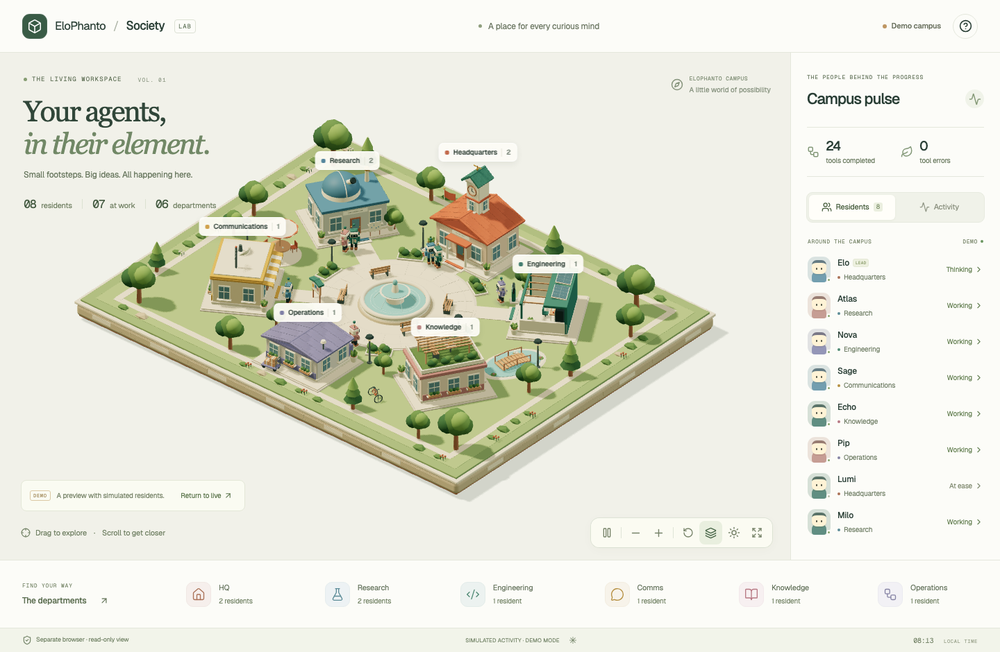

# Agent Society

Agent Society is a live, isometric campus for EloPhanto. The lead agent and its collaborators become little residents who travel between six departments as they work. The campus uses Three.js, locally bundled assets, soft shadows, landscaped buildings, animated characters, and daylight/evening views.



## Start it

Society is on by default. A fresh `elophanto init` writes the block below, `./update.sh` adds it to an existing `config.yaml`, and a config with no `society:` section at all runs it too:

```yaml
society:
  enabled: true
  host: 127.0.0.1
  port: 18790
  open_browser: true
```

Run `./start.sh` as usual. It prepares the graphics when necessary, then starts your normal CLI. The agent opens Society in a separate app window at `http://127.0.0.1:18790/society/`. This also works with `./start.sh chat --direct`, `./start.sh gateway`, and `./start.sh --web`.

Set `enabled: false` to disable the server, telemetry, and automatic window on the next startup — an explicit `false` is preserved by config migrations and never re-enabled for you. Set `open_browser: false` to run the local server without opening a window. The port is configurable; the service accepts only local connections.

Node.js and npm are required to build the frontend, as for the existing web dashboard. Startup uses a content fingerprint to reuse an unchanged build. A visual build, browser launch, occupied port, or telemetry failure leaves the CLI available. For direct `elophanto` commands or daemon installs, build once with `cd web && npm ci && npm run build` before starting the agent. No CDN or remote assets are needed after building.

## Explore

- Drag the campus to explore and scroll to zoom. The view controls also offer zoom and reset.
- Click a resident or select it in the roster to focus the camera and inspect its current department and tool.
- Select a department to focus it and filter its residents.
- Switch to Activity for the latest real tool and lifecycle events.
- Pause freezes the scene animation; it does not pause the agent or the live feed.
- Toggle labels or switch between daylight and evening.
- The help dialog offers a demo tour. `?demo=1` also opens a clearly marked simulation. Demo activity never represents real work or runs any tools.

The layout adapts to narrow screens. The roster, controls, help, and department navigation are keyboard accessible. Reduced-motion preferences disable decorative animation. A WebGL error leaves the textual activity view usable.

## What the residents mean

| Department | Work |
| --- | --- |
| Headquarters | Reasoning and planning |
| Research | Browser operations, web search, discovery |
| Engineering | Shell, code, files, documents, desktop |
| Communications | Email, messaging, social channels |
| Knowledge | Memory, skills, identity, learned knowledge |
| Operations | Swarm coordination, scheduling, goals, resources |

The lead agent and in-process delegates report actual tool start, approval wait, completion, failure, and cancellation. Parallel delegates have separate identities. External coding swarms, child agents, and organization specialists report the lifecycle information exposed by their managers. External coding processes do not currently stream their internal tool calls; an active coding worker remains in Engineering. The view does not invent detailed activity for those workers.

Rapid actions may finish before a resident physically arrives at a building. The roster and activity feed reflect the latest state immediately, while movement is a visual transition. Idle residents are still members of the society. Disconnections are labelled and the viewer reconnects automatically.

## Independence from browser automation

The viewer launches an installed Chrome, Chromium, Edge, or Brave executable with its own `.society-browser/` user-data directory, app mode, and a detached process. It does not expose a debugging port and is never registered with the agent's browser bridge. The browser bridge closes only its own contexts and processes, so its browser open/close/restart operations do not close Society.

There is deliberately no default-browser fallback, which could reuse an agent-controlled profile. If no suitable browser or desktop display is available, the server still starts and reports its URL. Closing the viewer does not stop the agent. Stopping the CLI stops its Society server; the window can remain open and reconnect on the next start. An operating-system-wide process kill or manual shutdown of all Chrome processes can still close any Chrome window.

## Architecture

`core/society.py` owns a loopback HTTP server and a bounded in-memory projection of actual runtime events. `Agent.initialize()` and `shutdown()` own its lifecycle. Executor wrappers and context-local delegate identities report metadata without altering tool return values. External manager state is sampled periodically.

The server serves the existing `web/dist` bundle under `/society/` and `/assets/`, plus two read-only endpoints:

- `GET /api/society/state`: current snapshot.
- `GET /api/society/events`: server-sent events named `state`, containing versioned full snapshots. Reconnecting clients receive the current state immediately.

Snapshots include agent IDs/names, kinds, departments, statuses, public tool identifiers, timestamps, and aggregate tool counters. Prompts, tool arguments/results, browser URLs, file contents, and credentials are not forwarded. The viewer cannot invoke tools or control the agent. Buffers and simultaneous streaming clients are bounded; slow or closed viewers cannot back-pressure agent work.

The Society route loads its graphics separately and does not connect to the dashboard's command WebSocket. `web/vite.config.ts` proxies Society endpoints to port 18790 for frontend development; adjust that development proxy if you choose a different service port.

## Verification

Focused tests cover configuration, startup opt-in and caching, isolated browser launch arguments, read-only loopback serving, path traversal and origin checks, SSE updates, approval/error/cancellation transitions, concurrent delegate identities, external worker lifecycle, and the agent's service lifecycle. Visual and interaction checks exercise desktop/mobile layouts, the demo/live distinction, selection, departments, animation controls, and disconnection behavior.

Run the browser smoke check against a fresh build:

```bash
.venv/bin/python web/scripts/society_smoke.py --screenshots /tmp/society-review
```

It starts a temporary local telemetry service with safe test data and checks real SSE updates, disconnected/reconnected states, the demo controls, mobile layout, and the WebGL fallback. It never initializes the agent, invokes tools or calls providers. Chromium must be installed for the project's Playwright dependency.
